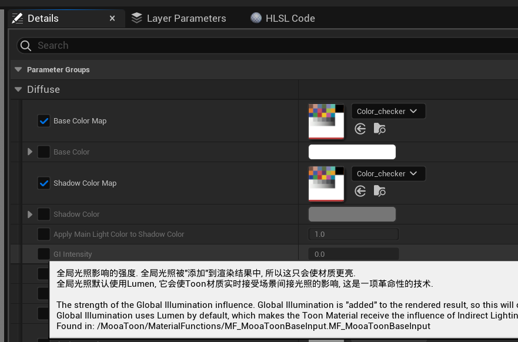
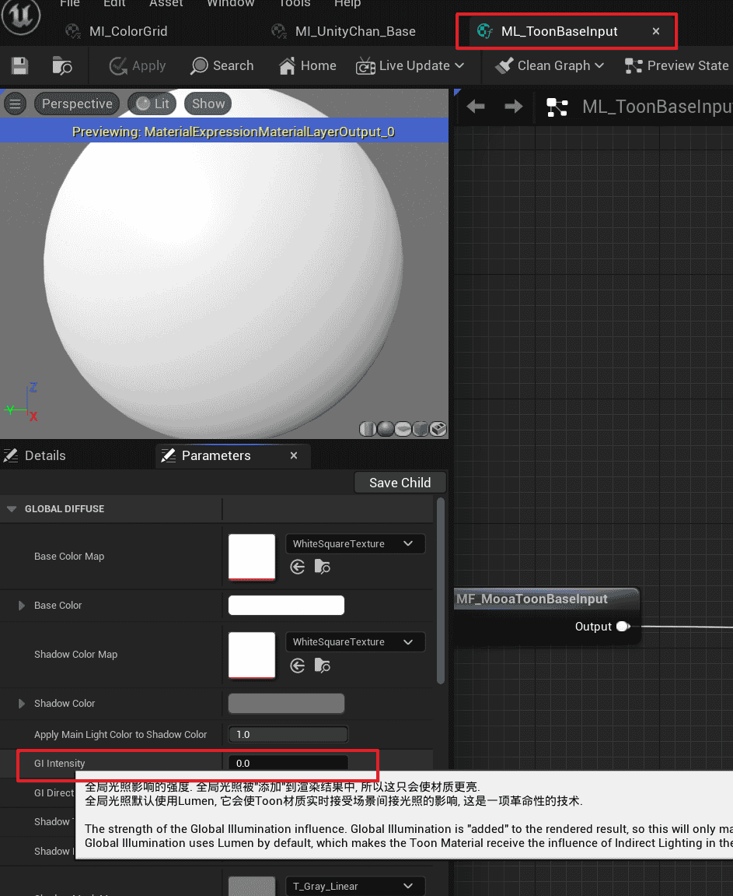

# 常见问题

## 限制

### 文件管理

请尽可能复制而不是更改MooaToon文件, 否则可能会因为更新而产生冲突

### 移动平台

MooaToon暂不支持移动平台, XR和主机平台理论上应该支持但尚未测试

### 全局光照

Toon Material中与全局光照相关的功能默认使用Lumen, 其他方法暂未测试

### 光线追踪

Toon Material中与Shadow有关的功能必须开启Ray Tracing Shadow和Hardware Ray Tracing

### 半透明

半透明的Rim Light需要在Post Processing Volume中开启High Quality Translucency Reflections (Lumen Front Layer Translucency Reflections) 以获取半透明物体深度

## 光线追踪

### 角色阴影消失

(Epic 5.1-5.2)

有时角色的光线追踪阴影会消失, 运行游戏或隐藏 / 显示角色后再次显示

### 描边与静态网格角色的阴影功能冲突

(Epic 5.1-)

这是由于Ray Tracing Shadow错误调用了Overlay Material的Hit Shader, Toon Material中的Ray Tracing Shadow相关功能将被描边覆盖.

### 材质预览

(5.0-5.1)

材质预览窗口的地面在开启光线追踪天光时是黑的

## 半透明

### OIT

(Epic 5.0-5.1)

OIT (排序无关半透明, 提供对多层半透明的正确渲染支持) 会导致半透明混合模式添加失效.

## 材质编辑

### 崩溃

(Epic 5.0+)

调整层材质时偶尔会崩溃, 使用时记得经常保存.


### 材质图层的参数描述消失

(Epic 5.0+)



材质图层的参数描述经常会消失, 请打材质编辑器后在参数面板上查看完整的参数描述:



### 对曲线图集参数的修改不会立即生效

(Epic 5.0+)

如果当前材质实例有被蓝图覆盖的参数, 那么手动修改曲线图集参数时不会立即生效, 需要额外切换一下参数前的开关.

## 无法在Epic启动器中找到MooaToon Project

1. 在资源管理器中打开路径`%LOCALAPPDATA%\EpicGamesLauncher\Saved\Config\Windows\GameUserSettings.ini`

2. 在`[Launcher]`下添加或修改`CreatedProjectPaths`的值为Project的上级路径, 如

   ```ini
   [Launcher]
   LastActiveDateTime=2023-03-27T00:00:00.000Z
   LastActiveVersion=14.7.1
   AutoEnabledStartOnBootVer=14.6.3
   LastActiveTab=ue
   VaultCacheDirectories=D:/Epic/VaultCache/
   DefaultAppInstallLocation=E:\UE
   CreatedProjectPaths=E:\MooaToon
   ```

3. 保存并重启Epic启动器

## 文档图片错误

由于Docusaurus的bug, 此文档网页在刷新后图片加载可能错误, 切换到其他文档页面再切回来可以恢复.


