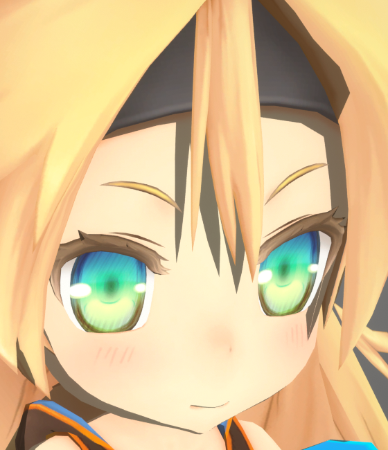
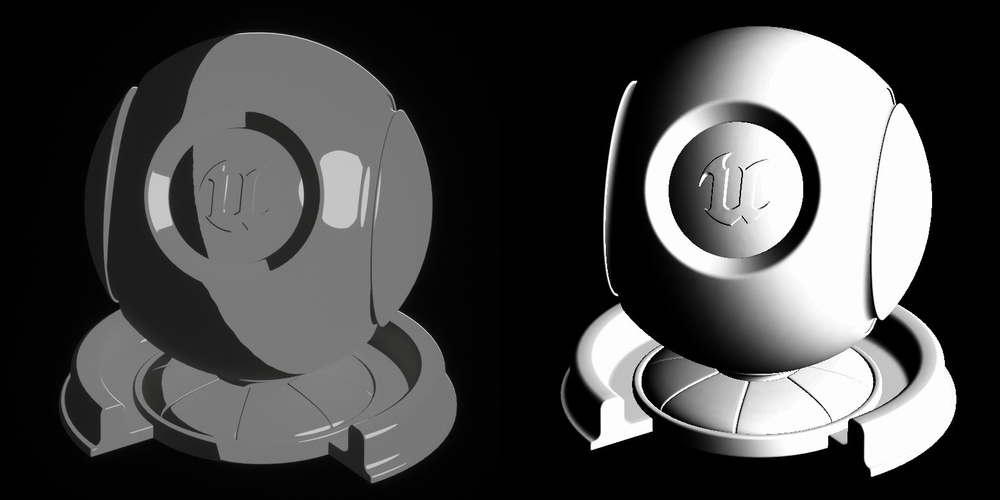
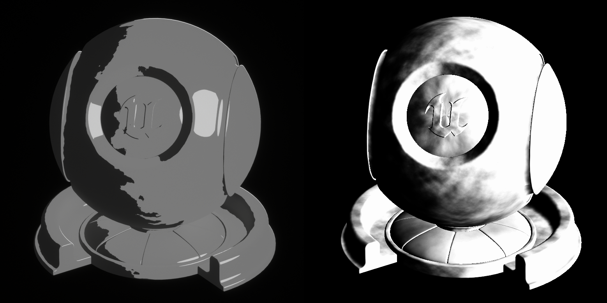
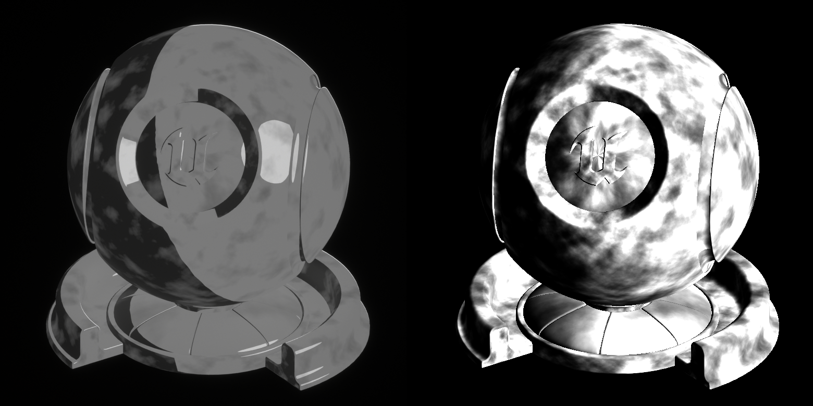
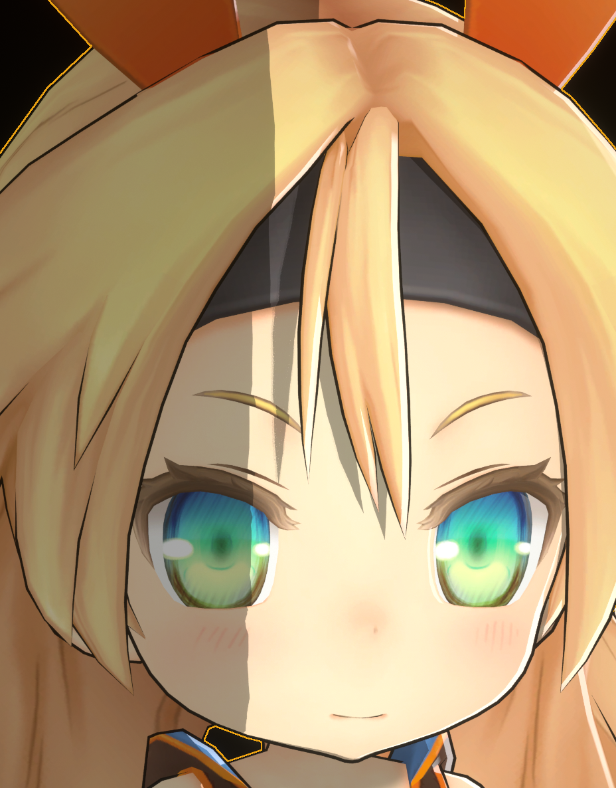
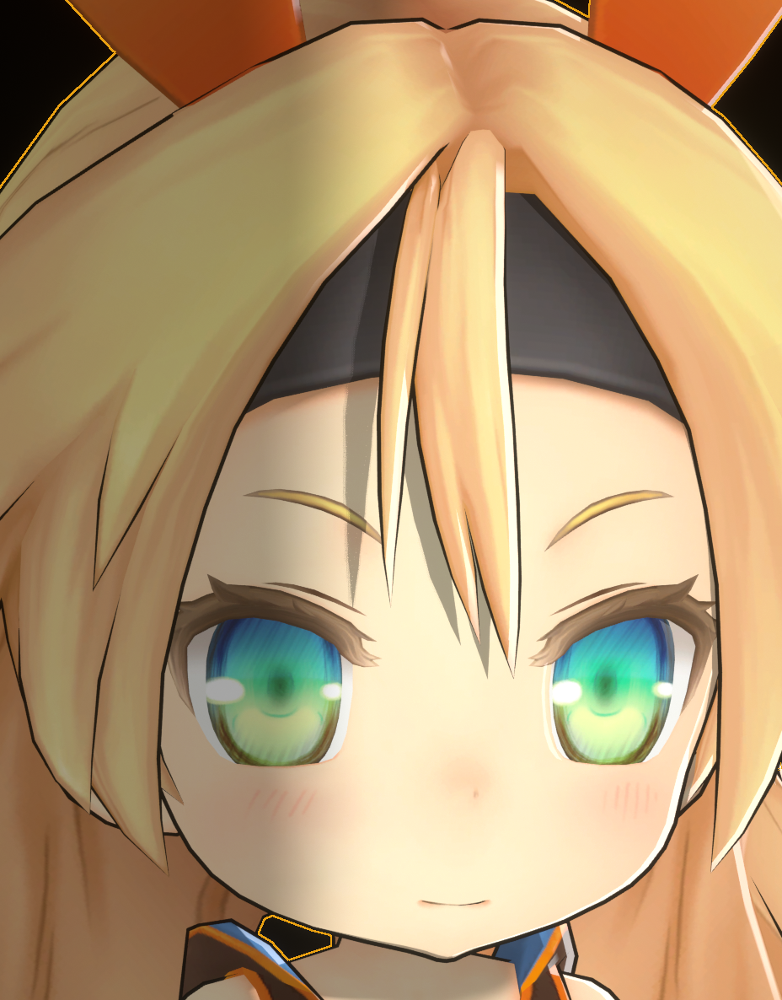
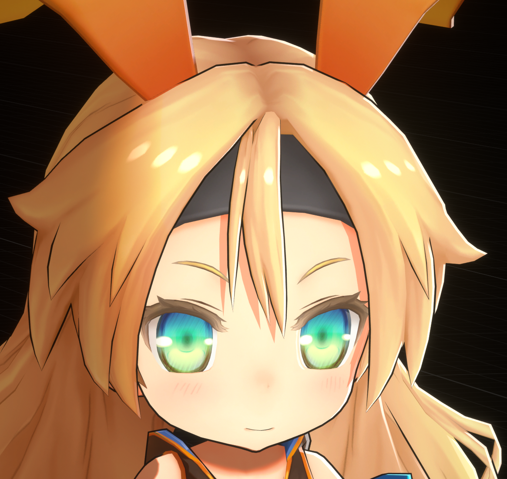

# 特性总览

## 宽度可控描边

MooaToon提供了一系列DCC和引擎工具以完全控制描边宽度:

左: 调整前; 右: 调整后

## 定制的光线追踪阴影

MooaToon深度定制了光线追踪阴影, 实现了可单独禁用自阴影和禁用局部阴影的功能:

|  |  |
| ------------------------------------------------------------ | ------------------------------------------------------------ |

禁用自阴影

|  |  |
| ------------------------------------------------------------ | ------------------------------------------------------------ |

禁用Toon材质之间的投影

以及设计了两种算法模拟动画风格的高精度发影:

|  |  |  |
| ------------------------------------------------------------ | ------------------------------------------------------------ | ------------------------------------------------------------ |
| 
Hair Shadow Width: 0.2
                      | 
Hair Shadow Width: 0.3
                      | 
Hair Shadow Width: 0.4
                      |

## 形状可控的法线阴影

通过法线传递和Shadow Gradient可以完全控制法线产生的阴影的形状:

左: 未修改的法线阴影; 右: 对应的Shadow Gradient

添加Noise到`Shadow Gradient Offset`, 会使阴影经过此处时边缘的位置产生偏移

添加Noise到`Shadow Intensity Offset`, 会直接在当前位置控制阴影产生的时机

阴影调整前后对比

## 使用RampMap控制软阴影过渡颜色

MooaToon使用Ramp Map描述软阴影的颜色过渡:

|  |  |  |
| ------------------------------------------------------------ | ------------------------------------------------------------ | ------------------------------------------------------------ |
| `Shadow Feather : 0.0`                                       | `Shadow Feather : 0.2`                                       | `Shadow Feather : 0.2 + Ramp Map`                            |

以Color Curve表示的Ramp Map

|  |  |
| ------------------------------------------------------------ | ------------------------------------------------------------ |
| Ramp On                                                      | Ramp Off                                                     |

## 动画风格的屏幕空间边缘光

相对等宽的, 支持深度遮挡的屏幕空间边缘光:

## 形状可自定义的动态头发高光

MooaToon提供了一系列工具以实现形状和运动轨迹都可控的动态头发高光:

基于Houdini的切线烘焙和高光预览工具

添加Highlight Mask前的动态高光

添加Highlight Mask后的最终效果

