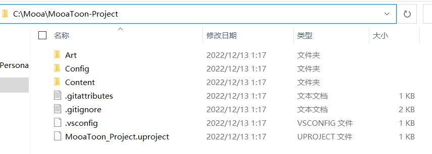

# 开始使用

根据你的网络和CPU, 整个安装过程可能需要3~8个小时, 请稍安勿躁, 如果过程中有无法解决的问题可以提交[Issues](https://github.com/JasonMa0012/MooaToon/issues/new).
## - 普通用户

### 关联账号
在开始之前, 你需要[**Epic账号**](https://www.unrealengine.com/)和[**Github账号**](https://github.com/), 如果没有请前往注册:

1.  然后前往该[链接](https://www.unrealengine.com/zh-CN/blog/updated-authentication-process-for-connecting-epic-github-accounts), 按照文中指示将Github账号关联到Epic账号. 
2.  返回Github, 前往Your Organizations, 接受Epic的邀请加入组织:

### 下载MooaToon安装工具
[下载](https://github.com/JasonMa0012/MooaToon/archive/refs/heads/main.zip)安装工具的Zip, 解压到你认为合适的位置, 强烈建议至少保留150GB的SSD硬盘空间.
然后可以开始安装过程.

### 使用工具自动安装
依次执行:

1. `_1_1_Install_Git.bat`以默认设置安装Git
2. `_1_2_Install_VisualStudio.bat`以默认设置安装Visual Studio
3. 保存你的工作内容
4. `_1_3_Restart_Computer.bat`重启电脑
5. `_2_0_Install_And_Run_MooaToon.bat`按照提示登录Github账号, 等待下载和编译完成, 这可能需要2到5小时
6. 完成后, 项目将自动打开

#### Install_MooaToon_Engine/Project期间的网络问题
可以尝试以下解决方法:
###### 自动获取最快的Github IP
通常,中国大陆用户访问Github网速很慢, 要解决这个问题请运行以下脚本:

- `_2_4_Fetch_Fastest_Github_IPs.bat`

该脚本在运行`_2_0_Install_And_Run_MooaToon.bat`时会自动执行, 其原理是通过第三方网站查询当前网络中最快的Github服务器IP, 并写入Host文件, 实现加速下载.
###### 手动设置Git代理
如果你有更快的代理服务器, 也可以手动为Git设置代理, `Win + R`输入以下命令(请将代理端口替换为你自己的代理端口):

- Socks5: `git config --global http.proxy socks5://127.0.0.1:10808`
- Http: `git config --global http.proxy http://127.0.0.1:10808`

取消Git代理: `git config --global --unset http.proxy`
###### 手动下载Zip
您也可以选择不使用Git而是直接下载Zip, 这种方式下载可能更稳定, 并且可以使用迅雷加速下载和断点续传, 但每次更新都需要手动下载整个引擎和项目.

1. 你可以前往https://github.com/Jason-Ma-0012/MooaToon-Engine下载Zip:					
2. 如图所示, 左侧选择的`5.1`为引擎分支, 点击右侧`Code > Download ZIP`开始下载引擎.
3. 完成后请切换到`5.1_MooaToonProject`分支下载项目.
4. 下载完成后回到MooaToon主目录, 将引擎解压到`MooaToon\MooaToon-Engine`目录内:			
5. 将项目解压到`MooaToon\MooaToon-Project`目录内:							
6. 运行`_2_3_Setup_Unreal_Engine.bat`, 注意, 这仍需要从Epic的服务器下载大量文件, 这一步目前无法绕过
7. 运行`_4_0_Build_And_Run_MooaToon.bat`

#### Setup_Unreal_Engine期间的网络问题

这个问题已知只在UE 5.1出现, 由于Epic服务器问题可能会导致网络错误, 这通常不是必须解决的问题, 因为不是所有文件都是编译所必须的.
你可以多次尝试Setup, 若持续遇到该问题则跳过这一步, 继续编译引擎.

### 检查项目
启动项目后, 请耐心等待Shader编译完成, 随后你应该看到类似以下界面:

在`Content\MooaToon\Maps`目录可以找到所有示例关卡:

随意探索一下吧.

### 获取更新
你可以检查[MooaToon-Engine](https://github.com/Jason-Ma-0012/MooaToon-Engine)仓库得知是否有更新, 并通过`_3_0_Update_And_Run_MooaToon.bat`脚本获取更新.
你也应该时常检查[安装工具](https://github.com/JasonMa0012/MooaToon)的更新情况, 并通过`_3_5_Update_InstallTool.bat`脚本进行更新.

#### 解决冲突
如果你修改了MooaToon的文件, 在更新时会收到提示, 如果已修改的文件和更新产生冲突, 则会有报错.
建议手动备份并删除导致合并失败的文件, 然后再次更新.
如果要放弃所有已修改的文件, 请运行`_3_4_Force_Update_MooaToon_X.bat`.

## - 开发者用户
如何从源码编译引擎: [https://docs.unrealengine.com/5.1/zh-CN/building-unreal-engine-from-source/](https://docs.unrealengine.com/5.1/zh-CN/building-unreal-engine-from-source/)
前往: [https://github.com/Jason-Ma-0012/MooaToon-Engine](https://github.com/Jason-Ma-0012/MooaToon-Engine)
拉取`5.1`分支以编译引擎, 拉取`5.1_MooaToonProject`分支以启动项目, Enjoy it!

## (可选) 安装Ultra Dynamic Sky
类似`L_TimeOfDay_Require_UltraDynamicSky`的关卡需要您自行购买并安装`Ultra Dynamic Sky`插件:

- 购买:[https://www.unrealengine.com/marketplace/zh-CN/product/ultra-dynamic-sky](https://www.unrealengine.com/marketplace/zh-CN/product/ultra-dynamic-sky)
- 在Epic启动器的保管库中, 将`Ultra Dynamic Sky`安装到`MooaToon-Project` (如果未找到项目, 你可能需要先打开一次项目):			
- 重启UE5
- 再次打开`L_TimeOfDay_Require_UltraDynamicSky`, 你应该能够看到:						
- 你可以Play以查看动态天气效果:															
- 你可以使用快捷键`G`预览Play模式的显示设置
- 有关`Ultra Dynamic Sky`的详细用法可以在其商店页面找到
## Tips

-  **请尽可能_复制_而不是更改MooaToon资源, 否则可能会因为更新而产生冲突**
-  官方 5.1 BUG: 有时角色RT阴影消失, Play或隐藏/显示角色后OK 
-  官方 5.1 BUG: TSR和`Ultra Dynamic Sky`同时开会crash 
-  官方 5.1 BUG: RT阴影获得的ShadingModelID永远是DefaultLit, 这意味着如Subsurface Transmission之类的效果不生效 
-  官方 5.1 BUG: 材质预览场景地板在开启RT Skylight时是黑的 
-  官方 5.1 BUG: OIT会导致半透明Add混合失效 
-  **官方 长期 BUG: 调整Layer材质相当容易Crash, 使用时记得经常保存**

