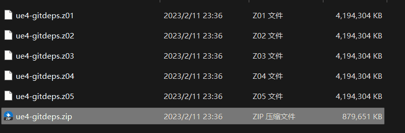

取决于你的网络带宽和CPU性能, 整个安装过程需要数小时, 请稍安勿躁. 如果过程中有无法解决的问题可以提交[Issues](https://github.com/JasonMa0012/MooaToon/issues/new).

请根据你的经验选择对应教程:

## - 普通用户

### 关联账号

在开始之前, 你需要[**Epic账号**](https://www.unrealengine.com/)和[**Github账号**](https://github.com/), 如果没有请前往注册. 然后:

1.  然后前往该[链接](https://www.unrealengine.com/zh-CN/blog/updated-authentication-process-for-connecting-epic-github-accounts), 按照文中指示将Github账号关联到Epic账号. 
2. 返回Github, 前往Your Organizations, 接受Epic的邀请加入组织:

   |  |  |
   | ------------------------------------------------------------ | ------------------------------------------------------------ |

:::caution

- 如果接受邀请后无法在组织中找到EpicGames, 请尝试重新登录GitHub账号.
- Epic近期调整过Github组织架构, 如果发现Github项目链接无法访问, 请检查Github账号是否成功加入EpicGames组织, 并尝试重新关联账号.

:::

### 下载MooaToon安装工具

[下载](https://github.com/JasonMa0012/MooaToon/archive/refs/heads/main.zip)安装工具的Zip, 解压到硬盘根目录, 如`D:\MooaToon`(目的是避免路径过长引起编译错误), 强烈建议**至少保留200GB的SSD硬盘空间**.

然后可以开始安装过程.

### 使用工具自动安装

依次执行:

1. 运行`_1_1_Install_Git.bat`以默认设置安装Git
2. 运行`_1_2_Install_VisualStudio.bat`以默认设置安装Visual Studio
3. **保存你的工作内容**, 运行`_1_3_Restart_Computer.bat`重启电脑
4. 运行`_2_0_Install_And_Run_MooaToon.bat`按照提示登录Github账号, 等待下载和编译完成, 这可能需要1到3小时
   1. 中国大陆的用户请根据提示开启全局代理, 否则可能遇到网络问题
5. 一切完成后, 项目将自动打开

### 检查项目

启动项目后, 请耐心等待Shader编译完成, 随后你应该看到类似以下界面:

在`Content\MooaToonSamples\Maps`目录可以找到所有示例关卡:

随意探索一下吧.

### 获取更新

你可以订阅[MooaToon-Engine](https://github.com/Jason-Ma-0012/MooaToon-Engine)仓库以得知是否有更新, 并通过`_3_0_Update_And_Run_MooaToon.bat`脚本获取更新.
:::caution

请勿使用`_2_0_Install_And_Run_MooaToon.bat`获取更新, 该脚本只下载最少的内容, 只适用于第一次安装时使用.

:::

### 解决冲突

如果你修改了MooaToon的文件, 在更新时会收到提示, 如果已修改的文件和更新产生冲突, 则会有报错.
建议手动备份导致合并失败的文件, 运行`_3_X_Clean_MooaToon_X`后再次更新.

## - 开发者用户

如何从源码编译引擎: [https://docs.unrealengine.com/5.1/zh-CN/building-unreal-engine-from-source/](https://docs.unrealengine.com/5.1/zh-CN/building-unreal-engine-from-source/)

前往: [https://github.com/Jason-Ma-0012/MooaToon-Engine](https://github.com/Jason-Ma-0012/MooaToon-Engine)

使用Git拉取`5.x`分支以编译引擎, 拉取`5.x_MooaToonProject`分支以启动项目.

## 常见问题

### 安装或更新期间的网络问题

可以尝试以下解决方法:

#### 自动获取最快的Github IP

通常,中国大陆用户访问Github网速很慢, 运行该脚本可以缓解问题: `_2_4_Fetch_Fastest_Github_IPs.bat`

其原理是通过第三方网站查询当前网络中最快的Github服务器IP, 并写入Host文件, 实现加速下载.

#### 设置全局代理

如果你有更快的代理服务器, 请先在你的代理工具软件中打开全局代理.

然后运行该脚本启用代理: 

- `_0_2_Set_CMD_And_Git_Proxy.bat`

若要取消代理请运行该脚本:

- `_0_3_Cancel_CMD_And_Git_Proxy.bat`

#### 手动下载Zip
您也可以选择不使用Git而是直接下载Zip, 这种方式下载可能更稳定, 并且可以使用迅雷加速下载和断点续传, 但每次更新都需要手动下载整个引擎和项目.

1. 前往[https://github.com/Jason-Ma-0012/MooaToon-Engine](https://github.com/Jason-Ma-0012/MooaToon-Engine):

  

2. 如图所示, 左侧选择的`5.x`为引擎分支, 点击右侧`Code > Download ZIP`开始下载引擎.

3. 完成后请切换到`5.x_MooaToonProject`分支下载项目.

4. 下载完成后回到MooaToon主目录, 将引擎解压到`MooaToon\MooaToon-Engine`目录内:

   

5. 将项目解压到`MooaToon\MooaToon-Project`目录内:

  

6. 运行`_2_3_Setup_Unreal_Engine.bat`, 注意, 这仍需要从Epic的服务器下载大量文件, 这一步目前无法绕过

7. 运行`_4_0_Build_And_Run_MooaToon.bat`

### Setup_Unreal_Engine期间的网络问题

由于Epic服务器或者网络速度问题, Setup期间可能卡在某一个文件, 或者下载失败.

你首先应该尝试使用全局代理, 或者切换代理服务器.

若仍然无法解决, 你可以从以下任意一个云盘手动下载:

- https://pan.baidu.com/s/1Y8FFDyhvEcuQ53gFziJjvA?pwd=cht2
- https://mega.nz/folder/5rZgVR5C#5YjddnKYDcWvLNHBhE58KA

下载后, 你应该得到如下分卷压缩文件:

使用解压软件打开`ue-gitdeps.zip`, 将其内容解压到`MooaToon-Engine\.git\ue-gitdeps`文件夹, 然后再次运行`_2_3_Setup_Unreal_Engine.bat`, 现在你应该以相当快的速度完成.

然后运行`_4_0_Build_And_Run_MooaToon.bat`以构建并启动项目.

### 编译期间的错误

#### 编译器版本错误

[UE对编译器版本有一定要求](https://dev.epicgames.com/documentation/en-us/unreal-engine/unreal-engine-5.4-release-notes#platformsdkupgrades), 你可以运行`_1_2_Install_VisualStudio.bat`自动安装正确的编译器版本, MooaToon编译时会优先选择正确的编译器版本.

如果持续出现编译问题, 你可以[彻底卸载VS](https://learn.microsoft.com/zh-cn/visualstudio/install/uninstall-visual-studio?view=vs-2022)并重启电脑后重试上述步骤.

#### 运行库缺失

编译报错也可能是Windows缺少某些运行库导致, 请尝试:

1. 安装最新的[.NET Framework](https://dotnet.microsoft.com/en-us/download/dotnet-framework)
2. [下载工具](https://drive.google.com/file/d/1DR80HhJu5iZ15RA71AO757_UgzG-_qig/view)并修复DirectX和C++运行库
