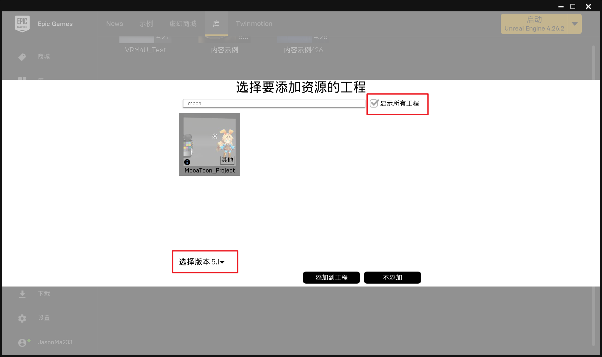
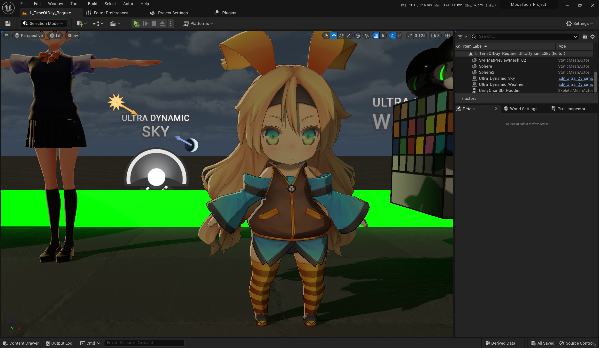
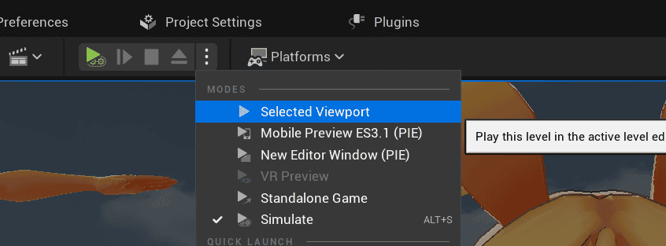

# 开始使用

## 体验可执行的Demo

TODO

## 选择你想要安装的引擎版本

MooaToon本质上是需要修改引擎代码的插件, 且目前未支持移动平台, 所以你无法将游戏打包到移动平台.

### 安装预编译版引擎

如果你是美术师, 只是想要试用MooaToon, 预编译版本是一个不错的选择.

预编译版本的优点是开箱即用, 无需等待引擎编译, 并且下载的内容最少, 运行的性能也最佳.

预编译版本的缺点是无法打包C++游戏, 不含调试信息, 并且每次微小的更新都需要重新下载整个包体.

依次执行以下步骤使用预编译版本:

1. [下载安装工具](https://github.com/JasonMa0012/MooaToon/archive/refs/heads/main.zip)并解压
2. 双击运行: `_0_0_Install_Latest_MooaToon_Precompiled_And_Override_All_Modified_Files.bat`自动下载并解压
3. 双击运行: `_0_1_Run_MooaToon_Precompiled_Project.bat`打开项目

:::caution

1. 下载问题

**由于服务基于Github, 对于中国大陆用户, 强烈推荐开启全局代理, 否则无法保证下载速度和稳定性.**

如果无法用代理, 建议先运行脚本`_2_4_Fetch_Fastest_Github_IPs.bat`以在一定程度上提高下载速度.

2. 运行问题

若启动项目时报错, 首先再次运行`_0_0_Install_Latest_MooaToon_Precompiled_And_Override_All_Modified_Files.bat`确保下载内容的完整性, 然后打开项目.

若问题没有解决, 请[下载并运行修复工具](https://drive.google.com/file/d/1DR80HhJu5iZ15RA71AO757_UgzG-_qig/view), 重启电脑后再次打开项目.

:::

你也可以使用脚本`_0_0_Install_Latest_MooaToon_Precompiled_And_Override_All_Modified_Files.bat`更新MooaToon, **所有已修改的文件都会被覆盖**, 新增的文件如果不和MooaToon文件重名就不会被覆盖.

### 从源码编译引擎

如果你想获得完整的引擎功能, 以及更快的更新速度, 请参考:

[从源码编译引擎](BuildEnginefromSourceCode.md)


## (可选) 安装Ultra Dynamic Sky

类似`L_TimeOfDay_Require_UltraDynamicSky`的关卡需要您自行购买并安装`Ultra Dynamic Sky`插件以获得对动态天气系统的支持:

- 购买:[https://www.unrealengine.com/marketplace/zh-CN/product/ultra-dynamic-sky](https://www.unrealengine.com/marketplace/zh-CN/product/ultra-dynamic-sky)

- [将MooaToon Project添加到Epic启动器](/docs/FAQ#无法在epic启动器中找到mooatoon-project)

- 在Epic启动器的保管库中, 将Ultra Dynamic Sky安装到MooaToon Project:

  

- 重启引擎

- 再次打开`L_TimeOfDay_Require_UltraDynamicSky`, 你应该能够看到:

  

- 你可以运行游戏以查看动态天气效果:

  |  |  |
  | ------------------------------------------------------------ | ------------------------------------------------------------ |

  

- 有关Ultra Dynamic Sky的详细用法可以在其商店页面找到

## 文件目录结构

- 预编译版

```
MooaToon ----------------------------------- 根目录
 ├-MooaToon-Engine-Precompiled ------------- 引擎安装目录
 │  ├-Windows\Engine\Plugins\MooaToon ------ MooaToon引擎插件目录
 │  └-Windows\Engine\Binaries\Win64 -------- 引擎可执行文件目录
 │    └-UnrealEditor.exe ------------------- 引擎可执行文件
 ├-MooaToon-Project-Precompiled ------------ 项目安装目录
 │  ├-Art ---------------------------------- 美术资源文件目录
 │  ├-Config ------------------------------- 项目设置目录
 │  ├-Content ------------------------------ 项目内容目录
 │  │  ├-Global ---------------------------- MooaToonSamples依赖的资源
 │  │  └-MooaToonSamples ------------------- MooaToon的所有示例, 可以删除
 │  └-MooaToon_Project.uproject ------------ 项目文件
 │
 ...  
```

- 源码版本

```
MooaToon ----------------------------------- 根目录
 ├-MooaToon-Engine ------------------------- 引擎安装目录
 │  ├-Engine\Plugins\MooaToon -------------- MooaToon引擎插件目录
 │  └-Engine\Binaries\Win64 ---------------- 引擎可执行文件目录
 │    └-UnrealEditor.exe ------------------- 引擎可执行文件
 ├-MooaToon-Project ------------------------ 项目安装目录
 │  ├-Art ---------------------------------- 美术资源文件目录
 │  ├-Config ------------------------------- 项目设置目录
 │  ├-Content ------------------------------ 项目内容目录
 │  │  ├-Global ---------------------------- MooaToonSamples依赖的资源
 │  │  └-MooaToonSamples ------------------- MooaToon的所有示例, 可以删除
 │  └-MooaToon_Project.uproject ------------ 项目文件
 │
 ...  
```


## 在现有项目中使用MooaToon

你可以使用MooaToon引擎打开你自己的项目.

### 确认现有项目版本和MooaToon引擎版本

你可以通过MooaToon的[Github仓库](https://github.com/JasonMa0012/MooaToon)分支名称和Release名称判断MooaToon的引擎版本.

如果你的项目使用的引擎版本低于MooaToon引擎版本, 则会被要求升级到MooaToon引擎版本.

如果你的项目使用的引擎版本高于MooaToon引擎版本, 则无法打开.

### 复制MooaToon示例文件到现有项目

复制以下示例文件夹到你的项目的Content目录内:

- 预编译版本

  - `MooaToon\MooaToon-Project-Precompiled\Content\Global`
  - `MooaToon\MooaToon-Project-Precompiled\Content\MooaToonSamples`
- 源码版本

  - `MooaToon\MooaToon-Project\Content\Global`
  - `MooaToon\MooaToon-Project\Content\MooaToonSamples`

### 使用MooaToon引擎打开现有项目

找到并执行引擎可执行文件:

- 预编译版本

  - `MooaToon\MooaToon-Engine-Precompiled\Windows\Engine\Binaries\Win64\UnrealEditor.exe`
- 源码版本
  - `MooaToon\MooaToon-Engine\Engine\Binaries\Win64\UnrealEditor.exe`

:::tip

你可以右键引擎可执行文件并固定到开始菜单, 或创建桌面快捷方式, 这样就不用每次手动查找了.

:::

随后在项目浏览器中打开你自己的项目.

:::caution

如果你的项目依赖了其他引擎插件, 这里需要手动复制这些插件到MooaToon引擎的插件目录:

- 预编译版本

  - `MooaToon\MooaToon-Engine-Precompiled\Windows\Engine\Plugins`
- 源码版本
  - `MooaToon\MooaToon-Engine\Engine\Plugins`

:::

### 检查项目设置

如果要使用完整的MooaToon的功能, 以下项目设置必须打开:

- `Renderding > Dynamic Global Illumination Method: Lumen`
- `Renderding > Ray Traced Shadows`

另外以下命令修复了一些UE的渲染问题, 推荐添加到你的项目的`Config\DefaultEngine.ini`中:

- `r.RayTracing.Shadows.AvoidSelfIntersectionTraceDistance=0.5`

现在你可以检查MooaToon的示例, 并在自己的项目中使用Toon材质了.
