## 升级现有项目到5.4

1. 先根据[安装教程](/docs/GettingStarted/)在临时目录中重新安装MooaToon.
2. 如果你的项目没有版本控制, 请先完整复制一份项目作为备份
3. 复制新安装的MooaToonProject中的**Art**, **Content**, **Plugins**文件夹到你的项目目录并覆盖同名文件
4. 用新安装的MooaToonEngine替换旧的
5. 打开项目, 选择在原位置升级项目
6. 根据下文检查并修复你的项目

## 从二值化升级到Global Ramp Lighting

5.4最重要的特性就是支持多光源的Global Ramp Lighting:

| 5.3                                                                          | 5.4                                                                                                                                                       |
| ---------------------------------------------------------------------------- | --------------------------------------------------------------------------------------------------------------------------------------------------------- |
| 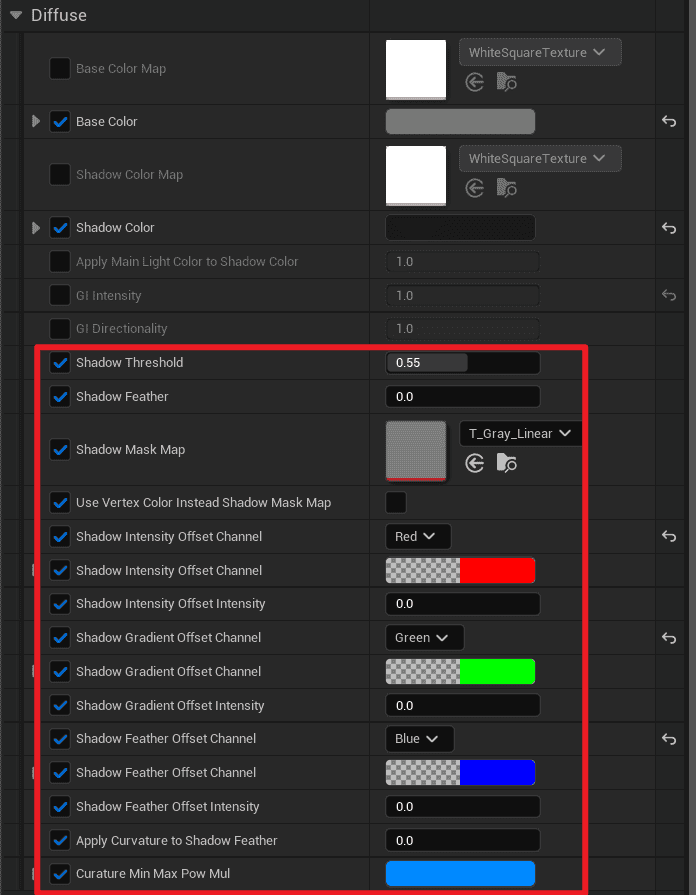             | 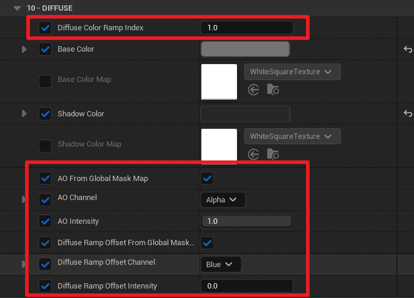                                                                                          |
|  | 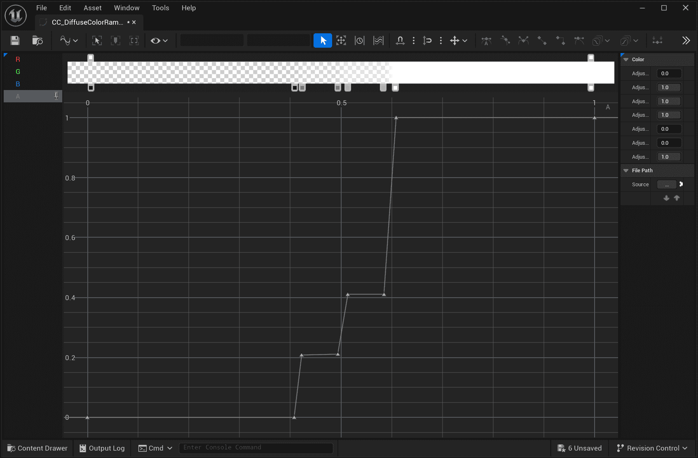 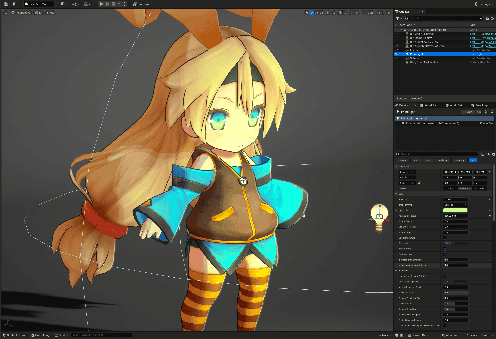 |
| 通过 `Threshold`和 `Feather`控制明暗过渡, 且Ramp Lighting只支持单个方向光                      | 通过 `Global Diffuse Color Ramp`完全自定义多光源的明暗过渡                                                                                                               |
| 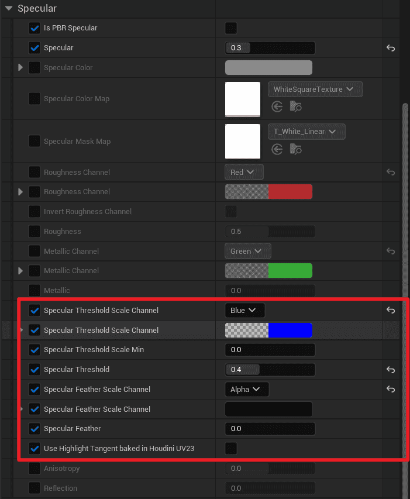             | 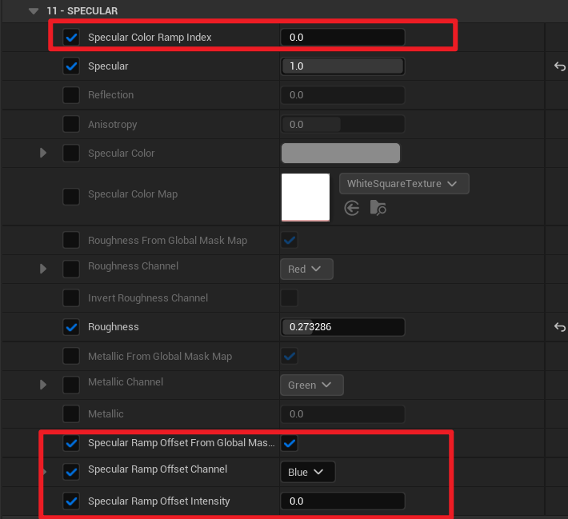                                                                                          |
| 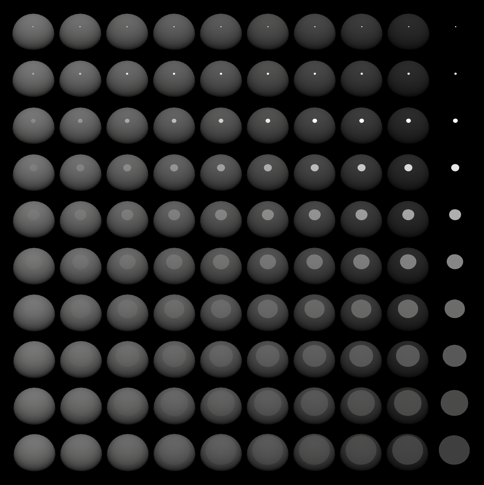 | 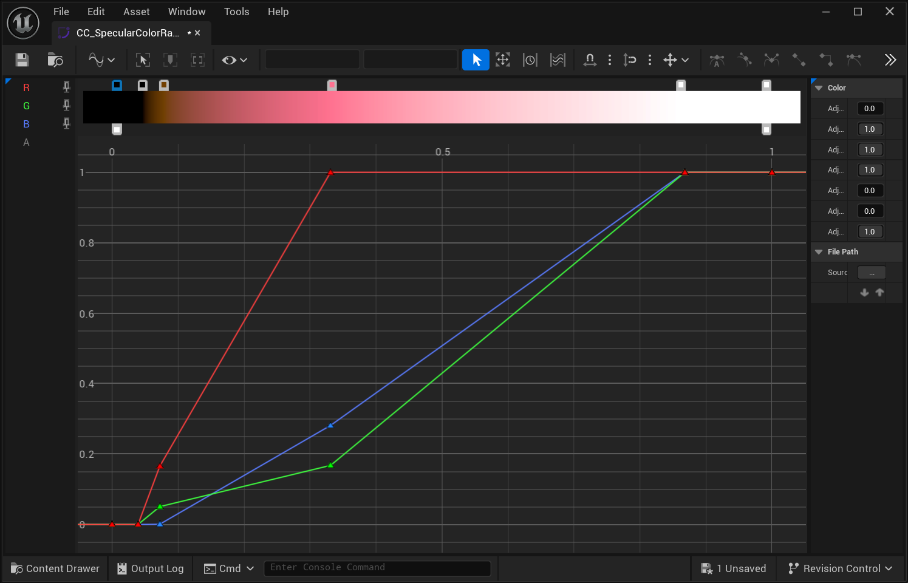 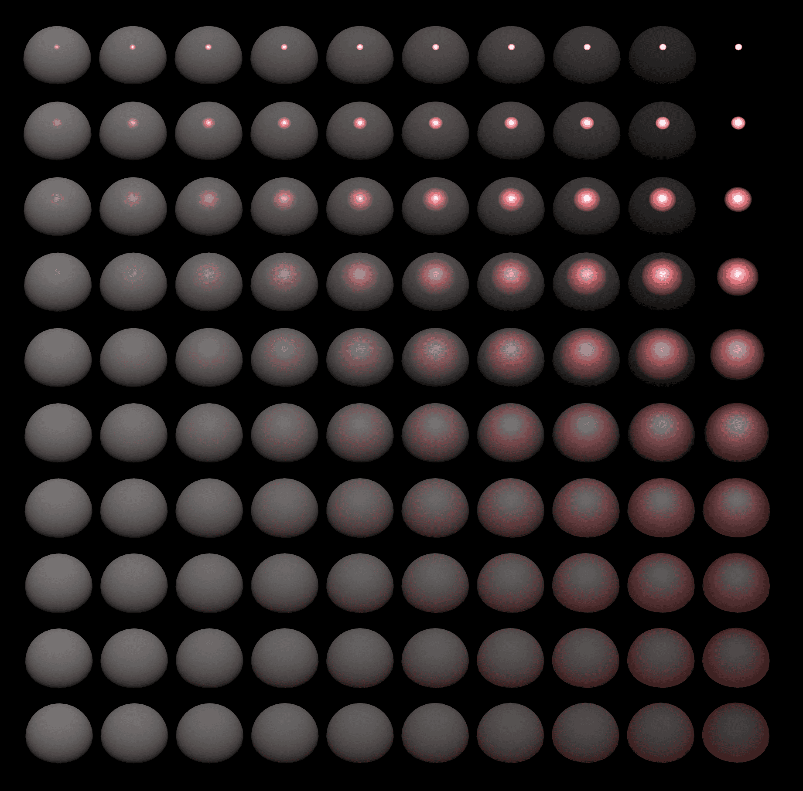 |
| 通过 `Threshold`和 `Feather`控制高光的软硬                                             | 通过 `Global Specular Color Ramp`完全自定义多光源的高光过渡                                                                                                              |

请参考这两篇教程以设置[Diffuse](/docs/Tutorial/ControlLightShadowColorTransition)和[Specular](/docs/Tutorial/AddStylizedHairHighlights#使用specular-color-ramp控制高光颜色过渡).

## Toon材质与GBuffer重构

通过一系列改动以优化性能, 简化参数, 提升用户体验:

- 不需要逐像素控制的参数已经改为**全局的控制台参数**和**后处理体积参数**:

	这可以减少带宽需求, 最大程度避免浪费GBuffer, 也简化了操作步骤.

| 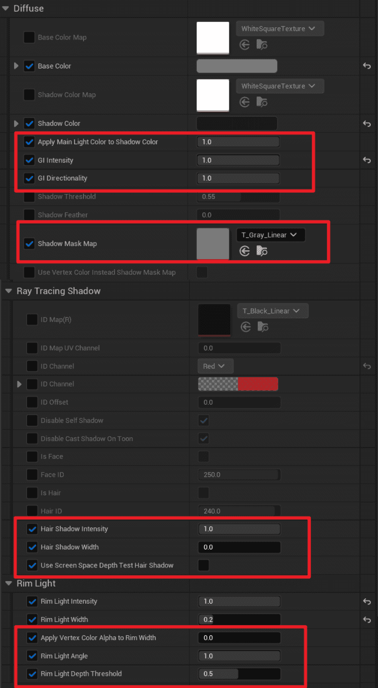 | 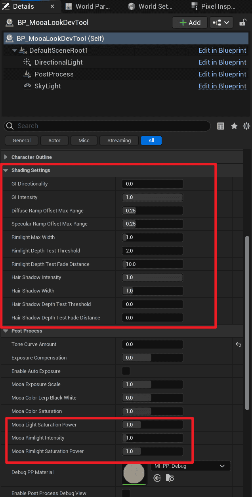 |
| ---------------------------------------------------------------- | ---------------------------------------------------------------- |
| 5.3: Toon材质中被删除的参数                                               | 5.4:`BP_LookdevTool`中新增的全局参数                                     |

- 一些全局设置已经整理到单独的分类:

|  | 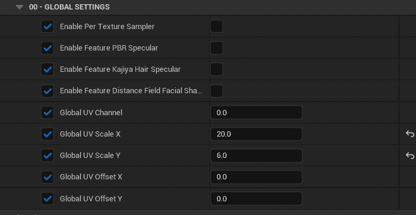 |
| ---------------------------------------------------------------- | ---------------------------------------------------------------- |
| 整理前                                                              | 整理后                                                              |
- 通过新的 `Global Mask Map`尽可能减少贴图采样. 现在你可以选择***使用单独的贴图***或者***使用 Global Mask Map中某个通道***:

| 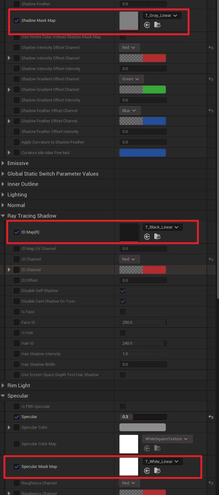 | 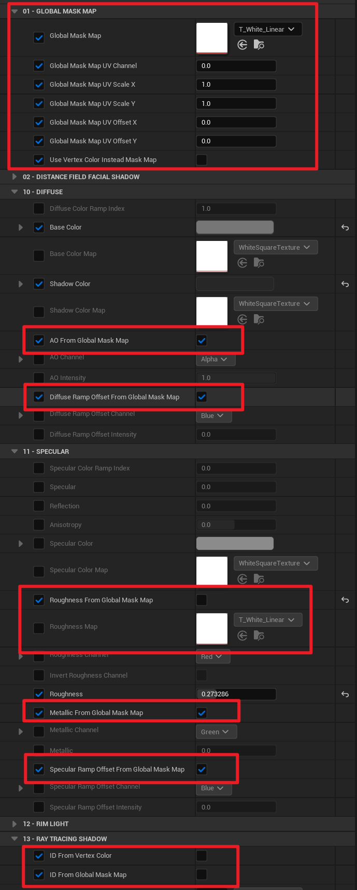 |
| ---------------------------------------------------------------- | ---------------------------------------------------------------- |
| 只能使用单独的贴图                                                        | 可以从 `Global Mask Map`中选择使用某个通道, 从而降低贴图数量                         |
|                                                                  |                                                                  |
- `ML_KajiyaKayHairHighlight`和`ML_DistanceFieldFacialShadow`已经删除, 其功能已经集成到`ML_ToonBaseInput`
- 光线追踪发影已删除, 因为其开销较高但效果没有比屏幕空间发影更好

:::caution
***部分参数和贴图可能需要重新配置.*** 
:::

## 支持直接导入VRM文件

MooaToon现在内置了[VRM4U](https://github.com/JasonMa0012/VRM4U_MooaToon)引擎插件, 你可以直接导入.vrm文件, 并自动设置材质:

源文件位于: `MooaToon\MooaToon-Project\Art\VRMs`

## Houdini示例更新

Houdini示例文件已经简化并添加注释以降低学习门槛, 其他教程中的文档已同步更新:

## 文档更新

所有教程都已经更新, 大幅优化了排版与顺序, 更直观, 更容易阅读.

## 用户协议更新

MooaToon致力于将技术带给更多普通人, 本次更新添加了商业行为更明确的定义, 且放宽了免费使用MooaToon的范围, 点击[这里](../Licence.md)查看.