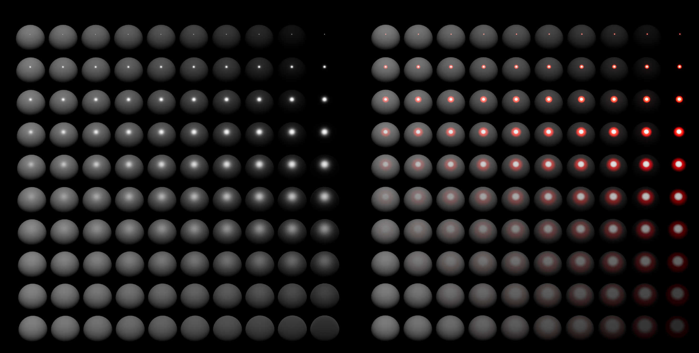

## Specular Color Ramp优化
(2025/11/3)  
Specular Color Ramp的UV和强度已经过优化, 现在结果可能看起来不同:  

| Before                                       | After                                        | Specular Color Ramp                             |
| -------------------------------------------- | -------------------------------------------- | ----------------------------------------------- |
|  |  |  |
|  |  |  |

优化内容包括:
- Specular Color Ramp UV分布优化, 使Ramp采样结果更符合预期.
- Specular强度优化, 现在不会出现极大值, 并使Bloom的结果与PBR Specular更加一致.
- 内部分内置Specular Color Ramp添加平滑渐变.