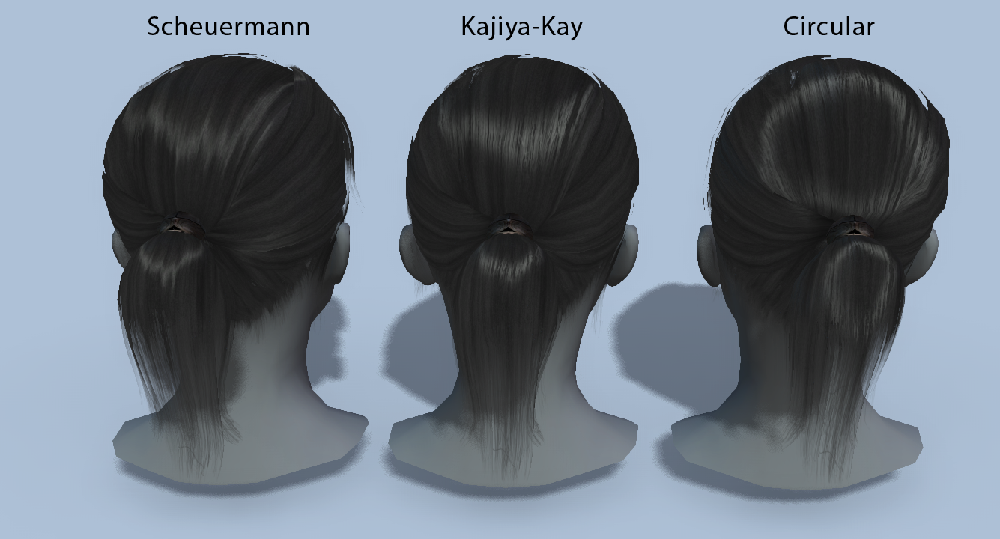
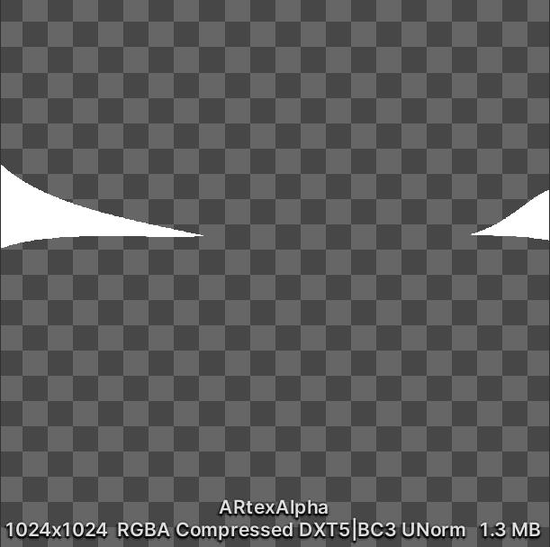

# 控制头发高光

## 常见实现方法

绘画作品 (作者: [おののいもこ 魚介](https://twitter.com/_himehajime)) 中的头发高光形态各异:

|  |  |  |
| ------------------------------------------------------------ | ------------------------------------------------------------ | ----------------------------------------- |
| 环状                                                         | 点状                                                         | 天使环                                    |

实现这些高光常有以下方法:

### 绘制在贴图上

静态, 无光照, 但可控性最佳, 适合固定视角游戏或影视作品.

### 基于物理的渲染

这类方法通常用来做写实风格的头发:

想用在三渲二中必须加以风格化. 动态, 支持多光源, 可控性较差, 形状受拓扑影响大, 适合偏写实风格的游戏或影视作品.

### 材质捕捉 (MatCap)

请参考[UTS](https://docs.unity3d.com/Packages/com.unity.toonshader@0.9/manual/MatCap.html).

MatCap Map Texture Example

|  |  |
| ---------------------------------- | ------------------------------- |
| MatCap Map Off                     | MatCap Map On                   |

这种方法仅支持单个主光源, 形状可以通过MatCap Map自定义, 但高光出现的时机受视角和拓扑影响, 在模型的面数较低或者结构不合理时经常出现难看的高光, 适合对高光要求不高的游戏作品.

### 贴图投射

请参考[UTS](https://docs.unity3d.com/Packages/com.unity.toonshader@0.9/manual/AngelRing.html).

|  |  |
| ------------------------------- | ----------------------------------------------- |
| Example Texture                 | Texture Projection On                           |

该方法沿视线方向投射贴图到头发上, 适合无论哪个角度看都一样的天使环高光.

### 基于切线传递的风格化Kajiya-Kay

这是MooaToon的创新算法之一.

Kajiya-Kay高光出现的时机依赖视线方向和切线方向, 通过切线传递可以自定义高光出现的时机, 而不受拓扑的影响. 再加上对高光Gradient的控制可以进一步细化高光形状, 理论上可以实现所有类型的高光, 可控性极佳, 适用于游戏和影视作品.

## 通过Houdini烘焙自定义的切线控制高光大致范围

## 绘制Gradient Mask精细控制高光形状

