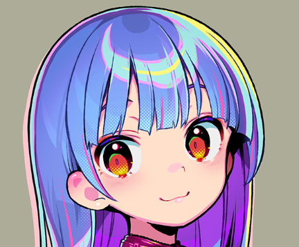
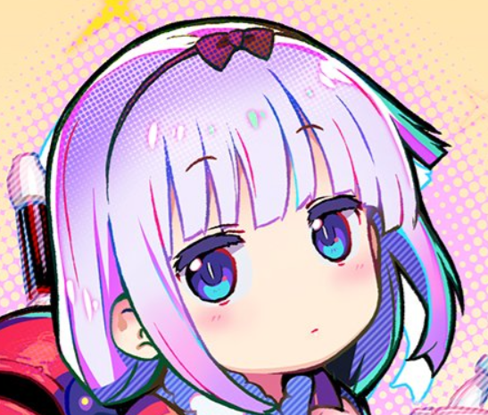
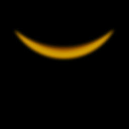
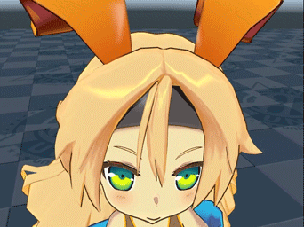

# 控制头发高光

## 常见实现方法

绘画作品 (作者: [おののいもこ 魚介](https://twitter.com/_himehajime)) 中的头发高光形态各异:

|  |  |  |
| ------------------------------------------------------------ | ------------------------------------------------------------ | ----------------------------------------- |
| 环状                                                         | 点状                                                         | 天使环                                    |

实现这些高光常有以下方法:

### 绘制在贴图上

静态, 无光照, 但可控性最佳, 适合固定视角游戏或影视作品.

### 基于物理的渲染

这类方法通常用来做写实风格的头发:

想用在三渲二中必须加以风格化. 动态, 支持多光源, 可控性较差, 形状受拓扑影响大, 适合偏写实风格的游戏或影视作品.

### 材质捕捉 (MatCap)

请参考[UTS](https://docs.unity3d.com/Packages/com.unity.toonshader@0.9/manual/MatCap.html).

MatCap Map Texture Example

|  |  |
| ---------------------------------- | ------------------------------- |
| MatCap Map Off                     | MatCap Map On                   |

这种方法仅支持单个主光源, 形状可以通过MatCap Map自定义, 但高光出现的时机受视角和拓扑影响, 在模型的面数较低或者结构不合理时经常出现难看的高光, 适合对高光要求不高的游戏作品.

### 贴图投射

请参考[UTS](https://docs.unity3d.com/Packages/com.unity.toonshader@0.9/manual/AngelRing.html).

|  |  |
| ------------------------------- | ----------------------------------------------- |
| Example Texture                 | Texture Projection On                           |

该方法沿视线方向投射贴图到头发上, 适合无论哪个角度看都一样的天使环高光.

### 基于切线传递的风格化Kajiya-Kay

这是MooaToon的创新算法之一.

Kajiya-Kay高光出现的时机依赖视线方向和切线方向, 通过切线传递可以自定义高光出现的时机, 而不受拓扑的影响. 再加上对高光Gradient的控制可以进一步细化高光形状, 理论上可以实现所有类型的高光, 可控性极佳, 适用于游戏和影视作品.

## 通过Houdini烘焙自定义的切线控制高光大致范围

经过[之前的教程](/docs/Tutorial/AddAdvancedRenderingFeaturesToCharacters/ControlShadowShape#使用Houdini传递自定义法线)你应该熟悉使用Houdini烘焙顶点数据的流程了.

在`Front_Hair_Highlight_Tangent`节点中, 椭球体的切线被传递给了头发, 用于定义头发高光的形状以及随光照和视角方向的移动轨迹:

1. Display `Anisotropy_HighLight_Preview`节点, 你可以看到以顶点色表示的高光范围
2. 视口右上角选择`cam1`并启用`Tie View To Camera/Light`, 然后你可以移动视角以查看高光变化
3. 在视口左下角调整光源旋转以查看高光变化

如果要使用你自己的模型, 你首先需要将以下节点中的`Group`设置为你自己的模型的头发`Group`:

然后调整球体的`Transform`以适配头发形状, 并实时预览高光的变化. 

:::tip

你也可以使用其他形状, 但需要注意的是必须具有切线属性, 且切线方向受UV方向影响.

:::

接下来`Bake_HighlightTangent_to_UV23`节点中的代码会将切线烘焙到UV2和UV3, 通常无需修改此节点.

准备好后按照之前的流程将模型导出到UE, 确保头发使用的是[分层材质](/docs/Tutorial/AddAdvancedRenderingFeaturesToCharacters/CreateComplexMaterialsUsingMaterialLayer):

1. 点击加号新建一层
2. `Layer Asset`选择`ML_KajiyaKayHairHighlight`
3. `Blend Asset`选择`MLB_KajiyaKayHairHighlightBlend`
4. 调整`Threshold`, `Feather`, `Range`参数, 并使用`Ctrl + L`调整灯光方向, 你就能看到形状和Houdini中类似的动态高光:

现在, 高光的运动轨迹已经达到预期, 接下来只需要通过Mask控制高光的形状.

## 绘制Highlight Mask精细控制高光形状

类似于[绘制Shadow Mask](/docs/Tutorial/AddAdvancedRenderingFeaturesToCharacters/ControlShadowShape#绘制shadow-mask), 你可以在`MooaToon\MooaToon-Project\Art\Models\NewTextures\HairHighlightMaskMap.spp`找到Highlight Mask的示例源文件:

- 值为0.5时不影响高光
- 值越接近0, 高光越容易消失, 值为0的区域永远不会出现高光
- 值越接近1, 高光越容易出现

绘制完成后将贴图导出到UE, 并取消勾选sRGB. 然后设置`Highlight Mask Map`和`Gradient Scale Intensity`:

