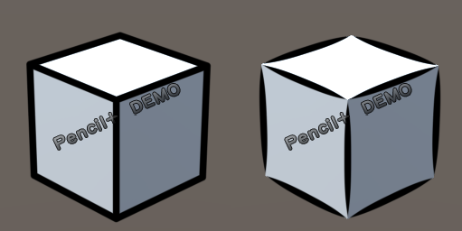
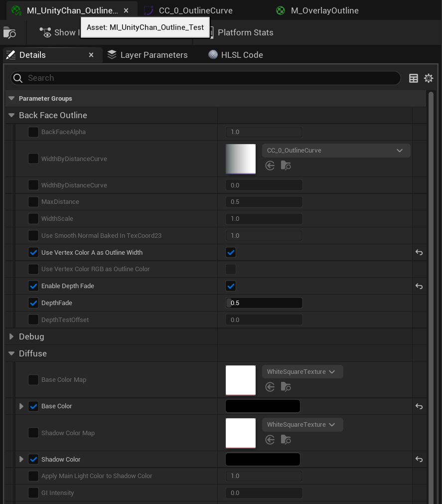

# 控制描边

## 描边和笔触

描边是指角色周围的勾线, 是实现三渲二, 让角色看起来像手绘的重要因素:

笔触是指一段描边起点到终点之间的宽度或颜色变化, 形成笔触的物理原因是笔尖在纸上压力的变化:

左: 无笔触; 右: 有笔触

宽度一致的描边比较容易实现, 带笔触的描边实现比较困难, 而是否有笔触则是让描边看起来更像手绘的关键因素, 因此笔触一直是描边技术的分水岭.

描边也有不同的**类型**:

## 描边和笔触的常见实现方法

**GUILTY GEAR的[分享](https://www.4gamer.net/games/216/G021678/20140703095/index_2.html)**详细讲述了三渲二中的描边技术.

以下列举了一些常见的实时描边渲染方法:

### 外描边

基于"背面"或"壳"的方法, 在角色之后再渲染一个角色背面的模型, 并沿法线挤出, 这是最经典的也是使用最广泛的描边技术, 挤出用的法线必须是平滑的, 否则描边在硬边处会断开. 只能渲染"Outline"类型, 因此将其简称为**外描边**.

可以用顶点色等方法控制宽度从而在局部模拟笔触:

左: 宽度可控的描边; 右: 用于控制宽度的顶点色

左: 肩膀处无宽度调整; 右: 肩膀处有宽度调整

### 内描边

与外描边相对, 直接画在贴图上的描边可以称之为**内描边**.

#### 本村线

贴图由于有分辨率限制, 画在贴图上的那描边在近距离观察时会出现像素化以及模糊.

本村・C・純也提出了一种叫"本村线"的方法, 通过特殊的UV布局和贴图, 可以获得无限高精度的完美描边:

左: 常规方法的描边; 右: 通过本村线现获得的描边

左: 本村线的UV和贴图; 中: 本村线的远景; 右: 本村线的近景

左: 常规方法的UV和贴图; 中: 常规方法的远景; 右: 常规方法的近景

该方法无需依赖渲染算法即可获得高精度的内描边, 但是美术师的工作量非常大.

#### SDF

还有一种[方法](https://zhuanlan.zhihu.com/p/113190695)通过将常规方法的内描边贴图转换为SDF以提高精度并且宽度可控, 类似于基于SDF的高精度文字渲染.

### 后处理描边

在屏幕空间内对深度 / 法线 / 颜色卷积计算得出的描边, 特点是全局生效, 耗时与场景复杂度无关, 且可以实现几乎全部的描边类型.

如果需要精细的控制角色描边的可见性与宽度, 需要对渲染管线做一些额外开发, 例如**二之国 (CG world 2018-06)**:

A: Base Color; B: 顶点色中边缘强度发生突变的地方会检测为描边; C: Mesh ID变化处也会被检测为描边; D: 描边结果 

### Pencil+

[Pencil+](https://www.psoft.co.jp/jp/product/pencil/unity/)是电影行业常用的描边插件, 其代表着行业最高的品质, 可控性和易用性.

但只能用于离线用途, 且目前并无UE版本.

### 其他

技术的更替是很快的, 近几年你可以看到[实时的带笔触的描边](https://github.com/JiangWZW/Realtime-GPU-Contour-Curves-from-3D-Mesh), [基于神经网络的描边](https://github.com/DifanLiu/NeuralStrokes)等新技术不断出现.

但我们对于极致的追求是不会变的, 利用好新的技术我们会更快的达到并且超越目标.

## 使用Houdini调整顶点色控制外描边宽度

左: 调整前; 右: 调整后

经过[之前的教程](/docs/Tutorial/AddAdvancedRenderingFeaturesToCharacters/ControlTheShapeOfShadows#使用Houdini传递自定义法线)你应该熟悉使用Houdini烘焙顶点数据的流程了, 在`Vertex_Color_Alpha_for_Outline`节点中包含所有描边宽度修改:

你可以使用类似的方式对你自己的模型直接指定或者绘制Alpha.

绘制完成后使用`OUTPUT_FBX`节点导出模型, 并导入UE.

按照[之前的教程](/docs/Tutorial/ImportANewCharacterAndSetupTheBasicMaterial#描边设置)设置描边.

然后设置以下材质参数, 你就能看到修改后的结果:

## 使用Curve控制不同距离下的外描边宽度

MooaToon使用Curve控制着描边在不同距离下的宽度:

曲线的X轴是当前像素在世界空间中的大小, 你可以简单理解为相机和角色的距离, 距离越近X越小反之X越大. Y轴是描边宽度. `Max Distance`控制X等于1时的距离.

得益于这独特的算法, 不同距离的描边宽度在各种复杂环境下都看起来正确, 比如不同的FOV / 长宽比 / 渲染分辨率:

<Video src={require("./assets/rider64_2023_04_16_16_00.webm").default}></Video>

:::caution

新增你自己的曲线时请在`MooaToon/MooaToon-Engine/Engine/Plugins/MooaToon/Content/Assets/CA_OutlineCurves`中复制并重命名一个, 以免更新MooaToon时被覆盖.

如果看不到该文件, 请确保已在内容浏览器中启用`显示引擎内容`:

并且更新预编译版MooaToon后, 由于所有重名文件已被覆盖, 你需要在`CA_OutlineCurves`中重新指定你创建的曲线.

:::

