# 控制阴影的形状

影响阴影形状的因素主要有**法线**, **自阴影**, **其他物体的投影**.

法线产生的阴影是指光线在照射到物体表面时, 表面法线和光线方向的夹角越大, 则单位面积受到的光照能量越少, 所以法线和光照方向越接近90º越暗:

## 自定义光线追踪阴影

得益于光线追踪可以获得具体的材质信息, 可以通过材质属性来控制光线追踪阴影的行为.

MooaToon提供了禁用Toon材质对自身的投影以及对其他不同ID的Toon材质的投影的功能.

要使用这些功能你首先需要为角色的不同部分设置不同的ID.

### 设置ID

MooaToon通过ID来判断射线当前命中的材质是否和射线起点的材质属于同一部分, 你可以选择以下两个方法中的一个设置ID:

#### ID Map

ID Map是指将角色的不同部位填充不同的纯色, 以便在制作贴图或者后期时方便抠图, 在影视工作流中通常是必备的贴图, 其分辨率可以很低, 只要保证不溢出UV边界即可.

通过使用ID Map你可以在一个材质中精确到像素地控制ID:

:::caution

受GBuffer位深限制, ID Map中不同的ID之间需要有足够的差异 (8 / 255).

ID Map的颜色空间必须是**线性**(在贴图资产中取消勾选sRGB).

:::

#### 分离材质并设置ID Offset

还有一种简单的办法, 你可以为角色不同部位设置不同的材质, 每个材质设置不同的`ID Offset`即可.

:::caution

这个方法虽然不需要ID Map, 但会产生更多的绘制调用, 请酌情使用.

:::

### 禁用自阴影

正确设置ID之后, 可以使用`Disable Self Shadow`来禁用角色各个部分的自阴影:

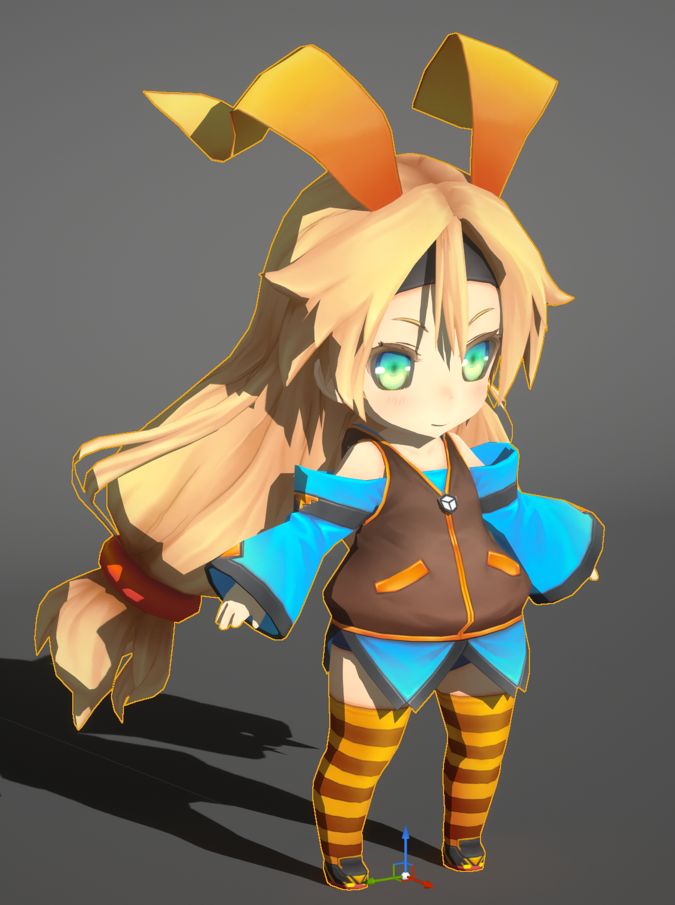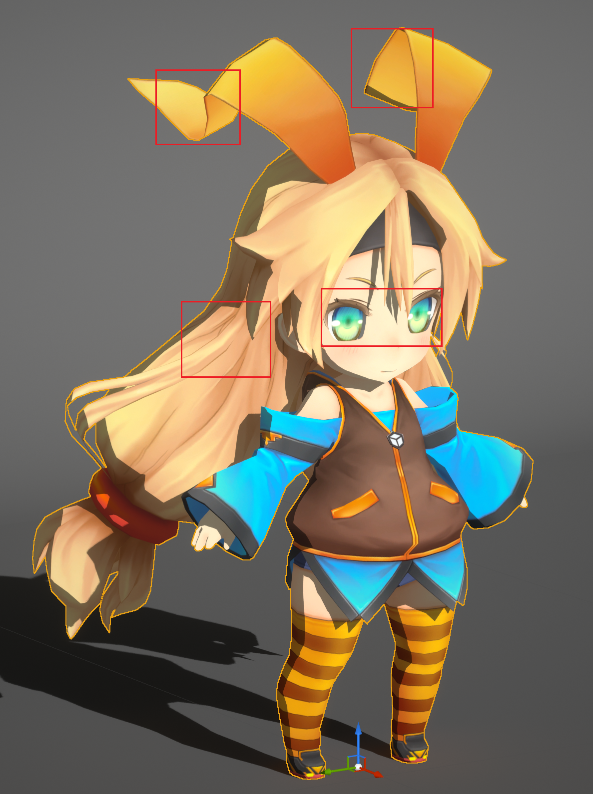

你可以看到角色每个部分对自身杂乱的自阴影已经消失.

### 禁用对其他不同ID的Toon材质的投影

接下来启用`Disable Cast Shadow on Toon`:

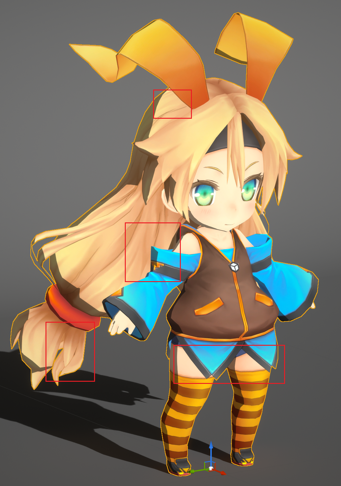

现在你可以看到除了法线阴影以外的阴影全部消失了.

### 设置头发对脸的投影

MooaToon对头发在脸上的阴影进行了特殊处理, 使用程序化的方法替代原有的发影, 以尽可能避免难看的发影.

MooaToon提供了**光线追踪发影**和**屏幕空间深度测试发影**两种程序化的方法, 本文会额外介绍一种只依靠美术资产的方法.

要使用MooaToon提供的方法, 你首先需要正确设置脸和头发的ID:

#### 设置脸和头发的ID

使用DCC软件打开你的ID Map, 记下脸和头发的ID对应`ID Channel`的值:

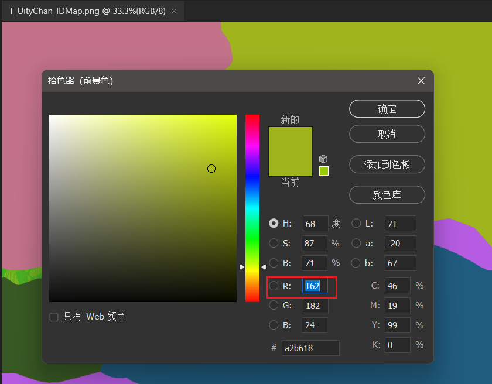

将`Face ID`和`Hair ID`设为对应的值:

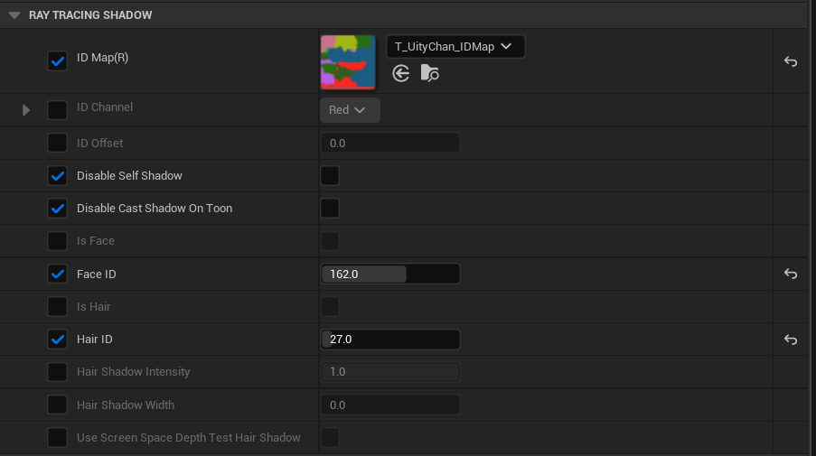

:::tip

还有一种简单的办法, 在脸的材质上启用`Is Face`, 在头发的材质上启用`Is Hair`, 这只适用于脸和头发都是单独材质的情况.

:::

现在无论`Disable Self Shadow`和`Disable Cast Shadow on Toon`设置如何, 头发始终不会对脸产生投影:

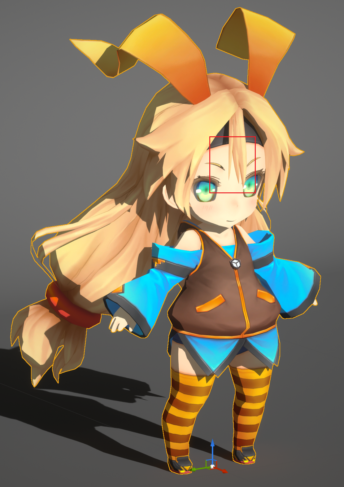

#### 光线追踪发影

正确设置脸和头发的ID之后, 只需调整`Hair Shadow Width`就可以看到光线追踪发影的结果:

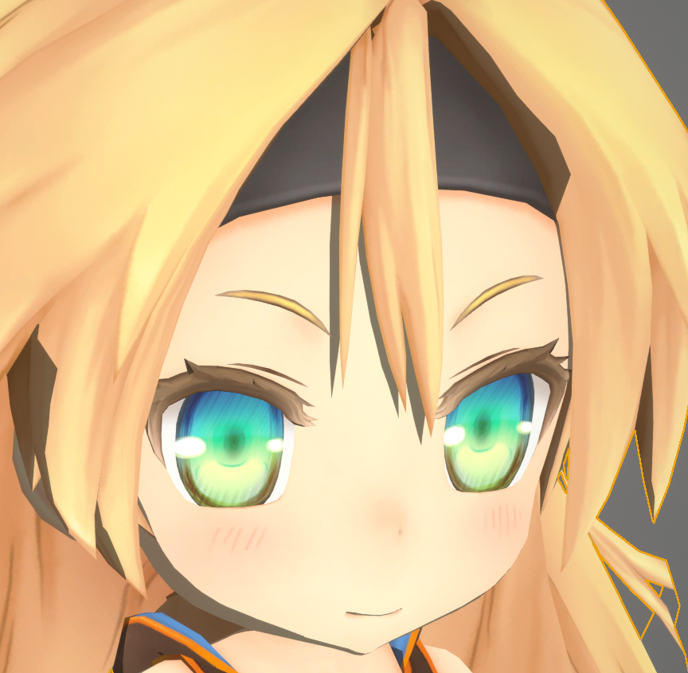
Hair Shadow Width: 0.3

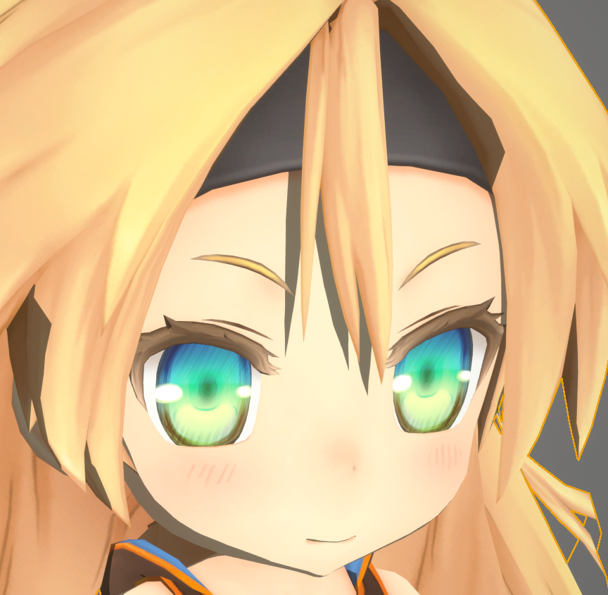
Hair Shadow Width: 0.5

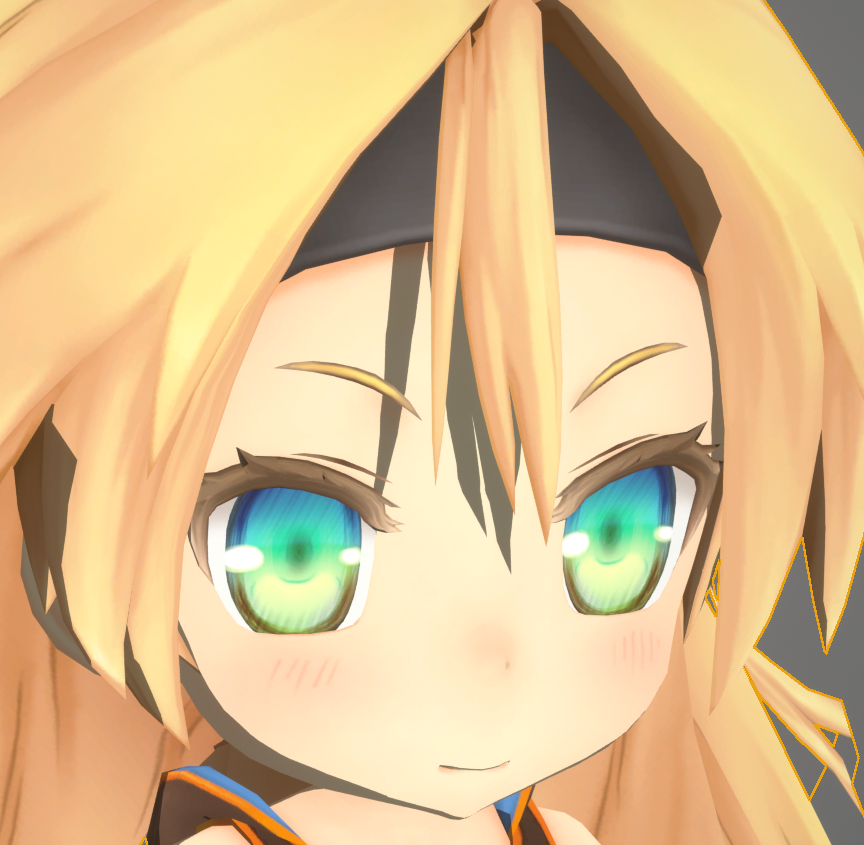
Hair Shadow Width: 1.0

其原理是将原本向光源方向发射的阴影射线, 向视线方向偏移, 于是射线方向和视线方向越接近, 阴影宽度也就越窄. 视频预览:

<Video src={require("./assets/UnrealEditor_2023_04_02_03_00.webm").default}></Video>

#### 屏幕空间深度测试发影

正确设置脸和头发的ID之后, 启用`Use Screen Space Depth Test Hair Shadow`即可:

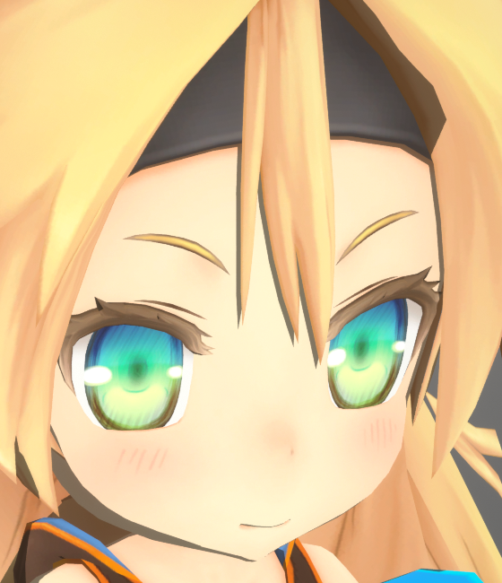
Hair Shadow Width: 0.2

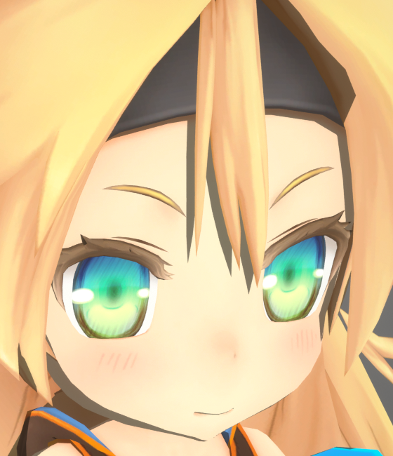
Hair Shadow Width: 0.3

Hair Shadow Width: 0.4

该方法更加简单, 着色当前像素时向光源方向平移一段距离后采样, 如果为头发则被遮挡.

所以该方法得到的发影的形状受视角影响更大:

<Video src={require("./assets/UnrealEditor_2023_04_02_03_57.webm").default}></Video>

#### 使用半透明模型作为发影

这种方法无需引擎支持, 请将Hair Shadow Width设为0禁用程序化发影.

由美术师制作一个单独的半透明模型放在头发下方作为阴影, 形状则由美术师完全可控.

请参考项目: [MIKONOTE Anime Toolbox Sample](https://assetstore.unity.com/packages/templates/tutorials/mikonote-anime-toolbox-sample-237176):

## 自定义法线阴影

### 使用Houdini传递自定义法线

### 使用Shadow Mask控制局部阴影

