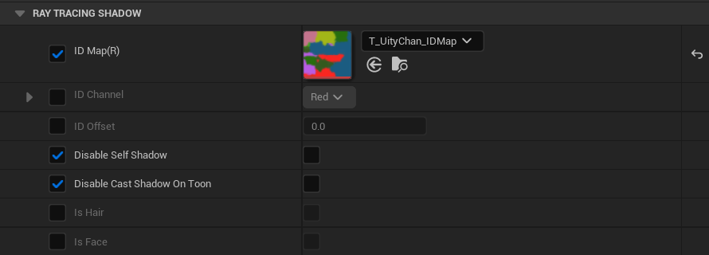
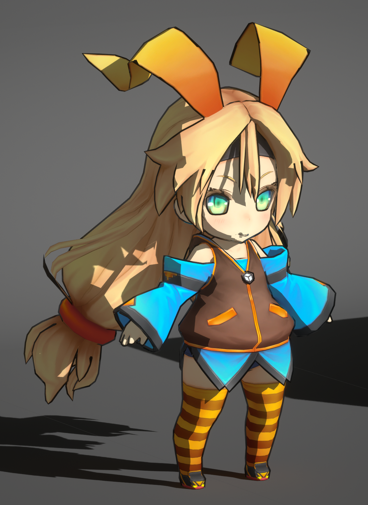
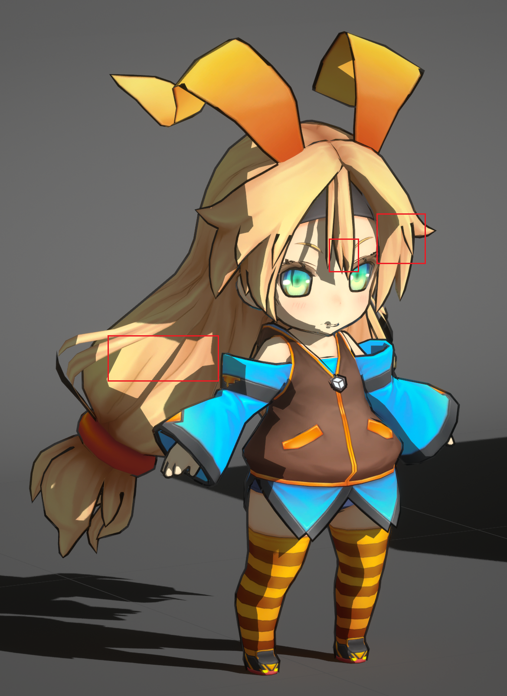
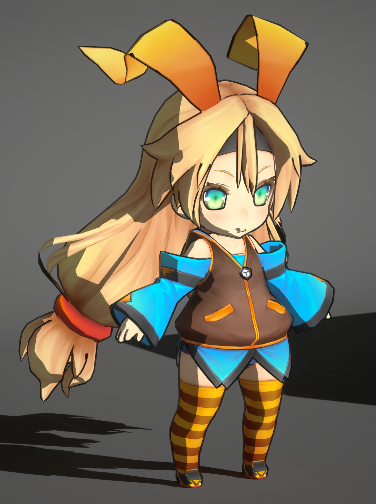
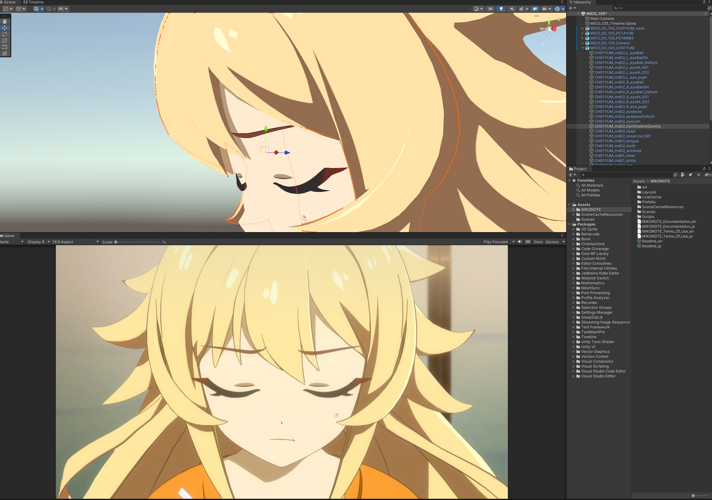

# 控制阴影的形状

影响阴影形状的因素主要有**法线**, **自阴影**, **其他物体的投影**.

法线产生的阴影是指光线在照射到物体表面时, 表面法线和光线方向的夹角越大, 则单位面积受到的光照能量越少, 所以法线和光照方向越接近90º越暗:

## 自定义光线追踪阴影

得益于光线追踪可以获得具体的材质信息, 可以通过材质属性来控制光线追踪阴影的行为.

MooaToon提供了禁用Toon材质对自身的投影以及对其他不同ID的Toon材质的投影的功能.

要使用这些功能你首先需要为角色的不同部分设置不同的ID.

### 设置ID

MooaToon通过ID来判断射线当前命中的材质是否和射线起点的材质属于同一部分, 你可以选择以下两个方法中的一个设置ID:

#### ID Map

通过使用ID Map你可以在一个材质中精确到像素地控制ID:

受GBuffer位深限制, ID Map中不同的ID之间需要有足够的差异 (8 / 255).

#### 分离材质并设置ID Offset

还有一种简单的办法, 你可以为角色不同部位设置不同的材质, 每个材质设置不同的ID Offset即可.

这个方法虽然不需要ID Map, 但会产生更多的绘制调用, 请酌情使用.

### 禁用自阴影

正确设置ID之后, 可以使用`Disable Self Shadow`来禁用角色各个部分的自阴影:

你可以看到角色每个部分对自身杂乱的自阴影已经消失.

### 禁用对其他不同ID的Toon材质的投影

接下来启用`Disable Cast Shadow on Toon`:

现在你可以看到除了法线阴影以外的阴影全部消失了.

### 设置头发对脸的投影

MooaToon提供了**光线追踪发影**和**屏幕空间深度测试发影**两种程序化的方法, 使头发在脸上的投影尽可能的干净:

#### 光线追踪发影

#### 屏幕空间深度测试发影

#### 使用半透明模型作为发影

这种方法无需引擎支持, 是由美术师制作一个单独的半透明模型放在头发下方作为阴影, 形状则由美术师完全可控.

请参考项目: [MIKONOTE Anime Toolbox Sample](https://assetstore.unity.com/packages/templates/tutorials/mikonote-anime-toolbox-sample-237176):

## 自定义法线阴影

### 使用Houdini传递自定义法线

### 使用Shadow Mask控制局部阴影

