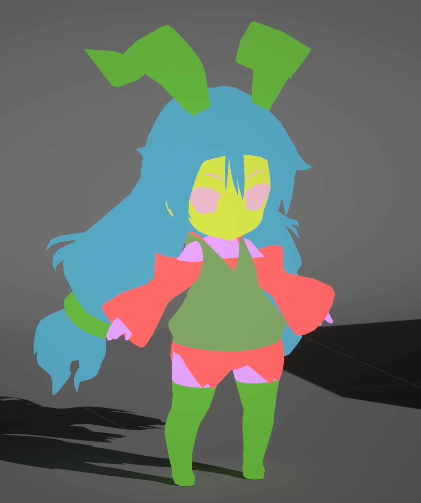
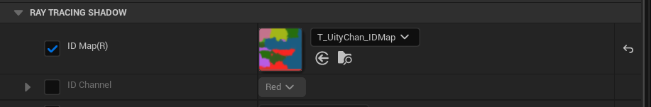
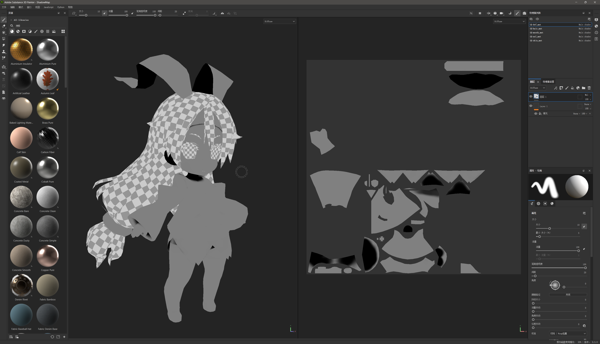

# 控制阴影的形状

影响阴影形状的因素主要有**法线**, **自阴影**, **其他物体的投影**.

法线产生的阴影是指光线在照射到物体表面时, 表面法线和光线方向的夹角越大, 则单位面积受到的光照能量越少, 所以法线和光照方向越接近90º越暗:


## 自定义光线追踪阴影

得益于光线追踪可以获得具体的材质信息, 可以通过材质属性来控制光线追踪阴影的行为.

MooaToon提供了禁用Toon材质对自身的投影以及对其他不同ID的Toon材质的投影的功能.

要使用这些功能你首先需要为角色的不同部分设置不同的ID.

### 设置ID

MooaToon通过ID来判断射线当前命中的材质是否和射线起点的材质属于同一部分, 你可以选择以下两个方法中的一个设置ID:

#### ID Map

ID Map是指将角色的不同部位填充不同的纯色, 以便在制作贴图或者后期时方便抠图, 在影视工作流中通常是必备的贴图, 其分辨率可以很低, 只要保证不溢出UV边界即可.



通过使用ID Map你可以在一个材质中精确到像素地控制ID:



:::caution

受GBuffer位深限制, ID Map中不同的ID之间需要有足够的差异 (8 / 255).

ID Map的颜色空间必须是**线性**(在贴图资产中取消勾选sRGB).

:::

#### 分离材质并设置ID Offset

还有一种简单的办法, 你可以为角色不同部位设置不同的材质, 每个材质设置不同的`ID Offset`即可.

:::caution

这个方法虽然不需要ID Map, 但会产生更多的绘制调用, 请酌情使用.

:::

### 禁用自阴影

正确设置ID之后, 可以使用`Disable Self Shadow`来禁用角色各个部分的自阴影:

|  |  |
| ------------------------------------------------------------ | ------------------------------------------------------------ |

你可以看到角色每个部分对自身杂乱的自阴影已经消失.

### 禁用对其他不同ID的Toon材质的投影

接下来启用`Disable Cast Shadow on Toon`:

|  |  |
| ------------------------------------------------------------ | ------------------------------------------------------------ |

现在你可以看到除了法线阴影以外的阴影全部消失了.

### 设置头发对脸的投影

MooaToon对头发在脸上的阴影进行了特殊处理, 使用程序化的方法替代原有的发影, 以尽可能避免难看的发影.

MooaToon提供了**光线追踪发影**和**屏幕空间深度测试发影**两种程序化的方法, 本文会额外介绍一种只依靠美术资产的方法.

要使用MooaToon提供的方法, 你首先需要正确设置脸和头发的ID:

#### 设置脸和头发的ID

使用DCC软件打开你的ID Map, 记下脸和头发的ID对应`ID Channel`的值:


将`Face ID`和`Hair ID`设为对应的值:


:::tip

还有一种简单的办法, 在脸的材质上启用`Is Face`, 在头发的材质上启用`Is Hair`, 这只适用于脸和头发都是单独材质的情况.

:::

现在无论`Disable Self Shadow`和`Disable Cast Shadow on Toon`设置如何, 头发始终不会对脸产生投影:


#### 光线追踪发影

正确设置脸和头发的ID之后, 只需调整`Hair Shadow Width`就可以看到光线追踪发影的结果:

|  |  |  |
| ------------------------------------------------------------ | ------------------------------------------------------------ | ------------------------------------------------------------ |
| <center>Hair Shadow Width: 0.3</center>                      | <center>Hair Shadow Width: 0.5</center>                      | <center>Hair Shadow Width: 1.0</center>                      |

其原理是将原本向光源方向发射的阴影射线, 向视线方向偏移, 于是射线方向和视线方向越接近, 阴影宽度也就越窄. 视频预览:

<Video src={require("./assets/UnrealEditor_2023_04_02_03_00.webm").default}></Video>

#### 屏幕空间深度测试发影

正确设置脸和头发的ID之后, 启用`Use Screen Space Depth Test Hair Shadow`即可:

|  |  |  |
| ------------------------------------------------------------ | ------------------------------------------------------------ | ------------------------------------------------------------ |
| <center>Hair Shadow Width: 0.2</center>                      | <center>Hair Shadow Width: 0.3</center>                      | <center>Hair Shadow Width: 0.4</center>                      |

该方法更加简单, 着色当前像素时向光源方向平移一段距离后采样, 如果为头发则被遮挡.

所以该方法得到的发影的形状受视角影响更大:

<Video src={require("./assets/UnrealEditor_2023_04_02_03_57.webm").default}></Video>

#### 使用半透明模型作为发影

这种方法无需引擎支持, 请将Hair Shadow Width设为0禁用程序化发影.

由美术师制作一个单独的半透明模型放在头发下方作为阴影, 形状则由美术师完全可控.

请参考项目: [MIKONOTE Anime Toolbox Sample](https://assetstore.unity.com/packages/templates/tutorials/mikonote-anime-toolbox-sample-237176):


## 自定义法线阴影

手动编辑法线以避免难看的阴影是工业界的经典技术, [Guilty Gear的分享](https://www.4gamer.net/games/216/G021678/20140703095/)是其中的代表:

<center>左: 原始的法线; 右: 原始法线对应的阴影</center>

<center>左: 手动编辑过的法线; 右: 编辑过的法线对应的阴影, 干净了很多</center>

这种工艺的美术工作量很大, 对于模型的要求很苛刻, 并且通常需要长时间的技术积累.

另一种便捷一些的方法是替换简化过的模型的法线:

<center>左: 原始法线产生的阴影; 右: 替换过的法线产生的阴影</center>

<center>替换使用的简化模型</center>

MooaToon提供了使用Houdini进行法线替换的示例文件.


分享中还涉及两种作用于Shadow Gradient的方法:

<center>左: 顶点色通道, 外观接近环境光遮蔽, 使该处更容易产生法线阴影; 中右: 设置前后对比, 注意裤子和大腿肌肉处比设置之前更早的产生了阴影</center>

<center>左: ILM贴图G通道; 中右: 设置前后对比, 在裙子等固定位置产生阴影</center>

MooaToon提供的Shadow Gradient相关功能足以实现这些效果.


### 使用Houdini传递自定义法线

[Houdini](https://www.sidefx.com/products/houdini/)是电影和游戏行业的常用DCC软件, 其强大的节点化工作流和几何功能非常适合用来对角色进行一些程序化的调整, 比如说调整法线, 烘焙AO / Curvature / 任何自定义数据到顶点色和UV, 并且每一步都使用节点表示, 你可以任意修改其顺序和参数而不破坏其他修改.

:::tip

如果只是传递法线, 其他DCC软件也能简单的做到这一点:

Blender: [https://www.youtube.com/watch?v=qgr0AR8R9yg](https://www.youtube.com/watch?v=qgr0AR8R9yg)

Maya: [https://www.youtube.com/watch?v=6LdtlJ71000](https://www.youtube.com/watch?v=6LdtlJ71000), [https://80.lv/articles/creating-stylized-leaves-in-maya/](https://80.lv/articles/creating-stylized-leaves-in-maya/)

3ds Max: http://www.scriptspot.com/3ds-max/scripts/normal-thief

:::

#### 安装

首先你需要确保已经安装了19.5.493以上版本的Houdini, 然后你需要安装[GameDevelopmentToolset](https://github.com/sideeffects/GameDevelopmentToolset):

1. [下载GameDevelopmentToolset](https://github.com/sideeffects/GameDevelopmentToolset/archive/refs/heads/Development.zip), 并解压到你觉得合适的目录.
2. 使用文本编辑器打开`C:\Users\YOUR USER NAME\Documents\houdini19.5\houdini.env`
3. 像这样设置`HOUDINI_PATH`和`PATH`的值为安装目录:
```
HOUDINI_PATH = C:\GameDevelopmentToolset;&
PATH = C:\GameDevelopmentToolset\bin;$PATH
```
4. 复制一份并打开`MooaToon\MooaToon-Project\Art\Models\UnityChanSD.hip`:


#### 使用

:::tip

如果你是Houdini新手, 这有些[教程](https://www.youtube.com/watch?v=Tsv8UGqDibc&list=PLhyeWJ40aDkUDHDOhZQ2UkCfNiQj7hS5W)可以帮助你快速入门.

:::

`Fbx Character Import`负责导入模型, 你可以修改路径以导入自己的模型:


左侧输出 (Rest Geometry) 包含几何信息, 大部分修改都是针对几何的.

中间输出 (Capture Pose) 包含蒙皮信息, 这里无需修改. Houdini相比其他DCC软件的一大优势就是微调几何不会破坏蒙皮.

右侧输出 (Animated Pose) 包含动画关键帧信息, 用于修改角色姿势以及表情.

接下来双击打开`Face_Normal`节点:


在这里我将脸的法线替换成了一个光滑的椭球体的法线.

在工具栏中将光照模式切换到`Normal Lighting`, 然后调整左下角的光照方向以预览法线阴影.

如果要使用你自己的模型, 需要修改`attribtransfer1`节点的`Destination Group`为你的角色的脸部, 然后通过`transform1`调整球体的位置和缩放.

对于头发部分的处理和脸类似, 修改后的法线和其阴影如下:


#### 导出

将下面几个无关节点暂时禁用, 然后选中`OUTPUT_FBX`节点, 修改`Output FBX File`路径后点击`Save to Disk`以导出修改后的模型:


:::tip

[免费版Houdini不提供FBX导出功能](https://www.sidefx.com/products/compare/), 你也可以尝试导出为OBJ格式.

:::

#### 导入UE

导入刚刚的模型到UE, `Normal Import Method`必须为`Import Normals and Tangents`, 以下是我使用的导入设置:


为其设置材质后放到场景中验收效果:

<Video src={require("./assets/UnrealEditor_2023_04_08_16_43.webm").default}></Video>

现在 (右) 阴影的形状已经干净多了, Great Job!


### 使用Shadow Gradient控制局部阴影

在MooaToon中, Shadow Gradient是指法线与光线方向之间的角度:

<center>左: 未修改的法线阴影; 右: 对应的Shadow Gradient</center>

<center>添加Noise到`Shadow Gradient Offset`, 会使阴影经过此处时边缘的位置产生偏移</center>

<center>添加Noise到`Shadow Intensity Offset`, 会直接在当前位置控制阴影产生的时机</center>

#### 绘制Shadow Mask

现在你可以绘制Shadow Mask为角色添加固定位置的阴影, 比如脖子下方.

Shadow Mask的背景色应该为0.5, 然后在R通道绘制`Shadow Intensity Offset`:

- 值为0: 该位置永远是阴影
- 值为0.5: 不影响阴影
- 值为1: 该位置永远不会处于阴影

:::caution

Shadow Mask只影响法线阴影, 不会影响其他物体的投影.

:::



:::tip

这里的Shadow Mask是使用最新版本的Substance 3D Painter绘制, Substance 3D Designer合成的.

源文件在: `MooaToon\MooaToon-Project\Art\Models\NewTextures\ShadowMap.spp`和`MooaToon\MooaToon-Project\Art\Models\NewTextures\ShadowMapCombine.sbs`.

这仅仅是为了绘制贴图更方便, 你也可以选择其他你更熟悉的DCC软件.

:::

#### 导入UE

绘制完成后将贴图导入UE, 然后在贴图设置中禁用sRGB:


:::tip

这一步是为了保证Shader以线性的方式采样贴图, 才能够采样到正确的背景色值.

:::

然后设置材质参数`Shadow Mask Map`和`Shadow Intensity Offset Intensity`:


现在 (右) 脖子下方已经有了固定位置的阴影.

:::tip

你也可以使用顶点色的替代Shadow Mask贴图, 只需启用`Use Vertex Color Instead Shadow Mask Map`.

需要注意顶点色同样有颜色空间的问题, 你可以用`Use Vertex Color In sRGB Space`控制是否使用伽马校正, 你可以先将所有顶点色设为0.5已验证背景色是否正确.

虽然使用顶点色替代贴图可以用很少的内存获得极高的精度, 但由于顶点之间存在线性插值, 模型的拓扑对于最终的效果影响会很大. 所以在早期建模的时候就要考虑到如何布线以获得最佳效果.

:::

#### 将光照变化从Base Color移到Shadow Mask

有一些过时的工作流会将光照变化画到Base Color Map中, 这不利于表现干净的画面, 也不适用于动态的阴影和全局光照, [这篇文章](https://muro.fanbox.cc/posts/1657633)介绍了如何将其重绘为动画风格的贴图:


在MooaToon中可以利用Shadow Mask将左侧贴图中的静态光照变化拆解为动态的Base Color + Shadow Color + Highlight.


## 自定义阴影颜色

