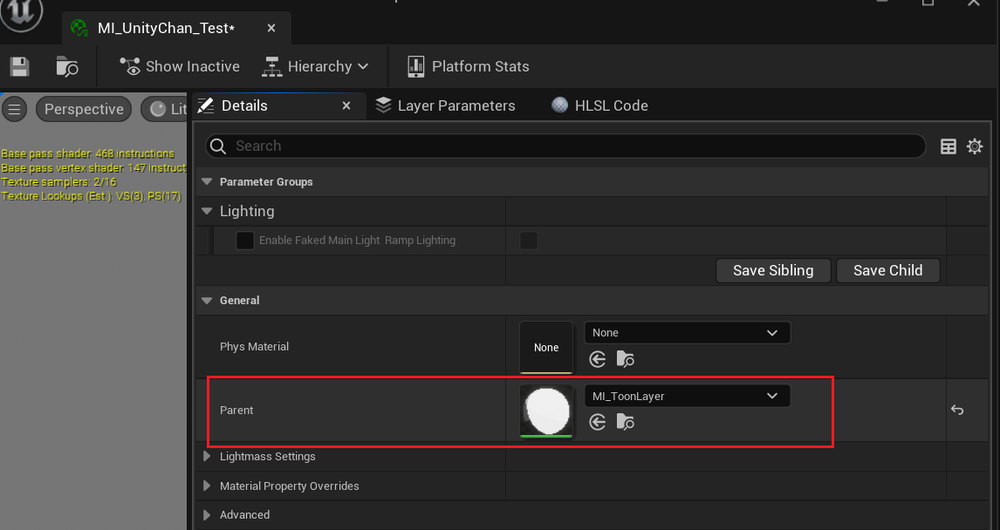
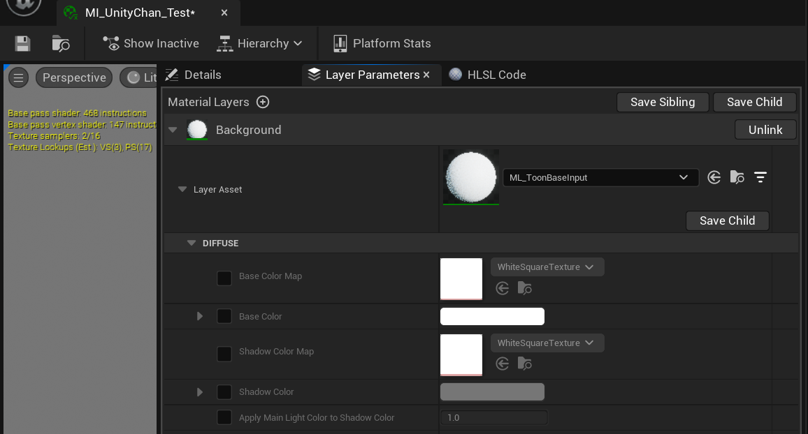
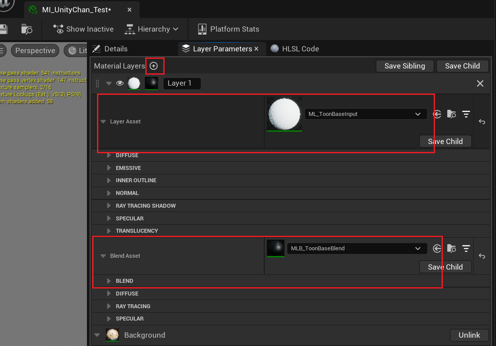
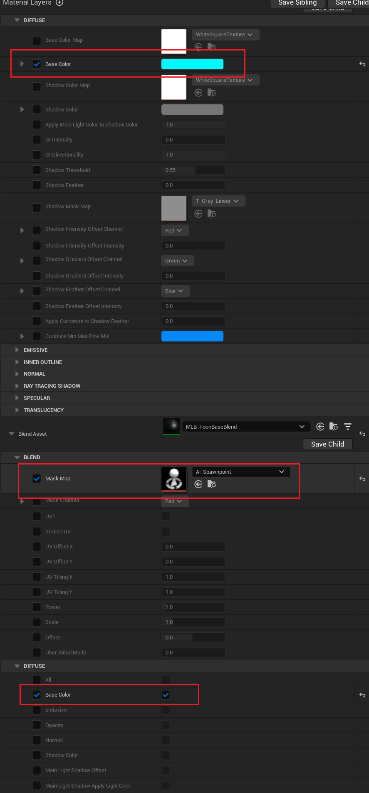

# 使用材质图层创建复杂材质

MI_Toon是普通材质, 其有着简单且固定的输入, 可以用于制作简单效果.

但如果你要为头发各向异性高光, 或叠加不同类型的材质或花纹到原有材质, 你需要使用分层材质.

UE的[分层材质](https://docs.unrealengine.com/5.1/zh-CN/layering-materials-in-unreal-engine/)可以让你自由组合不同类型的[材质图层](https://docs.unrealengine.com/5.1/zh-CN/using-material-layers-in-unreal-engine/), 调整顺序和混合模式.

## 将材质转换为分层材质

在材质编辑器中将父材质替换为MI_ToonLayer:

然后你可以在图层参数中找到原有参数:

:::caution

**注意, 这一步会丢失已经调整过的数值!** 所以要尽可能早的决定是否使用分层材质.

:::

:::info

这里有一些关于分层材质的[重要提示](/docs/FAQ#材质编辑).

:::

## 使用材质图层

现在你可以添加[材质图层](https://docs.unrealengine.com/5.1/zh-CN/using-material-layers-in-unreal-engine/)并创建复杂效果:

修改以下参数:

你可以看到以下变化:

也就是说使用材质图层添加新的效果, 使用图层混合控制其如何叠加到下面的图层.

