插画中的头发高光形态各异 (作者: [おののいもこ 魚介](https://twitter.com/_himehajime)):

|  | 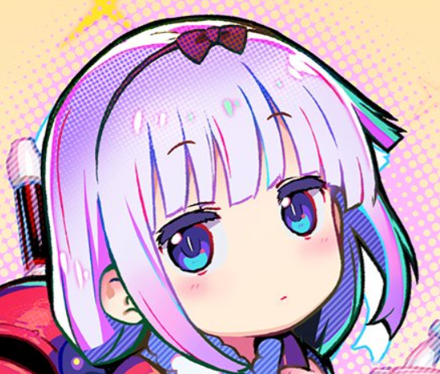 | 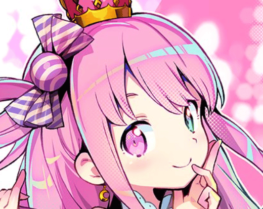 |
| ------------------------------------------------------------------ | ------------------------------------------------------------------ | ------------------------------------------- |
| 环状                                                             | 点状                                                             | 天使环                                    |

下文提供了常见的头发高光实现方法, MooaToon示例中使用的方法是独创的**基于切线传递的风格化Kajiya-Kay**:

## - 基于切线传递的风格化Kajiya-Kay

<Video src={require("./assets/bandicam 2024-08-10 17-19-49-631.webm").default}/>

Kajiya-Kay高光的位置依赖于视线方向和切线方向, 通过切线传递可以自定义切线, 从而控制高光的形状和走向, 而不受拓扑的限制.

再加上对Specular Gradient的控制可以进一步细化高光形状, 理论上可以实现所有类型的高光.

要使用该方法需要先将自定义的切线烘焙到模型UV中, MooaToon使用Houdini进行烘焙, 并提供所有源文件:

### 使用Houdini烘焙自定义切线

用到的节点已经包含在[之前的教程](ControlTheShapeOfShadows#--使用houdini传递自定义法线)中.

在`mooa_highlightTangentTransfer`节点中, 椭球体的切线被传递给了头发:

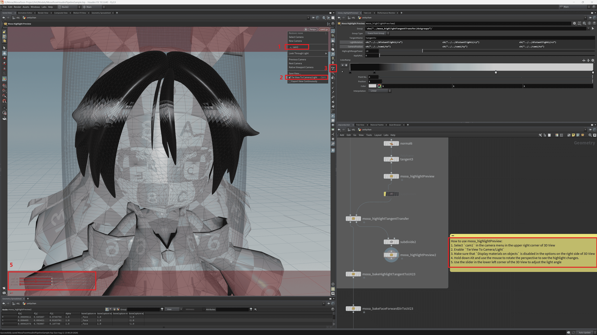

使用`mooa_highlightPreview2`节点预览高光范围:
1. 在3D View右上角相机菜单中选择`cam1`
2. 启用`Tie View To Camera/Light`
3. 确保3D View右侧选项中已禁用`Display materials on objects`
4. 按住Alt使用鼠标旋转视角查看高光变化
5. 使用3D View左下角的滑条调整灯光角度

<Video src={require("./assets/bandicam 2024-08-14 01-04-10-750.webm").default}/>

如果要使用你自己的模型, 你需要:

1. 修改`mooa_highlightTangentTransfer`节点中的`Destination Group`, 选中你的模型的头发部分
2. 修改`mooa_highlightTangentTransfer`第二个输入, 你可以直接修改椭球体的`transform5`节点以自定义高光形状, 也可以替换为新的几何输入

准备好后按照[之前的教程](ControlTheShapeOfShadows#将模型导入ue)将模型导出到UE, 然后如下图调整头发材质:

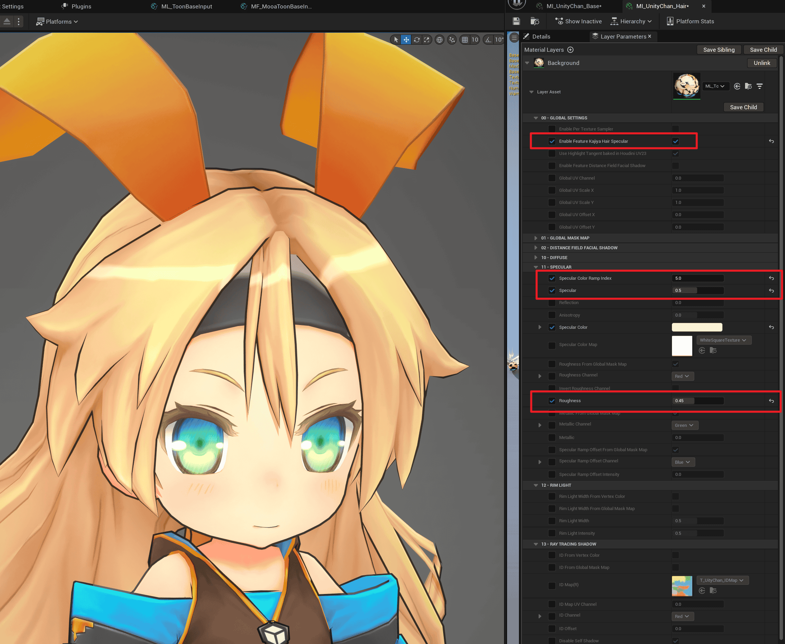

使用`Ctrl + L`调整灯光方向, 你就能看到形状和Houdini中类似的动态高光.

接下来可以通过Mask控制高光细节形状.

### 绘制Specular Mask精确控制高光形状

类似于[绘制Shadow Mask Map](ControlTheShapeOfShadows#在substance-3d-painter中绘制mask-map), Highlight Mask的示例源文件位于`MooaToon\MooaToon-Project\Art\Models\NewTextures\HairHighlightMaskMap.spp`:

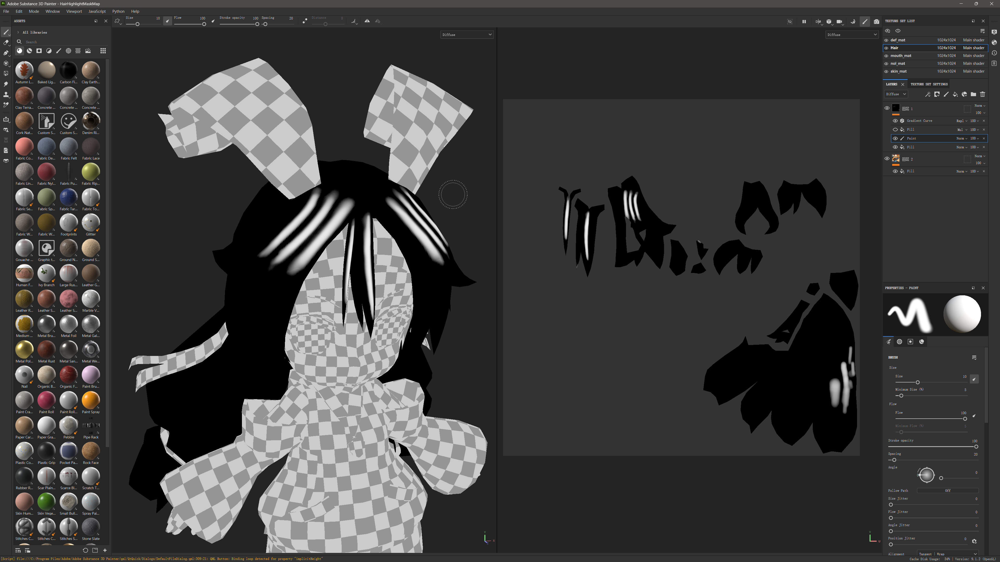

背景色为0, 想要出现高光的区域绘制1.

绘制完成后将贴图导出到UE, 取消勾选sRGB. 然后设置为`Specular Color Map`:

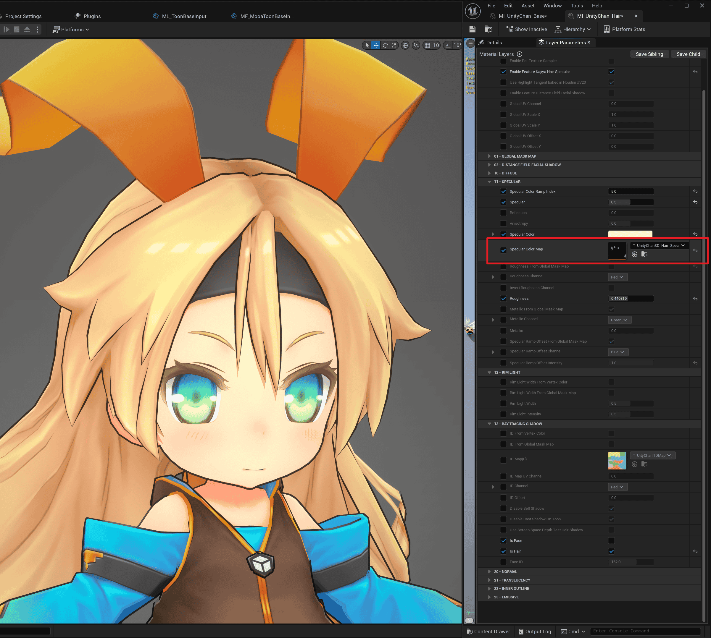

不想要的高光已被擦除. 

接下来你可以选择直接添加Noise到`Specular Ramp Offset`:

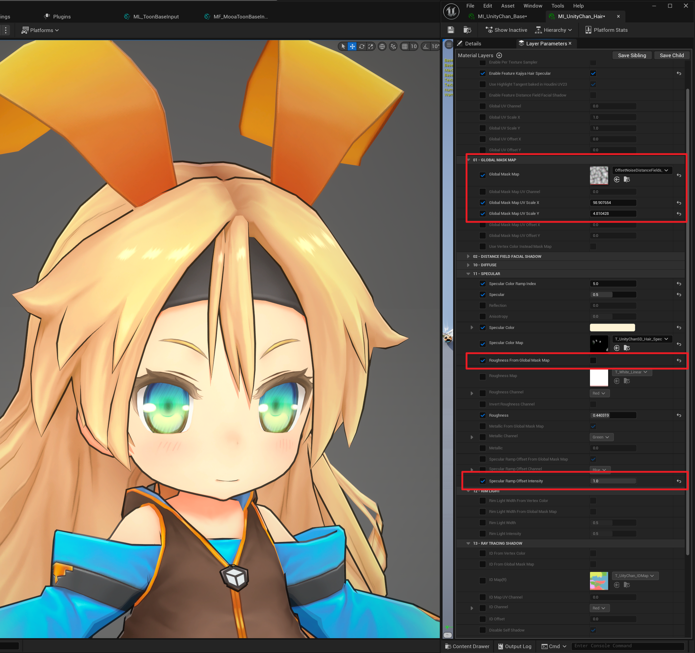

或者将`Specular Color Map`复制一份并将亮度降低一半 (最大值从1降低到0.5), 然后设置为`Specular Ramp Offset Map`:

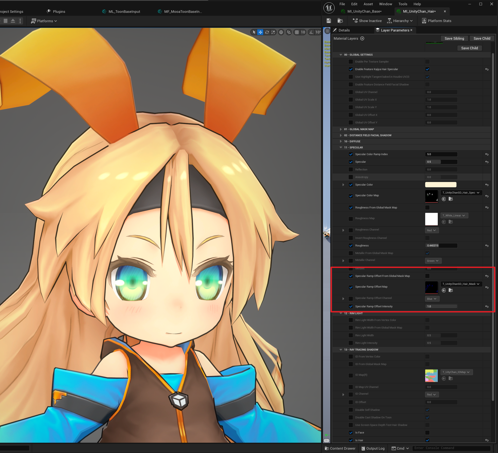

可见高光的锐角已经变成圆角.

### 使用Specular Color Ramp控制高光颜色过渡

类似于[Diffuse Color Ramp](ControlLightShadowColorTransition), 也可以使用Specular Color Ramp来控制高光颜色过渡.

Specular Color Ramp RGB通道的值为Specular Color, 横轴是PBR Specular的相对亮度:

- 0为最小亮度 (对应距离Specular中心最远处)
- 0.5为中间值 (对应PBR Specular根据经验二值化后的范围)
- 1为最大亮度 (对应Specular的中心)

直观表示如下:

|                                                              | 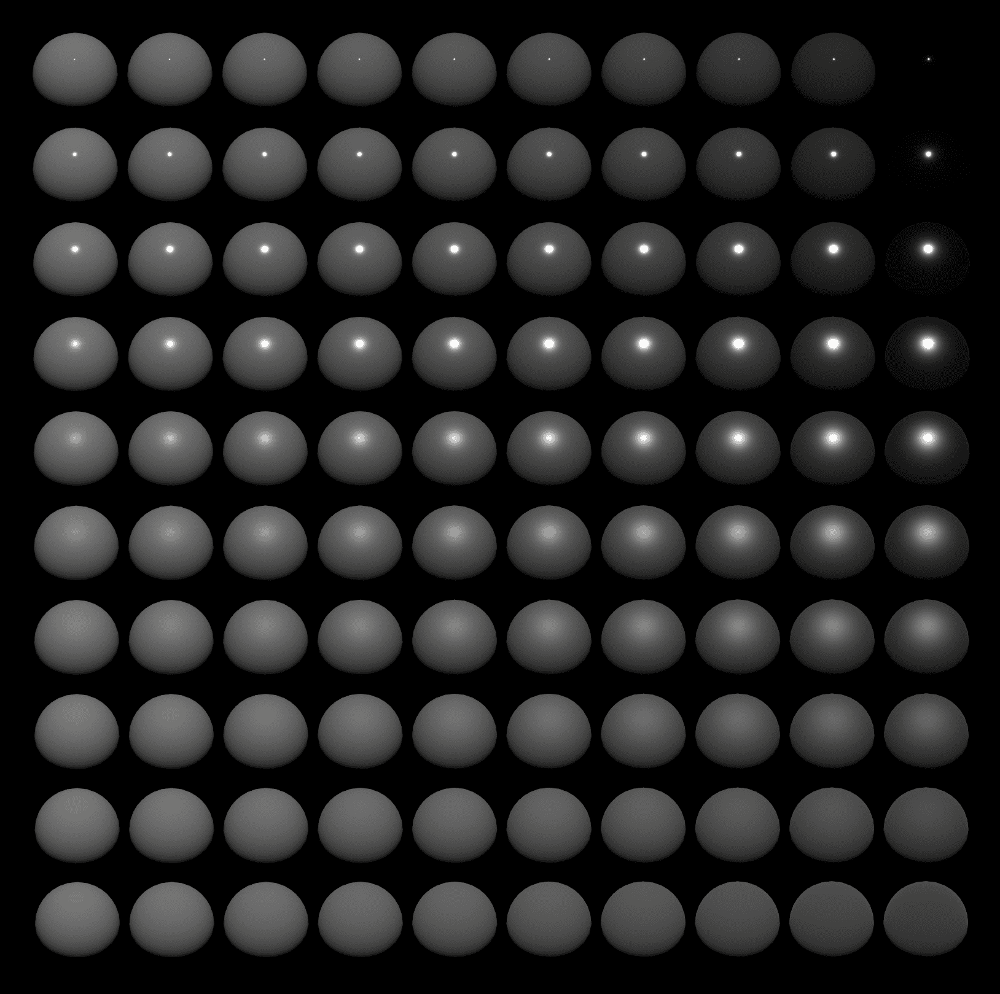 |
| ------------------------------------------------------------ | ------------------------------------------------------------ |
|                                                              | PBR Specular 金属度从左到右增加 粗糙度从上到下增加   |
| 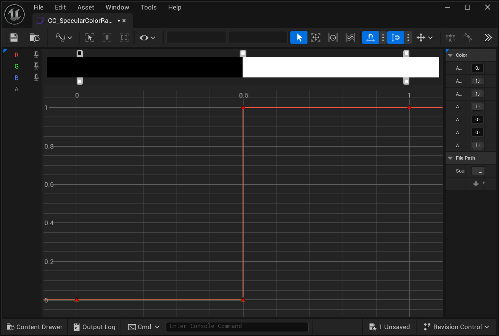 |  |
| Specular Color Ramp在0.5处二值化                             | Toon Specular 二值化高光范围与PBR近似                    |
| 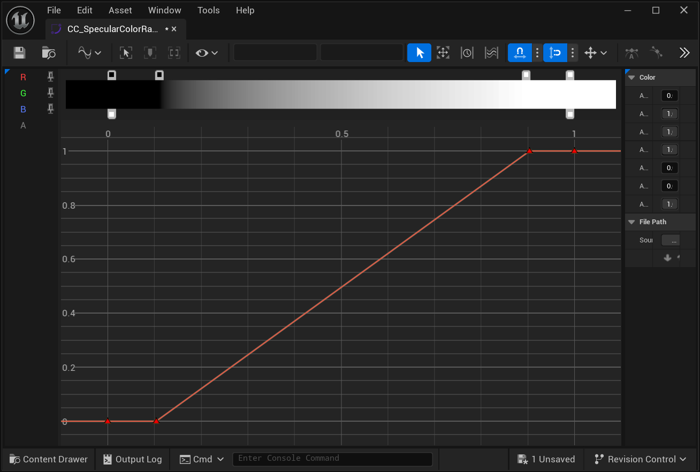 | 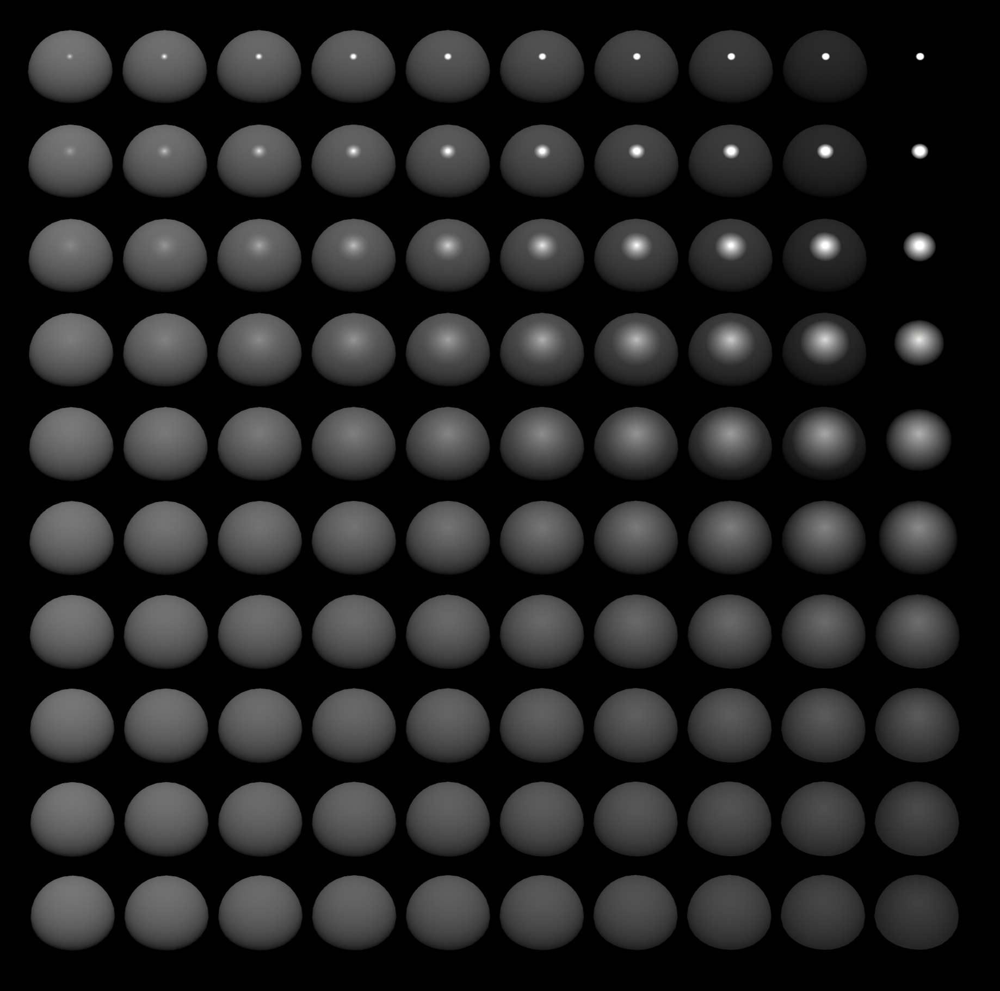 |
| 从0到1渐变                                                   | 边缘柔和过渡的高光                                           |
|  |  |
| 带有多种颜色的渐变                                           | 边缘带颜色过渡的高光                                         |

## - 绘制在贴图上

静态, 无光照, 但可控性最佳, 适合固定视角游戏或视频.

## - 基于物理的头发渲染

这类方法的目标是尽可能渲染出接近现实的头发, 因此只适用于写实风格的作品:

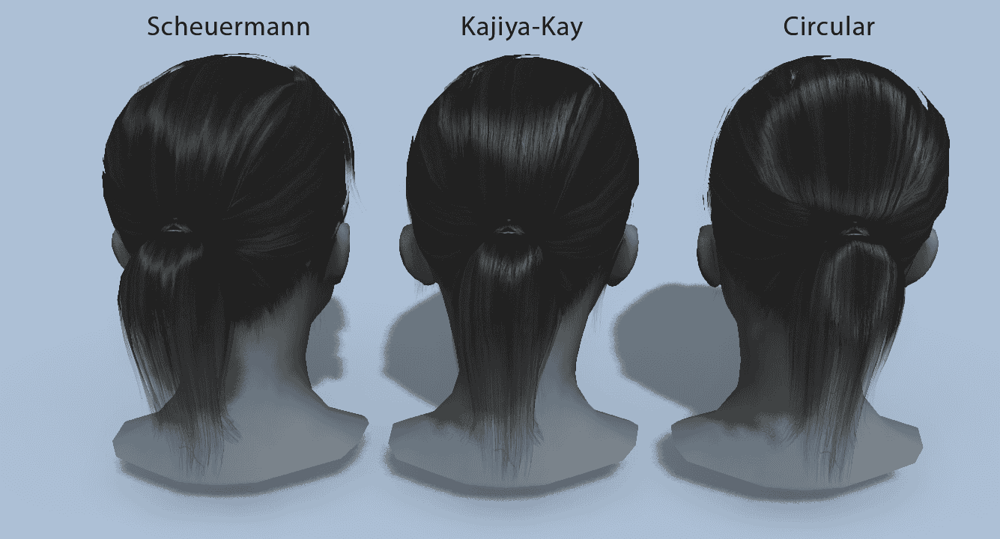

## - 材质捕捉 (MatCap)

请参考[UTS](https://docs.unity3d.com/Packages/com.unity.toonshader@0.9/manual/MatCap.html).

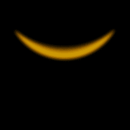
MatCap Map Example

|  |  |
| ------------------------------------ | --------------------------------- |
| MatCap Map Off                     | MatCap Map On                   |

这种方法仅支持单个主光源, 形状虽然可以通过MatCap Map自定义, 但高光形状依然受限于拓扑的影响, 在模型的面数较低或者结构不合理时经常出现难看的高光, 适合对高光形状要求不高的游戏作品.

## - 贴图投射

请参考[UTS](https://docs.unity3d.com/Packages/com.unity.toonshader@0.9/manual/AngelRing.html).

|  | 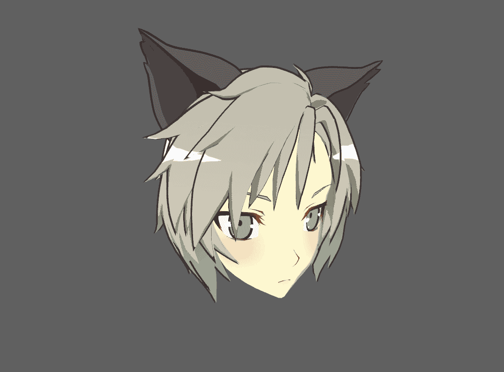 |
| --------------------------------- | ------------------------------------------------- |
| Example Texture                 | Texture Projection On                           |

该方法沿视线方向投射贴图到头发上, 适合无论哪个角度看都一样的天使环高光. 适用于特定风格的游戏.
