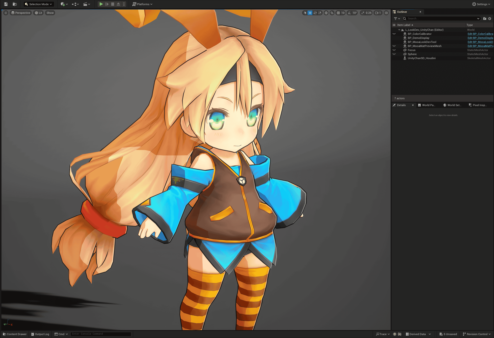
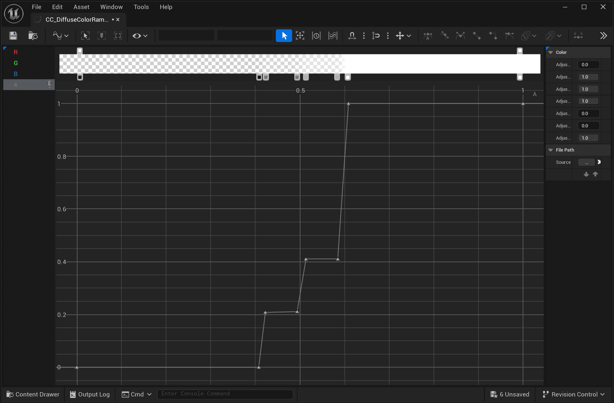
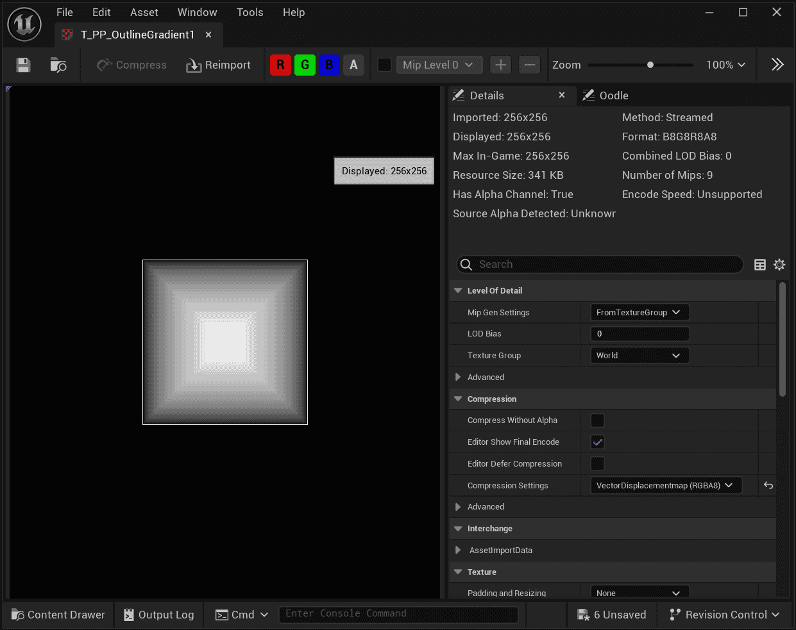
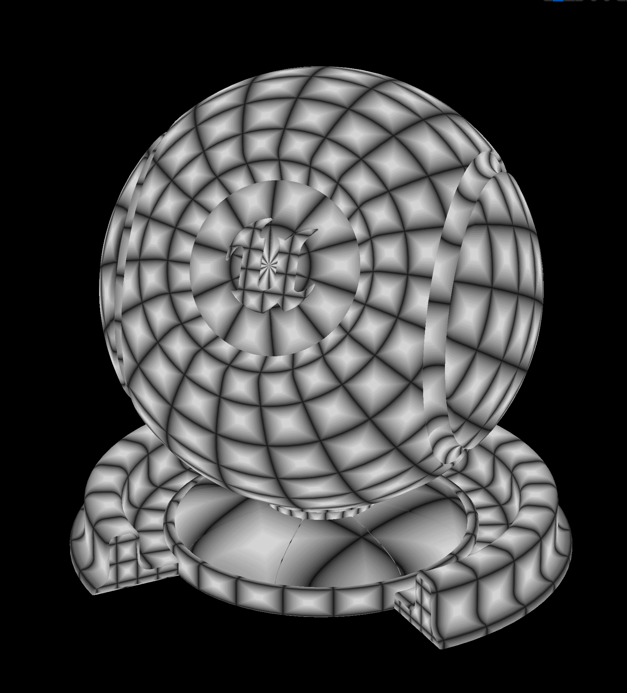

MooaToon使用Ramp Map来表示亮面到暗面之间的颜色过渡:

| 默认Ramp + 单光源<br/>普通二值化阴影过渡         |  |
| ---------------------------------- | ---------------------------------------------------------------- |
| 3Levels Ramp + 单光源<br/>阴影过渡现在有3个色阶 |  |
| 3Levels Ramp + 多光源                 |  |

Ramp是一种1D查找表(LUT), 其中存储着用户预定义的Curve, 在UE中表示为Color Curve:


通过将多个Color Curve竖向排列可以组成一个Curve Atlas贴图, 其中每个Color Curve占一行像素:


从MooaToon 5.4开始使用Global Diffuse Color Ramp和Global Specular Color Ramp, 通过将所有Ramp放到Atlas中, 并在每个材质中指定使用哪个Ramp, 即可实现多光源Ramp光照.

## 选择使用哪个Ramp

先在项目设置中找到`Global Diffuse Color Ramp Atlas`以浏览所有可用的Ramp:  
`Project Settings > Engine > MooaToon > Global Diffuse Color Ramp Atlas`.

然后记住你要使用的Ramp的序号, 比如`CC_DiffuseColorRamp_012_3Levels2`的序号是12, 然后将序号填入Toon材质的`Diffuse Color Ramp Index`:


## 添加新的Ramp和Ramp Atlas

为了不产生文件冲突, 请不要直接修改MooaToon内置Ramp或Ramp Atlas. 而是直接添加新的Ramp和Ramp Atlas.

首先将目前的`Global Diffuse Color Ramp`   (默认为`MooaToon-Project/Plugins/MooaToon/Content/Assets/DiffuseColorRamps/CA_GlobalDiffuseColorRampAtlas.uasset`)  
复制一份到你自己的目录中.

然后将刚刚复制的RampAtlas文件设置给`Global Diffuse Color Ramp Atlas`.

现在你可以编辑自己的Ramp Atlas了, 你可以直接新建Color Curve或者复制内置的Ramp, 然后添加到Ramp Atlas中.

## Diffuse Color Ramp各通道详解

| PBR兰伯特漫反射                                       | 二值化Ramp光照                                       | 3色阶Ramp光照                                       | 皮肤Ramp光照                                        |
| ----------------------------------------------- | ----------------------------------------------- | ----------------------------------------------- | ----------------------------------------------- |
|  |  |  |  |
|  |  |  |  |

Diffuse Color Ramp的横轴为法线方向与光照方向的角度 (N dot L, 简称NoL), 0为背光面, 1为正光面.   
Toon材质输入的`Diffuse Color Offset`用于偏移明暗交界线 (`NoL + DiffuseColorOffset`), 而`AO`则用于产生固定位置的阴影 (`min(NoL, AO)`).

RGB通道的值为漫反射颜色.  
A通道用于区分亮面与暗面, 也就是混合Base Color与Shadow Color, 1为亮面 (Base Color), 0为暗面 (Shadow Color).

:::info

最终的漫反射颜色计算顺序用伪代码表示如下:

```c
1. DiffuseColorRampU = 最小值(NoL + DiffuseColorRampUVOffset, AO, 阴影/*光线追踪阴影/虚拟阴影贴图/头发阴影*/)
2. DiffuseColorRamp  = 用 DiffuseColorRampU 采样 GlobalDiffuseColorRampAtlas
3. DiffuseColor      = 使用 DiffuseColorRamp.a 混合 ShadowColor 和 BaseColor
4. Output            = DiffuseColor * DiffuseColorRamp.rgb * 灯光颜色
```

:::

更多示例如下:

|  | +   |  | =   |  |
| :--------------------------------------------------------------- | --- | ---------------------------------------------------------------- | --- | ---------------------------------------------------------------- |
| Ramp A: 在0.5处二值化                                                 |     | 修改Base Color和Shadow Color                                        |     | 两种颜色的二值化                                                         |
|  | +   |  | =   |  |
| Ramp A: 从1缓慢过渡到0                                                 |     | 修改Base Color和Shadow Color                                        |     | 两种颜色缓慢渐变                                                         |
|  | +   |  | =   |  |
| Ramp RGB: 三种颜色渐变<br/>Ramp A: 从1缓慢过渡到0                            |     | Base Color = Shadow Color                                        |     | 三种颜色渐变                                                           |
|  | +   |  | =   |  |
| Ramp A: 4个色阶渐变                                                   |     | 调整Shadow Color                                                   |     | 两种颜色阶梯式渐变                                                        |
|  | +   |  | =   |  |
| Ramp RGB: 三种颜色渐变<br/>Ramp A: 4个色阶渐变                              |     | Base Color = Shadow Color                                        |     | 三种颜色阶梯式渐变                                                        |
|                                                                  |     |  | =   |  |
| Ramp不变                                                           |     | 调整Shadow Color                                                   |     | 三种颜色正片叠底Shadow Color的阶梯式渐变                                       |
|  |     |                                                                  | =   |  |
| 示例Noise Map                                                      |     |                                                                  |     | Noise Map采样结果                                                    |
|  | +   |  | =   |  |
| Ramp A: 4个色阶渐变                                                   |     | 将Noise Map作为Diffuse Ramp Offset                                  |     | 可见Diffuse Ramp A通道被偏移,<br/>也就是明暗交界线位置被偏移                         |
|                                                                  |     |  | =   |  |
| Ramp不变                                                           |     | 将Noise Map作为AO                                                   |     | - 可见Noise小于1的区域逐渐过渡为阴影,<br/>- 明暗交界线未偏移,<br/>- 可以产生柔和阴影过渡         |
|                                                                  |     |                                                                  |     |                                                                  |
## 控制台变量


### r.Mooa.DiffuseColorRamp.EnablePostRampShadow

来自其他物体的投影默认会作为UV之一参与Diffuse Color Ramp的采样, 这在大多数情况下是符合直觉的.  
但是对于一些大范围低强度的阴影(比如云的阴影), 这会导致角色看起来一会接受阴影, 一会不接受阴影.  

通过将`r.Mooa.DiffuseColorRamp.EnablePostRampShadow`设为1可以让阴影在Ramp光照之后计算, 从而让角色和场景接受阴影的表现一致, 如下图所示:

| Diffuse Color Ramp                              | EnablePostRampShadow = 0                        | EnablePostRampShadow = 1                        |
| ----------------------------------------------- | ----------------------------------------------- | ----------------------------------------------- |
|  |  |  |

### r.Mooa.DiffuseColorRamp.EnablePostRampMaterialAO

与`r.Mooa.DiffuseColorRamp.EnablePostRampShadow`类似, 启用后材质AO将不会影响Diffuse Color Ramp的采样, 而是与Diffuse Color Ramp的A通道一起影响Diffuse Color与Shadow Color的混合:

| Diffuse Color Ramp                              | AO Value                                        | EnablePostRampMaterialAO = 0 <br>Shadow Color = Black | EnablePostRampMaterialAO = 1 <br>Shadow Color = Black |
| ----------------------------------------------- | ----------------------------------------------- | ----------------------------------------------------- | ----------------------------------------------------- |
|  |  |        |        |

### r.Mooa.DiffuseColorRamp.UVOffsetMaxRange

UV Offset的最大范围. 注意: 受限于GBuffer位深有限, 如果该值太大则容易导致精度不足.

### r.Mooa.SpecularColorRamp.UVOffsetMaxRange

UV Offset的最大范围. 注意: 受限于GBuffer位深有限, 如果该值太大则容易导致精度不足.