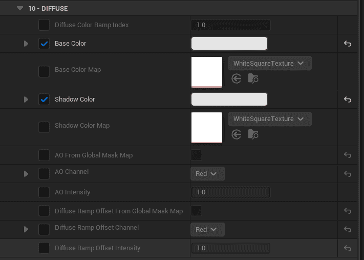
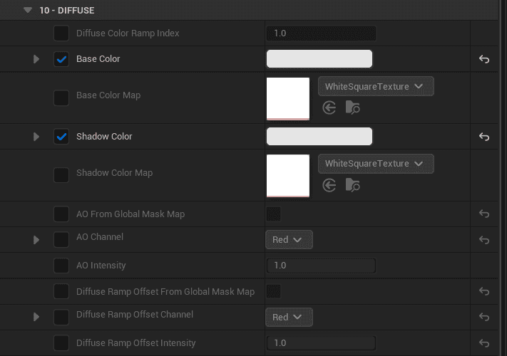
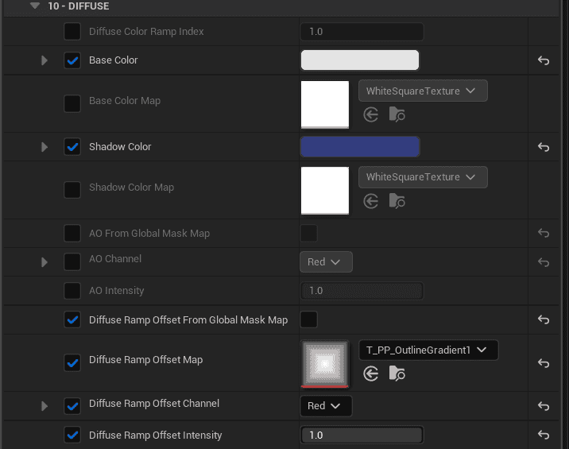

MooaToon使用Ramp Map来表示亮面到暗面之间的颜色过渡:


| 默认Ramp + 单光源<br/>普通二值化阴影过渡        |  |
| ------------------------------------------------- | ------------------------------------------------------------------ |
| 3Levels Ramp + 单光源<br/>阴影过渡现在有3个色阶 |  |
| 3Levels Ramp + 多光源                           |  |

Ramp是一种1D查找表(LUT), 其中存储着用户预定义的Curve, 在UE中表示为Color Curve:


通过将多个Color Curve竖向排列可以组成一个Curve Atlas贴图, 其中每个Color Curve占一行像素:


从MooaToon 5.4开始使用Global Diffuse Color Ramp和Global Specular Color Ramp, 通过将所有Ramp放到Atlas中, 并在每个材质中指定使用哪个Ramp, 即可实现多光源Ramp光照.

## 选择使用哪个Ramp

先在项目设置中找到`Global Diffuse Color Ramp Atlas`以浏览所有可用的Ramp: `Project Settings > Engine > MooaToon > Global Diffuse Color Ramp Atlas`.

然后记住你要使用的Ramp的序号, 比如`CC_DiffuseColorRamp_012_3Levels2`的序号是12, 然后将序号填入Toon材质的`Diffuse Color Ramp Index`:


## 添加新的Ramp

为了不产生文件冲突, 请不要直接修改MooaToon内置Ramp. 而是直接添加新的Ramp.

首先将目前的`Global Diffuse Color Ramp` (默认为`CA_GlobalDiffuseColorRampAtlas`) 复制一份, 然后放到你自己的目录中.

然后将刚刚复制的RampAtlas文件设置给`Global Diffuse Color Ramp Atlas`.

现在你可以编辑自己的Ramp Atlas了, 你可以直接新建Color Curve或者复制内置的Ramp, 然后添加到Ramp Atlas中.

## Diffuse Color Ramp各通道详解

Diffuse Color Ramp的A通道横轴为法线方向与光照方向的角度(N dot L), 0为背光面, 1为正光面. 值为Shadow Gradient.

RGB通道的横轴为Shadow Gradient, 值为颜色.

:::info

最终的Diffuse颜色计算顺序用伪代码表示如下:

```c
1. ShadowGradient = 使用 NdotL + DiffuseColorRampOffset 采样 DiffuseColorRamp.A
2. ShadowGradient = 最小值(ShadowGradient, 阴影衰减/*光线追踪阴影/虚拟阴影贴图*/, 材质AO)
3. DiffuseColor   = 使用ShadowGradient 混合 ShadowColor 和 BaseColor // 1为`Base Color`, 0为`Shadow Color`
4. Output         = DiffuseColor 正片叠底 使用最小值(NdotL, ShadowGrdient)采样 DiffuseColorRamp.RGB
```

:::

直观表示如下:


|  | +   |  | =   |  |
| :--------------------------------------------------------------- | --- | ---------------------------------------------------------------- | --- | ---------------------------------------------------------------- |
| Ramp A: 在0.5处二值化                                                 |     | 修改Base Color和Shadow Color                                        |     | 两种颜色的二值化                                                         |
|  | +   |  | =   |  |
| Ramp A: 从1缓慢过渡到0                                                 |     | 修改Base Color和Shadow Color                                        |     | 两种颜色缓慢渐变                                                         |
|  | +   |  | =   |  |
| Ramp RGB: 三种颜色渐变<br/>Ramp A: 从1缓慢过渡到0                            |     | Base Color = Shadow Color                                        |     | 三种颜色渐变                                                           |
|  | +   |  | =   |  |
| Ramp A: 4个色阶渐变                                                   |     | 调整Shadow Color                                                   |     | 两种颜色阶梯式渐变                                                        |
|  | +   |  | =   |  |
| Ramp RGB: 三种颜色渐变<br/>Ramp A: 4个色阶渐变                              |     | Base Color = Shadow Color                                        |     | 三种颜色阶梯式渐变                                                        |
|                                                                  |     |  | =   |  |
| Ramp不变                                                           |     | 调整Shadow Color                                                   |     | 三种颜色正片叠底Shadow Color的阶梯式渐变                                       |
|  |     |                                                                  | =   |  |
| 示例Noise Map                                                      |     |                                                                  |     | Noise Map采样结果                                                    |
|  | +   |  | =   |  |
| Ramp A: 4个色阶渐变                                                   |     | 将Noise Map作为Diffuse Ramp Offset                                  |     | 可见Diffuse Ramp A通道被偏移,<br/>也就是明暗交界线位置被偏移                         |
|                                                                  |     |  | =   |  |
| Ramp不变                                                           |     | 将Noise Map作为AO                                                   |     | - 可见Noise小于1的区域逐渐过渡为阴影,<br/>- 明暗交界线未偏移,<br/>- 可以产生柔和阴影过渡         |
