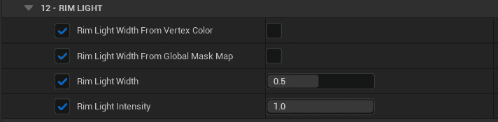

屏幕空间边缘光不同于传统的基于法线方向和视线方向角度的边缘光, 其不受表面曲率的影响, 可以提供接近等宽的边缘光, 更接近手绘:

<Video src={require("./assets/WindowTop_2023_05_01_01_54.webm").default}/>

你可以通过以下材质参数简单地调整屏幕空间边缘光, 支持使用贴图或顶点色控制局部宽度:

更多全局参数可以在`BP_MooaLookDevTool`中调整.
