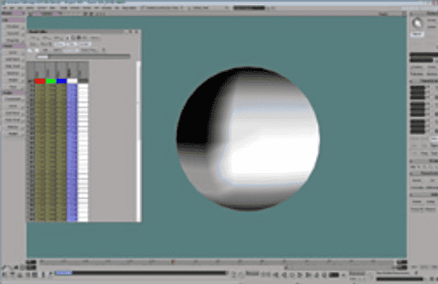
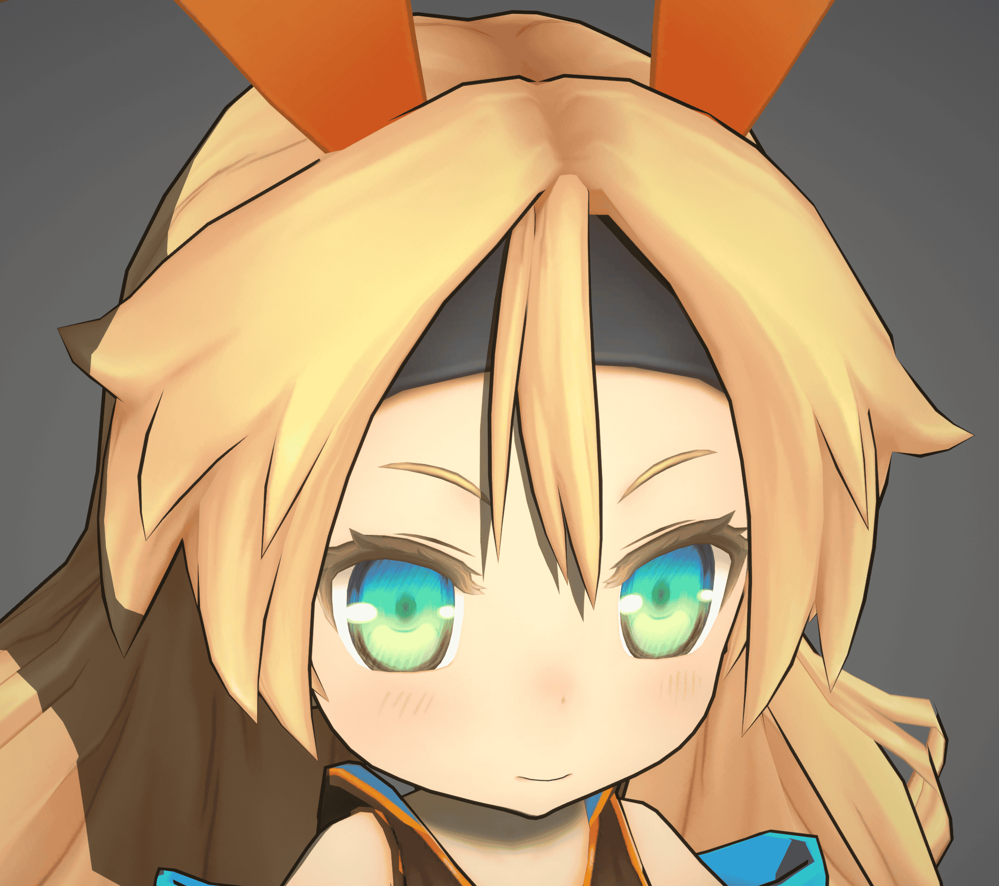

## 什么是描边和笔触

描边是让角色看起来像手绘的重要因素:

笔触是指一段描边起点到终点之间的宽度或颜色变化, 形成笔触的物理原因是笔尖在纸上压力的变化:

|  |  |
| ------------------------------------------------------------ | ------------------------------------------------------------ |
| 无笔触, 描边等宽                                             | 有笔触, 笔画的起点和终点更细                                 |

宽度一致的描边比较容易实现, 带笔触的描边实现比较困难, 而是否有笔触则是让描边看起来更像手绘的关键因素, 因此能否自动生成笔触一直是描边技术的分水岭.

描边也有不同的类型:

## 描边和笔触的实现方法

下文列举了一些描边和笔触的实现方法.

MooaToon实现了GUILTY GEAR的[分享](https://www.4gamer.net/games/216/G021678/20140703095/index_2.html)中提到的***外描边***和***内描边***:

### - 外描边

外描边指描边在模型的外部, 也就是上图中的"Outline"类型. 是在渲染完角色之后再渲染一次角色背面模型, 同时沿法线方向挤出. 这是最经典的也是使用最广泛的描边技术.

此技术的缺点是挤出用的法线必须是平滑的, 否则描边在硬边处会断开. 并且描边类型单一, 细节不是很多.

GUILTY GEAR中使用顶点色作为描边宽度, 从而在局部模拟笔触:

|  |  |
| ------------------------------------------------------------ | ------------------------------------------------------------ |
| 带笔触的外描边                                               | 用于控制宽度的顶点色                                         |

|  |  |
| ---------------------------------------------------------------- | ---------------------------------------------------------------- |
| 肩膀处无宽度调整                                                         | 肩膀处有宽度调整                                                         |

示例中的Unity Chan是在Houdini中绘制的顶点色:

:::tip

你也可以在[*Blender*](https://www.youtube.com/watch?v=khT1Pjx9w-g)或[*Maya*](https://www.youtube.com/watch?v=rREjGwDM5AA)等DCC软件中绘制顶点色.

:::

#### 绘制顶点色以控制描边宽度

左: 调整前; 右: 调整后

经过[之前的教程](ControlTheShapeOfShadows#--使用houdini传递自定义法线)你应该熟悉使用Houdini烘焙顶点数据的流程了.

要为你自己的模型添加宽度可控的描边:

1. 选择并启用`attributePaint_face_vertexColor_alpha`节点
2. 点击`Reset All Changes`
3. 选择需要绘制的Group
4. 选择你觉得合适的光照模式

5. 按回车键进入绘制模式, 按左上角的说明在模型上绘制Alpha, 注意FG的值: 
6. Display `mooa_outlinePreview`节点, 并选中`attributePaint_face_vertexColor_alpha`节点, 然后启用材质显示即可实时绘制并预览描边:<Video src={require("./assets/bandicam 2024-08-14 00-23-01-549.webm").default}/>

7. 绘制完成后使用`OUTPUT_FBX`或`OUTPUT_OBJ`节点导出模型, 并导入UE.

按照[之前的教程](ImportANewCharacter#描边设置)设置描边.

然后描边材质中启用`Use Vertex Color A as Outline Width`, 你就能看到修改后的结果:

#### 常见问题

##### 糟糕的描边形状

这种描边的原理是将网格向外挤出, 然后仅渲染其背面作为描边.

以下原因都可能导致糟糕的描边形状:
- 错误的法线/切线/UV, 或者缺失这些数据. 解决方法:
	- 确保在`mooa_bakeSmoothedNormalToUV34`节点之前已经连接了`mooa_dataInit`节点
	- 确保输入网格有正确的法线和UV
	- 你可以在Geometry Spreadsheet面板中检查所有几何属性
- 单面网格, 描边会在网格边界突然断开. 解决方法:
	- 避免使用单面网格
	- 在单面网格的边界处将描边宽度设为0
- 距离很近的复杂多层网格, 且描边太粗, 可能会导致有些描边突然出现或消失. 解决方法:
	- 在复杂结构中减少描边宽度
	- 对于使用物理模拟的布料等结构, 必须保证描边宽度小于碰撞半径, 否则描边可能会穿模
	- 避免近距离内的重叠/交叉等复杂拓扑结构
	- 在复杂结构中使用内描边替代外描边
- 输入网格包含大于三条边的多边形. UE导入网格时会将所有多边形转换为三角形, 其结果可能与Houdini中不一致. 解决方法:
	- 处理网格之前使用`Divide`节点转换为三角形

##### Alembic

虽然Houdini在导出Alembic时可以通过`Additional UV Attributes`导出多个UV通道, 但是**UE导入Alembic为Geometry Cache时不支持多个UV通道**.

由于Alembic通常只用于离线生产或过场动画, 所以你可以连同`mooa_outlinePreview`节点生成的描边网格一起导出到UE. 并且要确保导入设置中的`Compressed Position Precision`足够小.

### - 内描边

与外描边相对, 内描边通常直接画在贴图上. 内描边和外描边相互配合可以实现很漂亮的描边效果.

该方法的有点是简单且可控, 但由于贴图有分辨率限制, 加上描边通常很细, 导致在近距离观察时描边会出现模糊和锯齿.

这些方法可以在不增加贴图分辨率的同时减少模糊和锯齿:

#### - 本村线抗锯齿

在GUILTY GEAR中, 本村・C・純也提出了一种叫"本村线"的方法, 通过特殊的UV布局和贴图, 可以不受分辨率限制在任何距离获得完美的内描边:

|  |  |
| ------------------------------------------------------------ | ------------------------------------------------------------ |
| 用常规方法画在贴图上的内描边                                 | 使用本村线获得的内描边                                       |

|  |  |  |
| ------------------------------------------------------------ | ------------------------------------------------------------ | ------------------------------------------------------------ |
| 本村线的UV和贴图                                             | 远处观察本村线内描边                                         | 近处观察本村线内描边                                         |

|  |  |  |
| ------------------------------------------------------------ | ------------------------------------------------------------ | ------------------------------------------------------------ |
| 常规方法的UV和贴图                                           | 远处观察常规内描边                                           | 近处观察常规内描边                                           |

该方法无需依赖渲染算法即可获得高精度的内描边, 且在不同引擎和渲染器间通用, 但是美术师的工作量非常大.

#### - SDF抗锯齿

还有一种[方法](https://zhuanlan.zhihu.com/p/113190695)通过将常规方法的内描边贴图转换为SDF贴图以提高精度并且宽度可控, 类似于基于SDF的高精度文字渲染.

MooaToon暂不支持此方法.

### - 后处理描边

后处理描边是在屏幕空间内对深度/法线/颜色缓冲区做卷积计算得出的描边.

优点是全屏生效, 性能开销与场景复杂度无关, 且可以实现几乎全部类型描边.

缺点是难以精确控制局部描边.

如果需要精确控制描边可见性与宽度, 需要对渲染管线做一些额外开发, 例如**二之国 (CG world 2018-06)**:

|  |  |  |  |
| ------------------------------------------------------------ | ------------------------------------------------------------ | ------------------------------------------------------------ | ------------------------------------------------------------ |
| 固有色                                                       | 顶点色                                                       | Mesh ID                                                      | 顶点色突变的地方会检测为描边                                 |

目前你可以直接通过插件获得后处理描边, 比如:

- [Post Process Hand Draw Outline](https://www.unrealengine.com/marketplace/en-US/product/post-process-hand-draw-outline)
- [Stylized Post Process Material Pack vol.1](https://www.unrealengine.com/marketplace/en-US/product/stylized-post-process-material-pack-vol-1)

### - Pencil+

[Pencil+](https://www.psoft.co.jp/jp/product/pencil/unity/)是电影行业常用的描边插件, 其代表着行业最高的品质, 可控性和易用性.

但只能用于离线用途, 且目前并无UE版本.

### - 其他前沿技术

近几年学术界出现了一些新技术, 比如[实时的带笔触的描边](https://github.com/JiangWZW/Realtime-GPU-Contour-Curves-from-3D-Mesh), [基于神经网络的描边](https://github.com/DifanLiu/NeuralStrokes)等.

但离落地到工业界还需要一段时间.

