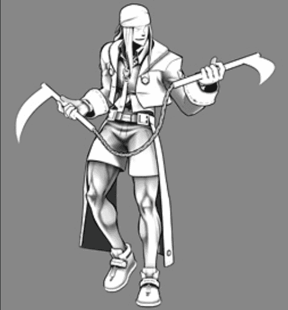
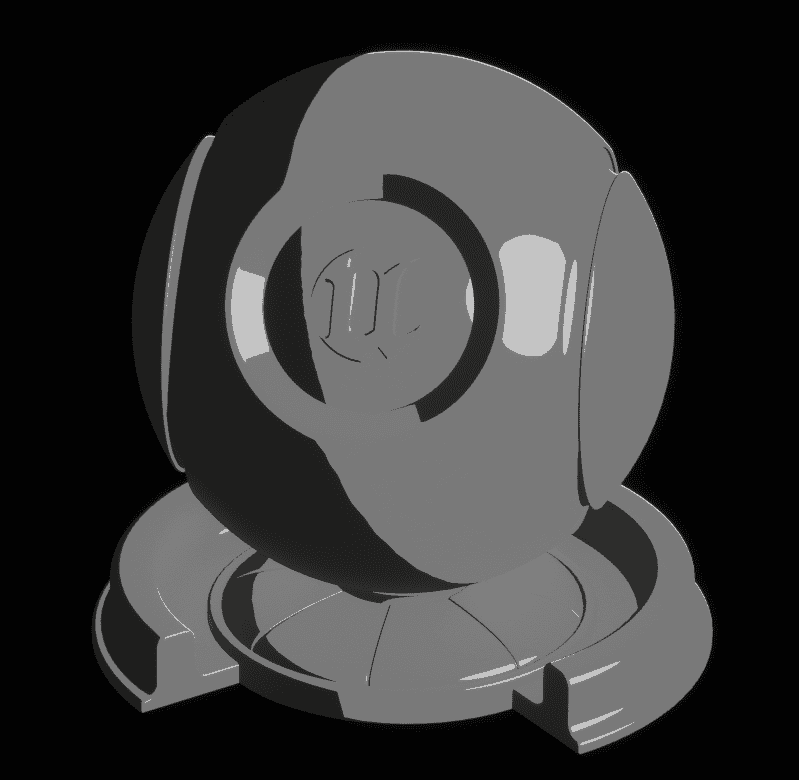
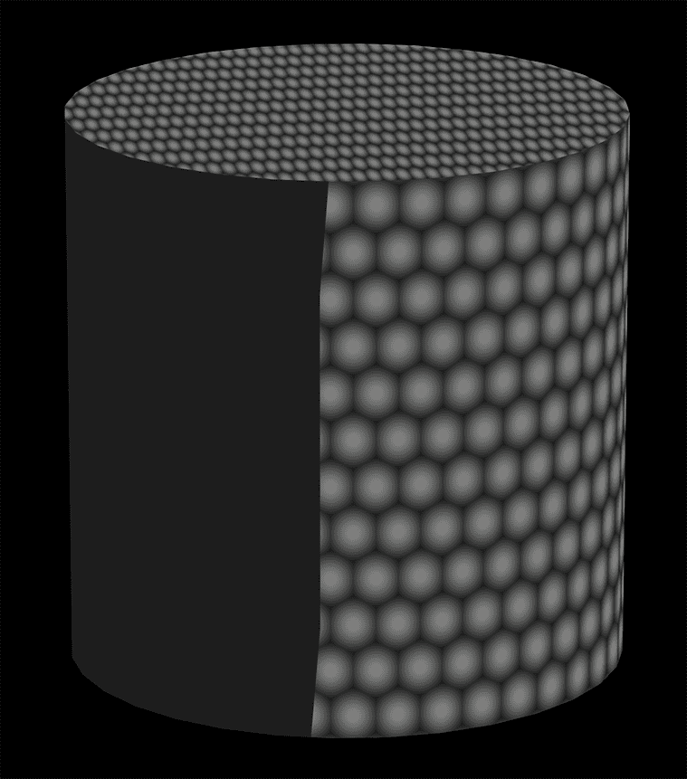
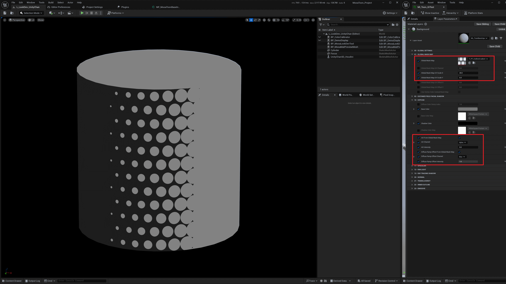

影响阴影形状的因素主要有**表面法线**, **自阴影**, **其他物体的投影**.

表面法线产生的阴影是指光线在照射到物体表面时, 表面法线和光线方向的夹角越大, 则单位面积受到的光照能量越少, 所以法线和光照方向越接近90º越暗:

## 自定义来自自身或其他物体的投影

MooaToon提供**光线追踪**和**阴影偏移**两种方式来移除杂乱的自阴影, 并保留来自场景的投影.

光线追踪方法提供了完整功能, 在性能允许的情况下请优先使用光线追踪. 阴影偏移只是性能不足或设备太旧时的备选方案.

### - 光线追踪

得益于光线追踪可以获得具体的材质信息, 可以通过材质属性来控制光线追踪阴影的行为.

MooaToon提供了禁用***自阴影***和***对不同ID的投影***的功能.

借助这两个功能, 你可以实现:

- 让一个角色完全禁用自阴影, 并接收来自其他角色或场景的投影
- 将同一个角色分成几个不同部位, 每个部位禁用自阴影, 并接收来自其他部位或场景的投影

要使用这些功能你首先需要为角色的不同部分设置不同的ID.

#### 设置ID

MooaToon通过ID来判断射线当前命中的材质是否和射线起点的材质属于同一部分, 你可以选择以下两个方法中的一个设置ID:

##### - ID Map

ID Map是指将角色的不同部位填充不同的纯色, 以便在制作贴图或者后期时方便抠图, 在影视工作流中通常是必备的贴图, 其分辨率可以很低, 只要保证不溢出UV边界即可.

通过使用ID Map你可以在一个材质中精确到像素地控制ID:

:::caution

受GBuffer位深限制, ID Map中不同的ID之间需要有足够的差异 (8 / 255).

ID Map的颜色空间必须是**线性**(在贴图资产中取消勾选sRGB).

:::

##### - 分离材质并设置ID Offset

还有一种简单的办法, 你可以为角色不同部位设置不同的材质, 每个材质设置不同的`ID Offset`即可.

这个方法虽然不需要ID Map, 但会产生更多的绘制调用, 会略微提高渲染性能开销, 请酌情使用.

#### 禁用自阴影

正确设置ID之后, 可以使用`Disable Self Shadow`来禁用角色各个部分的自阴影:

|  |  |
| ------------------------------------------------------------ | ------------------------------------------------------------ |

你可以看到角色每个部分对自身杂乱的自阴影已经消失.

#### 禁用对不同ID的投影

接下来启用`Disable Cast Shadow on Toon`:

|  |  |
| ------------------------------------------------------------ | ------------------------------------------------------------ |

现在你可以看到除了法线阴影以外的阴影全部消失了.

### - 阴影偏移

作为光线追踪之外备选方案, 可以简单地在光源空间深度测试中偏移像素深度, 从而在一定距离内消除所有阴影.

你可以在以下位置找到`Shadow Bias`参数:
- `Post Process Volume > MooaToon > Shadow Bias`
- `BP_MooaLookDevTool > Post Process > Shadow Bias`

提高Shadow Bias可以移除来自一定距离内的遮挡物的投影. 例如将Shadow Bias设为200意味着从角色模型表面为起点, 到光源方向200厘米以内的物体不会对角色产生投影:

|  |  |  |  |
| ----------------------------------------------- | ----------------------------------------------- | ----------------------------------------------- | ----------------------------------------------- |
| Shadow Bias: 0                                  | Shadow Bias: 10                                 | Shadow Bias: 30                                 | Shadow Bias: 150                                |

:::caution

- 阴影偏移只对光线追踪以外的阴影生效.
- 在阴影偏移距离之外可能会突然出现阴影.
- 由于UE本身算法问题, 阴影偏移对于不同类型的光源以及光源和相机不同的距离下可能不一致.

:::

## 自定义头发阴影

绘画作品中的发影通常和头发轮廓一致, MooaToon提供了**屏幕空间深度测试发影**可以程序化实现接近手绘的发影, 而无需修改美术资产.

你也可以选择使用半透明模型作为发影, 其形状可以自定义, 但需要修改美术资产.

### - 屏幕空间发影

首先需要正确设置脸和头发的ID:

##### 设置脸和头发的ID

如果脸和头发使用不同材质, 那么可以直接通过材质参数指定脸和头发, 否则需要使用ID Map.

###### - 材质参数

在脸的材质上启用`Is Face`, 在头发的材质上启用`Is Hair`即可.

###### - ID Map

使用DCC软件打开你的ID Map, 记下脸和头发的ID对应`ID Channel`的值:

将`Face ID`和`Hair ID`设为对应的值:

##### 设置发影参数

正确设置脸和头发的ID之后, 在**脸材质**上启用`Use Screen Space Depth Test Hair Shadow`:

发影的参数通过Console Variable全局调整, 也可以在`BP_MooaLookDevTool`中调整.

|  |  |  |
| ------------------------------------------------------------ | ------------------------------------------------------------ | ------------------------------------------------------------ |
| 
Hair Shadow Width: 0.2
                      | 
Hair Shadow Width: 0.3
                      | 
Hair Shadow Width: 0.4
                      |

该方法的原理是从当前像素向光源方向平移一段距离后采样深度, 如果采样像素为头发且深度更小则被遮挡.

所以发影形状完全取决于头发在当前视角的形状:

<Video src={require("./assets/UnrealEditor_2023_04_02_03_57.webm").default}/>

### - 半透明模型

这种方法无需引擎支持, 由美术师制作一个单独的半透明模型放在头发下方作为阴影, 形状则由美术师完全可控.

请参考项目: [MIKONOTE Anime Toolbox Sample](https://assetstore.unity.com/packages/templates/tutorials/mikonote-anime-toolbox-sample-237176)

## 自定义法线阴影

MooaToon中可以使用以下方式修改法线阴影的形状:

### 修改法线

修改顶点法线是避免难看的阴影的最直接的方法, 并且适用于不同引擎和渲染器.

你可以选择以下不同的方法来改善法线阴影:

#### - Houdini法线传递

该方法使用简单模型的法线替换原有模型的法线, 用低成本实现了可控且足够好的结果, 可以满足大部分情况的需求.

 [这篇文章](https://www.4gamer.net/games/216/G021678/20140703095/)记录了Arc System Works是如何在Guilty Gear中运用此技术的:

|  |  |
| ------------------------------------------------------------ | ------------------------------------------------------------ |
| 原始法线产生的阴影                                           | 替换过的法线产生的阴影                                       |

|  |  |
| ------------------------------------------------------------ | ------------------------------------------------------------ |
| 简化过的模型                                                 | 使用简化模型包裹原模型, 然后原模型查找并替换为最近顶点的法线 |

MooaToon示例中的Unity Chan模型就在Houdini中用此方法处理的, 所有源文件都已经包含在项目中.

[Houdini](https://www.sidefx.com/products/houdini/)是电影和游戏行业的常用DCC软件, 其强大的节点化工作流和几何功能非常适合用来对角色进行一些程序化的调整, 比如说调整法线, 烘焙AO / Curvature / 任何自定义数据到顶点色和UV, 并且每一步都使用节点表示, 你可以任意修改其顺序和参数而不破坏其他修改.

:::tip

如果只是传递法线, 其他DCC软件也能简单的做到这一点:

Blender: [https://www.youtube.com/watch?v=qgr0AR8R9yg](https://www.youtube.com/watch?v=qgr0AR8R9yg)

Maya: [https://www.youtube.com/watch?v=6LdtlJ71000](https://www.youtube.com/watch?v=6LdtlJ71000), [https://80.lv/articles/creating-stylized-leaves-in-maya/](https://80.lv/articles/creating-stylized-leaves-in-maya/)

3ds Max: http://www.scriptspot.com/3ds-max/scripts/normal-thief

:::

##### 安装Houdini

1. [下载](https://www.sidefx.com/download/daily-builds/?production=true&python3=true&win=true)并安装最新的Houdini 19.5, 安装过程需要勾选`SideFX Labs`:  
2. 激活Houdini. 你可以免费试用Houdini Apprentice, 但[无法导出FBX等文件](https://www.sidefx.com/products/compare/).
3. 复制一份并打开`MooaToon\MooaToon-Project\Art\Models\MooaToonHoudiniPipelineSample.hip`.
4. 在右下角显示设置中, 启用: `Optimize > Remove Backfaces`以显示描边: 

##### 传递法线并导出模型

:::tip

如果你是Houdini新手, 这有些[*教程*](https://www.youtube.com/watch?v=Tsv8UGqDibc&list=PLhyeWJ40aDkUDHDOhZQ2UkCfNiQj7hS5W)可以帮助你快速入门.

:::

1. 在`Fbx Character Import`节点中修改File路径以导入模型:
2. (可选) 在`mooa_setMaterials`节点中输入贴图路径, 然后双击`Load Textures`以加载材质:
3. 在`mooa_normalTransfer`节点中选择需要传递法线的Group:
4. 打开法线显示, 然后按`D`键打开`Display Options`, 修改`Scale Normal`到合适大小:
5. 选中`transform1`节点并将其设为Template, 然后按回车键即可实时调整球体的位置和缩放并观察法线的变化:<Video src={require("./assets/bandicam 2024-08-14 00-34-38-362.webm").default}/>
6. 使用左下角的滑条实时调整光照角度:
7. 暂时禁用无关节点:
8. 使用`OUTPUT_FBX`或`OUTPUT_OBJ`节点导出模型 (Houdini Apprentice版本只支持导出OBJ格式, 无法包含法线以外的顶点数据):

##### 将模型导入UE

导入刚刚的模型到UE, 为了确保烘焙的数据不被破坏, 必须手动调整以下设置:
- 禁用`Recompute Normals/Tangents`
- 启用`Use High Precision Tangent Basis/Full Precision UVs`

为其设置材质后放到场景中检查效果:

<Video src={require("./assets/UnrealEditor_2023_04_08_16_43.webm").default}/>

右侧模型的阴影形状已经干净多了.

#### - Blender法线传递

[@aVersionOfReality](https://www.youtube.com/@aVersionOfReality)在这个[视频](https://www.youtube.com/watch?v=sQW2wqltB0A)中介绍了如何在Blender中程序化生成干净的法线, 在这个[视频](https://www.youtube.com/watch?v=qgr0AR8R9yg)中介绍了如何使用法线传递.

如果你更熟悉Blender, 那么该方法成本更低, 并且免费.

#### - 手动绘制法线贴图

有时候直接画法线贴图会比修改顶点法线更容易一些, 并且可以逐像素控制法线.

缺点是受限于法线贴图的分辨率和压缩精度, 近距离下可能出现瑕疵.

@[SFNA](https://note.com/sfna32121)在[这篇](https://note.com/sfna32121/n/n8d46090005d1?tdsourcetag=s_pctim_aiomsg)文章介绍了如何在Substance 3D Painter中预览并绘制法线贴图.

#### - 手动编辑顶点法线

在高面数模型上手动编辑顶点法线可以在任何视距提供最高精度的结果, 但代价是阴影形状之间没有柔和过渡, 且美术成本极高, 需要长时间的经验积累才能灵活运用此技术.

Arc System Works在Guilty Gear中使用了此技术:

|  |  |
| ------------------------------------------------------------ | ------------------------------------------------------------ |
| 原法线                                                       | 对应的阴影                                                   |

|  |  |
| ------------------------------------------------------------ | ------------------------------------------------------------ |
| 手动编辑过的法线                                             | 对应的阴影, 干净了很多                                       |

### 修改Shadow Gradient

Arc System Works在Guilty Gear中还使用了顶点色间接控制阴影形状:

|  |  |  |
| ---------------------------------------------------------------- | ---------------------------------------------------------------- | ---------------------------------------------------------------- |
| 顶点色通道, 看起来类似环境光遮蔽,  颜色更深处更容易产生阴影                             | 原阴影                                                              | 设置后的阴影, 注意裤子和肌肉之间更容易产生阴影                                         |

|  |  |  |
| ------------------------------------------------------------ | ------------------------------------------------------------ | ------------------------------------------------------------ |
| ILM贴图G通道,  颜色更深处更容易产生阴影                  | 原阴影                                                       | 设置后的阴影, 注意裙子下摆处更容易产生阴影                   |

在MooaToon中, 可以通过调整Shadow Gradient来实现相同的效果.

Shadow Gradient基本是指法线方向与光线方向之间的角度:

|  |  |
| ------------------------------------------------------------ | ------------------------------------------------------------ |
| 渲染结果                                                     | 对应的Shadow Gradient,  可以理解为法线方向与光线方向之间的角度 |

MooaToon的着色器利用Shadow Gradient作为UV采样Diffuse Color Ramp (之后的文章会详细介绍), 根据Ramp计算最终的阴影范围与颜色.

你可以在材质中通过两种不同的方式修改Shadow Gradient来控制阴影形状:

| 圆柱体的正常渲染结果                                                                                                                            |  |
| ------------------------------------------------------------------------------------------------------------------------------------- | ---------------------------------------------------------------- |
| 圆柱体卡通渲染结果                                                                                                                             |  |
| Noise贴图的采样结果                                                                                                                          |  |
| 将Noise作为***AO*** (Ambient Occlusion): - Noise值越小则阴影强度越大 - 不会改变明暗交界线位置 - 可以产生柔和的阴影                                         |  |
| 将Noise作为***Diffuse Ramp Offset***: - Noise值越接近1则越容易进入亮部 - Noise值越接近0则越容易进入暗部 - 改变明暗交界线位置 - 阴影的软硬取决于Diffuse Ramp的RGB通道 |  |

如图所示, 通过AO和Diffuse Ramp Offset可以精确控制阴影的形状.

在Toon材质中, 你可以在Global Mask Map中选择特定通道作为AO和Diffuse Ramp Offset:

以下教程展示了如何使用Substance 3D Painter直接在模型上绘制Mask Map:

:::tip

示例文件的路径:`MooaToon\MooaToon-Project\Art\Models\NewTextures\ShadowMap.spp`

你也可以在其他DCC软件中绘制贴图, 比如[*Blender*](https://www.youtube.com/watch?v=AnRQhH3fEDY)或[*C4D*](https://www.youtube.com/watch?v=Pm4mtXhBZ_I).

:::

#### 绘制Mask Map

现在你可以绘制Shadow Mask为角色添加AO, 比如脖子下方.

首先根据[此教程](https://www.youtube.com/watch?v=LsV7CkaBWoM)将模型导入Substance 3D Painter.

然后在固有色通道以白色为背景绘制AO:

绘制完成后根据[此教程](https://www.youtube.com/watch?v=kXC8ZsHZvHQ)导出贴图, 然后将贴图导入UE, 并禁用sRGB:

:::tip

所有非颜色贴图必须禁用sRGB, 否则无法采样到正确的数值.

:::

然后将贴图设置为Global Mask Map, 现在脖子附近有了AO:

### 距离场脸影

距离场脸影是指将特定方向的脸部阴影形状直接绘制为贴图, 然后将多个贴图烘焙为一张SDF贴图, 从而在各个光照角度下获得完全自定义形状的脸影.

首先你需要烘焙网格数据并初步设置材质, 步骤如下:
1. 保存所有修改
2. 在骨骼网格体上右键`Scripted Asset Actions > Mooa Toon > Bake Face Forward Direction`  
:::caution
烘焙某些特定模型时UE可能会崩溃, 请提前保存所有修改!  
如果发生崩溃, 请尝试在重启UE后立即烘焙.
:::
3. 在脸材质上启用`Enable Feature Distance Field Facial Shadow`
4. 如果烘焙的数据正确, 那么你可以在`Debug View`中看到脸部的`World Tangent`显示为纯色:
5. 你也可以用Lookdev Tool检查烘焙的数据, 颜色代表方向, 例如+X方向表示为`(255, 128, 128)`, -X方向表示为`(0, 128, 128)`:

接下来你需要生成SDF贴图, 请参考[该开源项目](https://github.com/akasaki1211/sdf_shadow_threshold_map), 步骤如下:  
1. 将画好的Shadow Mask放到`MooaToon-Project\Art\DistanceFieldFacialShadowSamples\InputShadowMasks`目录:
2. 返回上级目录, 将`InputShadowMasks`目录拖拽到`gen.bat`上:  

|  |  |
| ----------------------------------------------- | ----------------------------------------------- |

3. 在`output`目录中可以看到结果:
4. 将SDF贴图导入UE, 将压缩格式设为`Half Float (R16F)`, Mip Gen设置为`No Mipmaps`:
5. 在脸部材质中将SDF贴图设为`Distance Field Shadow Map`, 然后旋转灯光就能看到结果:  
<Video src={require("./assets/bandicam 2025-03-07 23-01-12-401.mp4").default}/>
4. 支持多光源交互:  
<Video src={require("./assets/bandicam 2025-03-07 23-19-01-688.mp4").default}/>
## 将光照从固有色迁移到Mask Map

一些旧工作流会将光照变化直接画到固有色贴图中, 这不利于表现干净的画面, 也不适用于动态的阴影和全局光照, [这篇文章](https://muro.fanbox.cc/posts/1657633)介绍了如何将其重绘为干净的贴图:

在MooaToon中可以利用Mask Map将左图中的静态光照拆分为动态的固有色 + 阴影 + 高光色.

