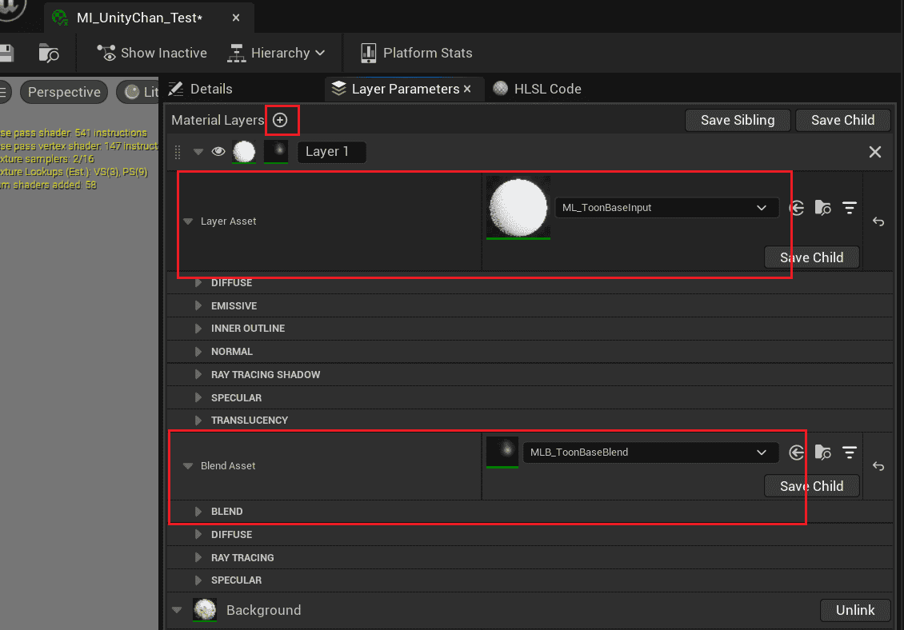
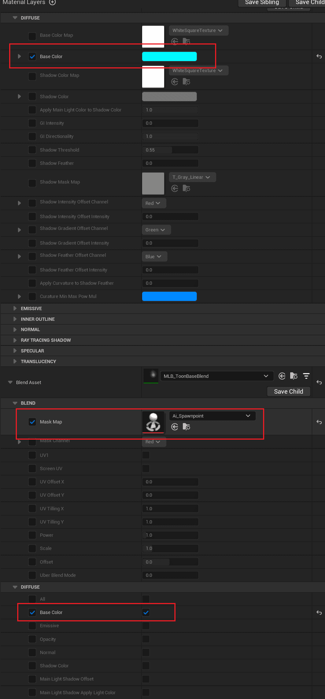

MI_Toon是普通材质, 其有着简单且固定的输入, 可以用于制作简单效果.

但如果你想叠加多层纹理, 或混合其他自定义效果, 你需要使用分层材质.

UE的[分层材质](https://docs.unrealengine.com/5.1/zh-CN/layering-materials-in-unreal-engine/)可以让你自由组合[材质图层](https://docs.unrealengine.com/5.1/zh-CN/using-material-layers-in-unreal-engine/), 调整顺序和混合模式.

## 将材质转换为分层材质

在材质编辑器中将父材质替换为MI_ToonLayer:

然后你可以在图层参数中找到原有参数:

:::caution

***注意, 这一步会丢失已经调整过的数值!*** 所以要尽可能早的决定是否使用分层材质.

在编辑分层材质时***有一定概率使UE崩溃, 请经常保存!***

:::

## 使用材质图层

现在你可以添加材质图层并创建复杂效果:

修改以下参数:

你可以看到以下变化:

|  |  |
| ------------------------------------------------------------ | ------------------------------------------------------------ |

也就是说使用材质图层添加新的效果, 使用图层混合控制其如何叠加到下面的图层.

