以[Unity Chan](https://unity-chan.com/)为示例角色, 你可以在`MooaToon\MooaToon-Project\Art\Models\SD_unitychan_generic.fbx`找到原始的Unity Chan模型.

你还可以通过以下网站获取角色模型:

- 付费
  - UE 官方商城: https://www.unrealengine.com/marketplace
  - Unity官方商城: https://assetstore.unity.com/
  - BOOTH: https://booth.pm/
  - ...

- 免费
  - VRoid模型: https://hub.vroid.com/
  - Mirai Komachi: https://www.miraikomachi.com/download/
  - ネオン: http://airtone-vr.com/
  - MMD模型: https://bowlroll.net/
  - ...

:::info

- 现已支持***直接导入VRoid模型***(.vrm, 借助[VRM4U插件](https://github.com/JasonMa0012/VRM4U_MooaToon)), 你可以通过[VRoid Studio](https://vroid.com/studio)快速制作你自己的模型, 然后连同贴图和材质导入MooaToon项目.

- 对于MMD模型你需要先将其转换为FBX模型, 推荐使用[Blender](https://www.blender.org/)和[Cats Blender Plugin](https://github.com/absolute-quantum/cats-blender-plugin).

:::

## 导入角色

直接将角色模型拖入虚幻编辑器的内容浏览器即可导入角色模型, 由于不同DCC软件的导出设置不同, 可能需要调整导入设置中的旋转和缩放.

正确导入后角色应面朝前方(+Y轴), 大小合适:

复制并打开场景`Content/MooaToonSamples/Maps/L_LookDev.umap`, 将角色骨骼网格体放入其中:

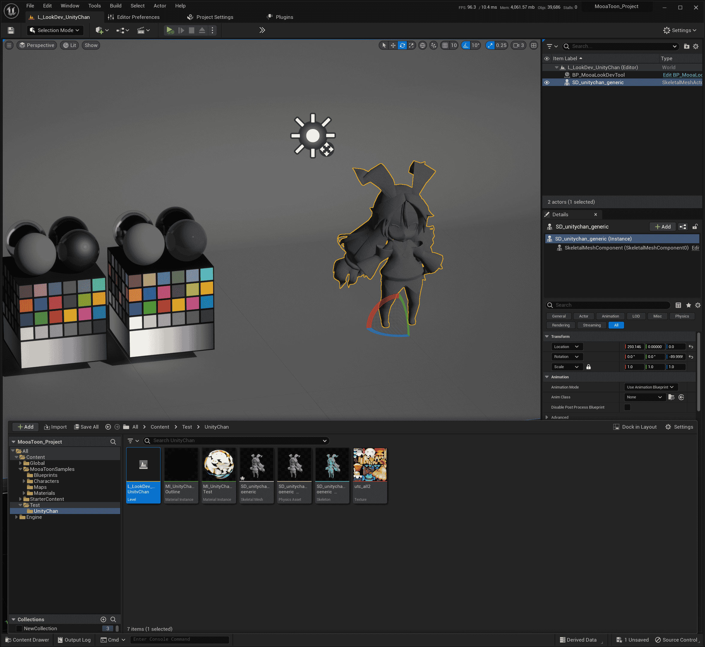

## 创建并分配材质实例

### - 导入时自动创建

可以在导入时直接选择创建材质实例(***确保筛选器中已选择显示插件内容***):

### - 手动创建

在内容浏览器中创建一个材质实例, 父材质选择`MI_Toon`, ***确保筛选器中已选择显示插件内容***: 

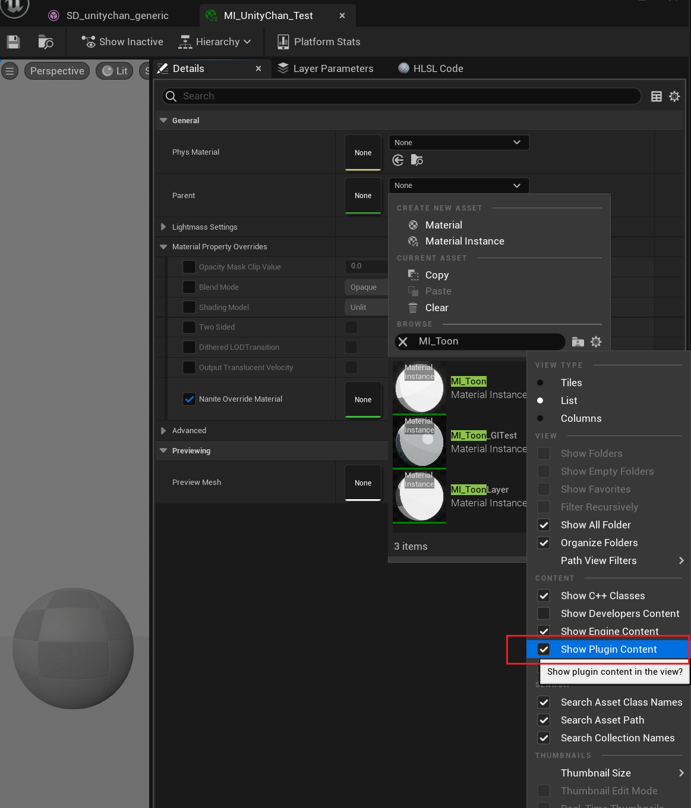

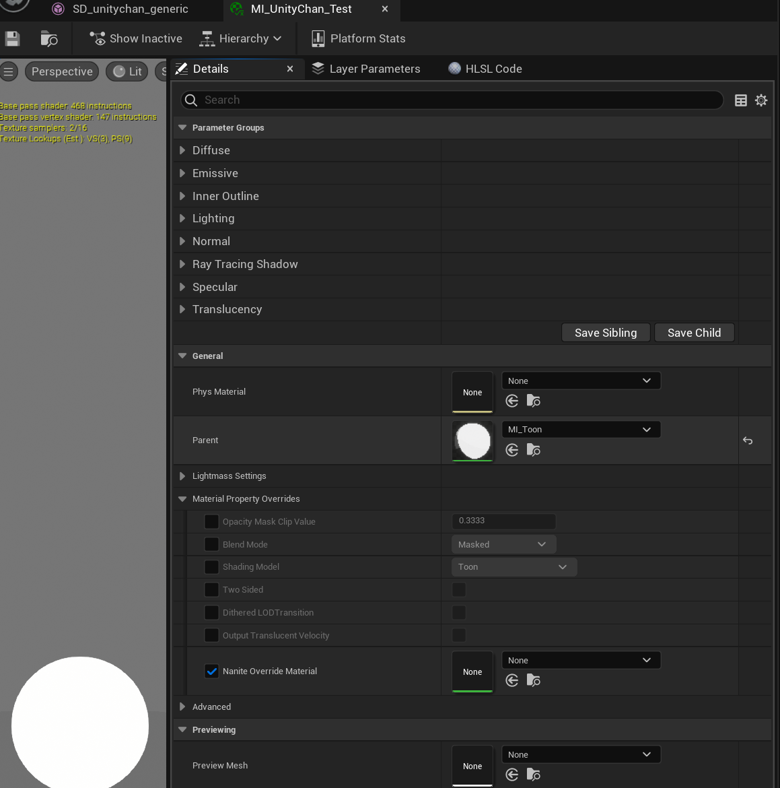

打开角色的骨骼网格体文件, 将刚刚创建的材质放入材质插槽中:

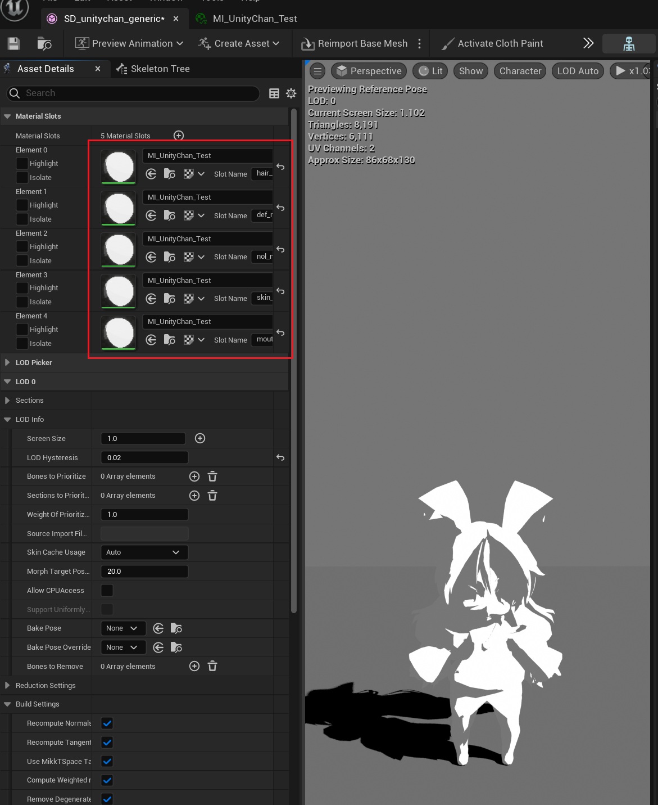

注意, Unity Chan只有一张贴图所以只创建了一个材质实例, **如果你的模型的多个部位对应不同的贴图, 那么你需要为每个部位分别创建一个材质实例**.

## 材质设置

在内容浏览器中导入固有色贴图(`MooaToon\MooaToon-Project\Art\Models\Textures\utc_all2.tga`).

在材质实例中, 将`Base Color Map`和`Shadow Color Map`设置为固有色贴图:

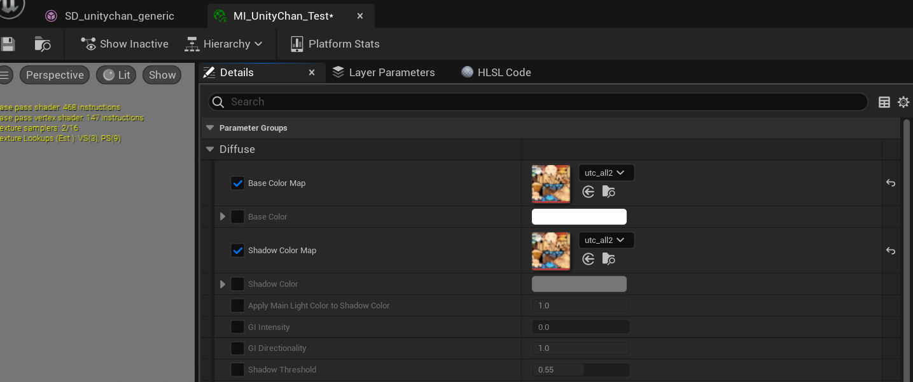

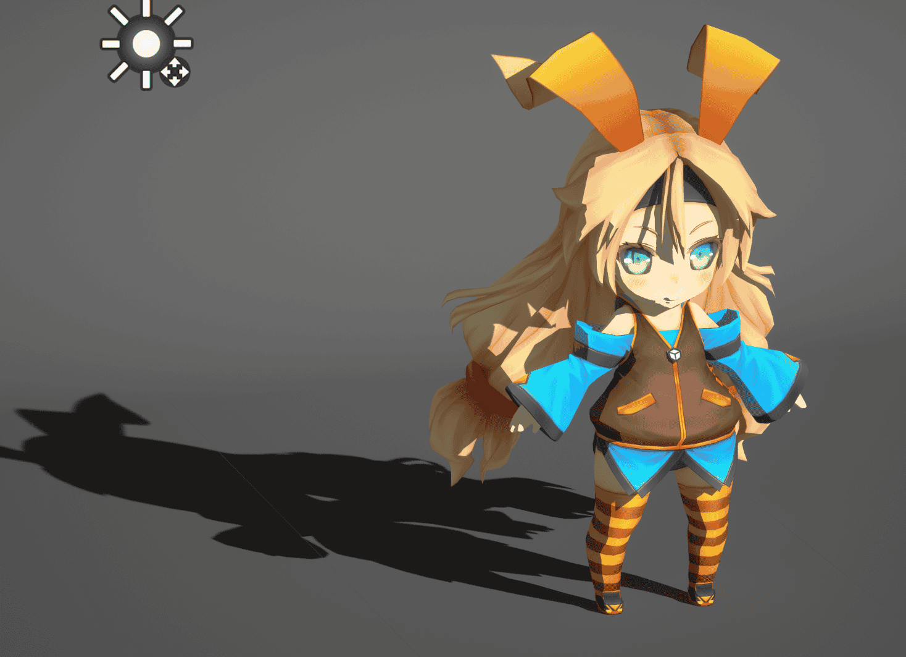

## 描边设置

1. 保存所有修改
2. 在角色骨骼网格体上右键: `Scripted Asset Actions > Mooa Toon > Bake Smoothed Normal and Curvature`:

:::caution
烘焙某些特定模型时UE可能会崩溃, 请提前保存所有修改!  
如果发生崩溃, 请尝试在重启UE后立即烘焙.
:::
在内容浏览器中创建用于描边的材质实例, 父材质选择`MI_Outline`, 并设置以下参数:

选中关卡中的角色, 将描边材质设为`Outline Material`:
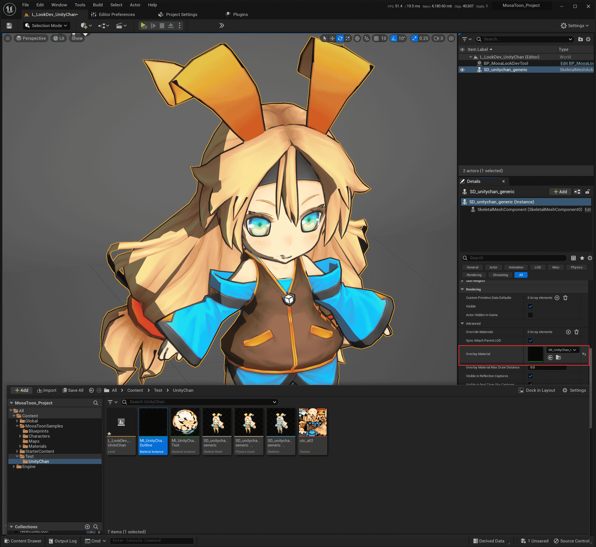

现在你应该能看到完整的角色描边:

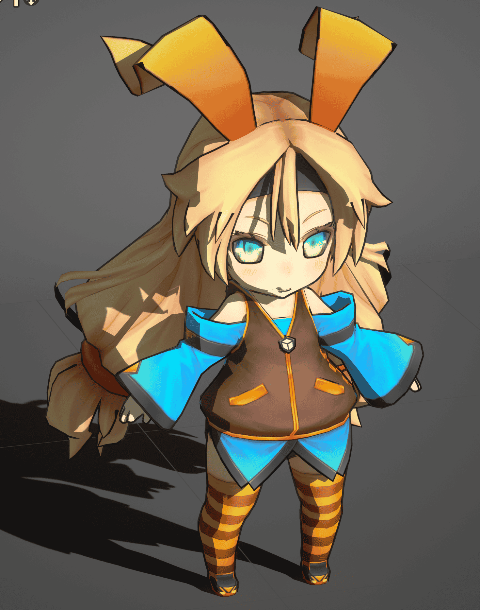

## 视口设置

你应该注意视口设置, 不同的FOV将对角色透视产生巨大的影响:

| 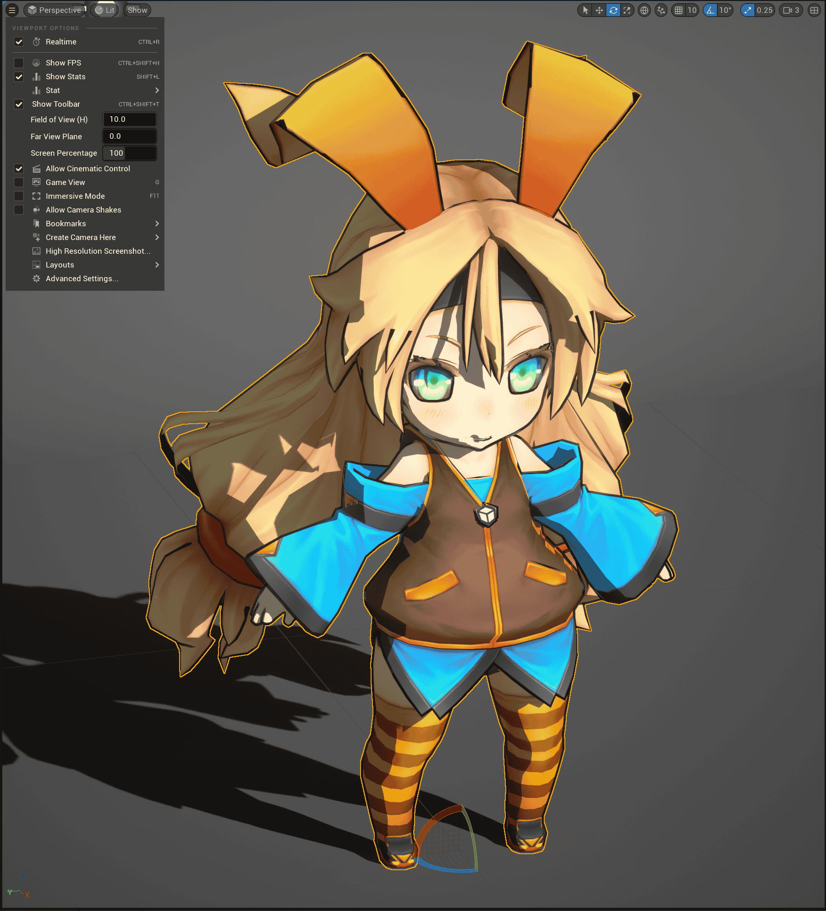 | 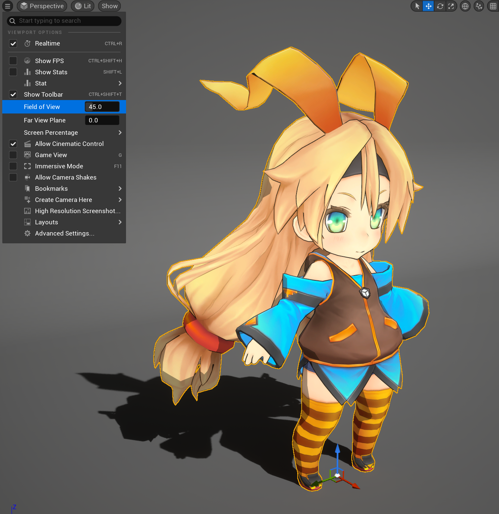 | 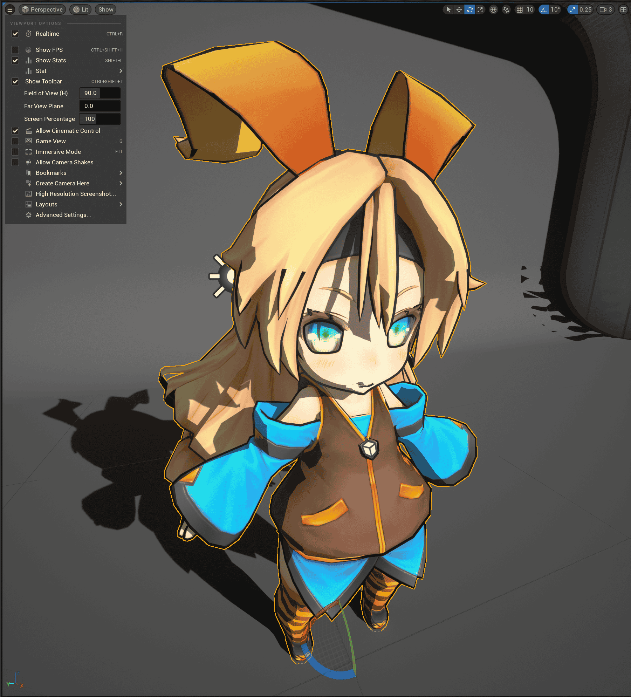 |
| ---------------------------------------------------------------- | ---------------------------------------------------------------- | ---------------------------------------------------------------- |
| 10                                                               | 45                                                               | 90                                                               |

如果你追求接近手绘的美术风格, 你应该使用尽可能小的FOV使角色看起来更加平面化, 比如10.

如果你让玩家实时操控视角, 你应该根据你的游戏类型选择合适的FOV, 并保证主角处于屏幕中央, 以减少透视畸变.

## 进阶设置

不得不承认现在的渲染结果离好看还差得很远:

仔细观察目前的角色你会发现以下需要改进的地方:

- 眼白的颜色, 眼周的描边, 头发的阴影

  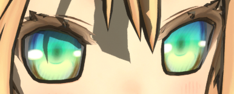

- 自阴影的形状

  

- 头发描边宽度

  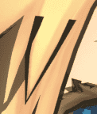

- 手的描边宽度

  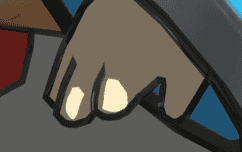

- 头发的高光

- 皮肤的质感

- 角色模型和贴图本身的精度

- 动画和表情

- 环境和后处理

- ......

还必须经过一系列更加细致的调整, 基本上你花费的时间和最终的渲染质量成正比.

请继续阅读教程.

