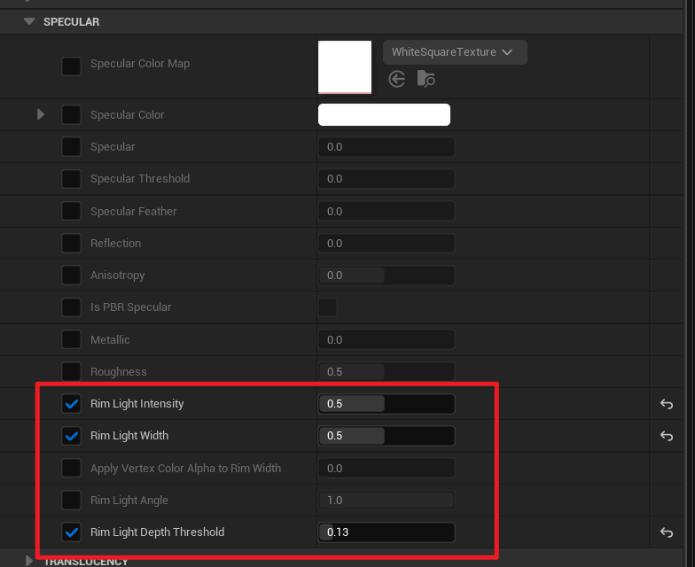

# 使用边缘光添加层次感

设置几个材质参数即可添加屏幕空间边缘光:

屏幕空间意味着边缘光的宽度几乎不受表面曲率影响, 这与动画中常见的绘画方法相似, 并且支持深度遮挡和多光源交互:

<Video src={require("./assets/WindowTop_2023_05_01_01_54.webm").default}/>

除了材质参数, 还有全局的控制台变量可以控制边缘光:

- `r.Mooa.RimLight.MaxDepthFadeDistance`
- `r.Mooa.RimLight.MaxDepthTestDistance`
- `r.Mooa.RimLight.MaxWidth`
