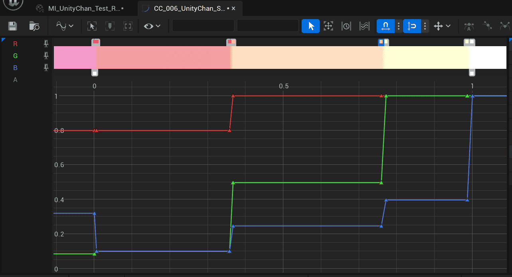

# 使用RampMap控制明暗过渡

Ramp Map是一种1D查找表(LUT), 横轴为法线与光线方向夹角角度, 值为对应角度的颜色.

MooaToon使用Ramp Map描述软阴影的颜色过渡:

|  |  |  |
| ------------------------------------------------------------ | ------------------------------------------------------------ | ------------------------------------------------------------ |
| `Shadow Feather : 0.0`                                       | `Shadow Feather : 0.2`                                       | `Shadow Feather : 0.2 + Ramp Map`                            |

以Color Curve表示的Ramp Map

在材质中启用Ramp Map, 并选择Color Curve:

Color Curve的RGB通道为颜色; A通道为阴影系数, 值为0时颜色受`Shadow Color`影响, 值为1时颜色受`Base Color`影响.

:::caution

新增你自己的曲线时请在`MooaToon/MooaToon-Engine/Engine/Plugins/MooaToon/Content/Assets/CA_RampCurves`中复制并重命名一个, 以免更新MooaToon时被覆盖.

如果看不到该文件, 请确保已在内容浏览器中启用`显示引擎内容`:

并且更新预编译版MooaToon后, 由于所有重名文件已被覆盖, 你需要在`CA_RampCurves`中重新指定你创建的曲线.

:::

:::tip

目前Ramp Map不会影响来自其他物体的阴影, 后续会添加这个功能.

:::
