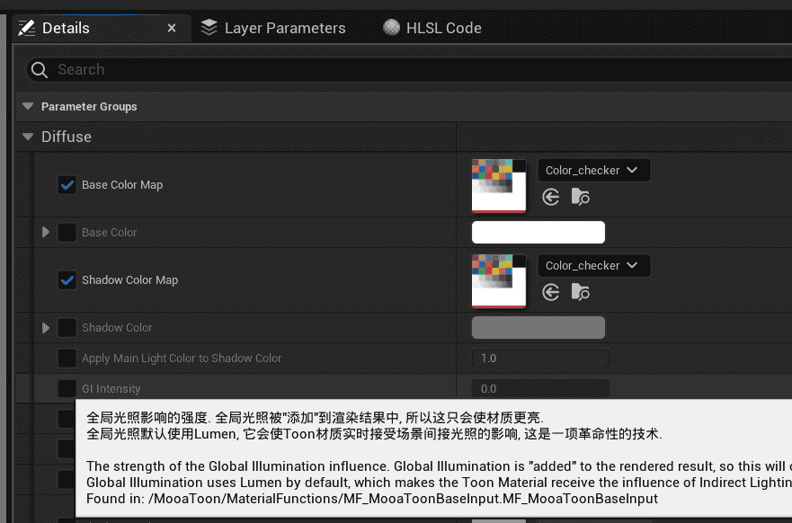

## Limitations
### Platform Limitations
  
Mobile platforms are not supported at this time, XR and console platforms should theoretically be supported but have not yet been tested.

### Substrate

Substrate is not supported.

### File management

Please copy and not change the MooaToon file as much as possible, otherwise conflicts may arise due to the update.


### Global Illumination

Lumen is used by default for global illumination related functions, other methods have not been tested yet.

### Ray  Tracing

Shadow-related features must have `Ray Tracing Shadow` and `Hardware Ray Tracing` enabled.

The ability to control Self-Shadow when Ray Tracing is not enabled will be available in a future version.

### Translucent

Translucent Rimlight requires that `High Quality Translucency Reflections (Lumen Front Layer Translucency Reflections)` be enabled in `Post Processing Volume` in order to get the depth of the translucent object.

## Ray Tracing

### Character shadow disappears

(Epic 5.1+)

Sometimes the character's Ray Tracing Shadow disappears, runs the game or Hide / Show the character and then shows it again.

### Strange Shadows in the Scene

When two triangles are very close to each other, Ray Tracing Shadows can be problematic:


The problem can be solved with the following console command:

```
r.RayTracing.Shadows.AvoidSelfIntersectionTraceDistance 1
```

You can adjust this value to suit your project.

### Outline conflicts with shadow functionality for static mesh characters

(Epic 5.0-5.1)

This is because Ray Tracing Shadow incorrectly calls the Hit Shader of Overlay Material, and the related functions of Ray Tracing Shadow in Toon Material will be covered by the Outline.

### Material preview

(5.0-5.1)

The floor of the material preview window is black when Ray Tracing Skylight is enabled.

## Translucent

### OIT

(Epic 5.0-5.1)

OIT (Order Independent Transparency, which provides support for correct rendering of multiple layers of translucency) causes translucent Blending Mode Add not to work.

## Material editing

### Crash

(Epic 5.0+)

Occasionally it will crash when adjusting layer parameters, remember to save frequently when using it.


### The parameter description of Layer Parameters disappears

(Epic 5.0+)



The description of Material Layer parameters often disappears, please check the full parameter description on the Parameters Panel after opening the Material Editor:


### Modifications to Curve Atlas Parameters will not take effect immediately

(Epic 5.0+)

If the current material instance has parameters that are covered by the blueprint, manually modifying the curve atlas parameters will not take effect immediately, and you need to toggle the switch in front of the parameters.


## Compile

### Compile Errors When Building Engine From Source

[Strict compiler version requirements from UE 5.4 onwards](https://dev.epicgames.com/documentation/en-us/unreal-engine/unreal-engine-5.4-release-notes#platformsdkupgrades), you can [uninstall Visual Studio](https://learn.microsoft.com/en-us/visualstudio/install/uninstall-visual-studio?view=vs-2022) first, and then use `_1_2_Install_VisualStudio.bat` to automatically install the correct compiler version.

## Others

### Can not find MooaToon Project in Epic Launcher

1. Open path in Explorer `%LOCALAPPDATA%\EpicGamesLauncher\Saved\Config\Windows\GameUserSettings.ini`

2. Add or modify the value of `CreatedProjectPaths` under `[Launcher]` to be the parent path of the Project, such as

   ```
   [Launcher]
   LastActiveDateTime=2023-03-27T00:00:00.000Z
   LastActiveVersion=14.7.1
   AutoEnabledStartOnBootVer=14.6.3
   LastActiveTab=ue
   VaultCacheDirectories=D:/Epic/VaultCache/
   DefaultAppInstallLocation=E:\UE
   CreatedProjectPaths=E:\MooaToon
   ```

3. Save and restart Epic Launcher

### Document image error

Due to a bug in Docusaurus, the image loading of this document page may be wrong after refreshing, and it can be restored by switching to other document pages and then switching back.
