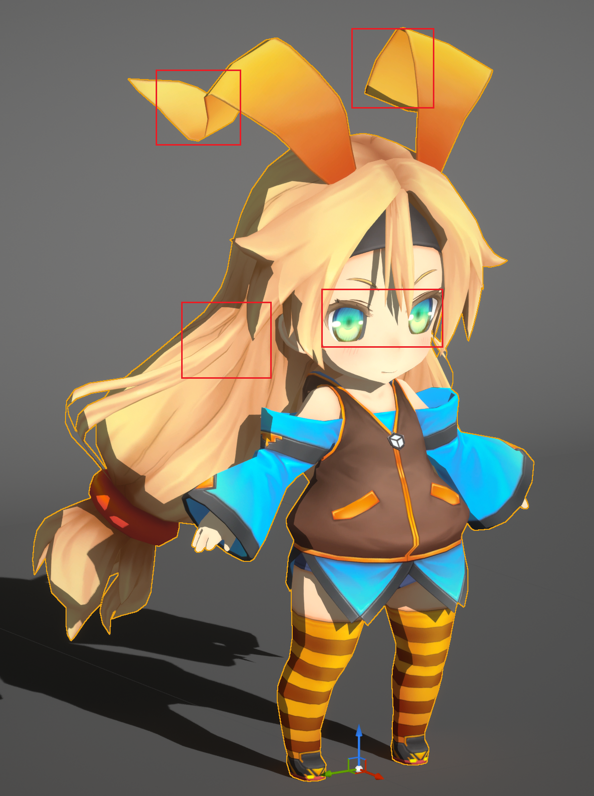
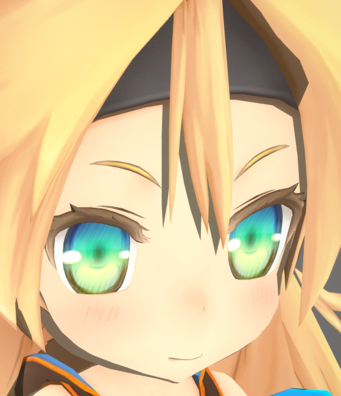

# Features Overview

## Controllable Stroke Width

MooaToon provides a series of DCC and engine tools to fully control the stroke width:

Left: before adjustment; Right: after adjustment

## Customized Ray Tracing Shadows

MooaToon has deeply customized the Ray Tracing Shadows, allowing for the separate disabling of Self-Shadows and Local Shadows:

|  |  |
| ------------------------------------------------------------ | ------------------------------------------------------------ |

Disable Self-Shadows

|  |  |
| ------------------------------------------------------------ | ------------------------------------------------------------ |

Disable Local Shadows between Toon Materials

And two high-precision hair shadow algorithms have been designed to simulate anime styles:

|  |  |  |
| ------------------------------------------------------------ | ------------------------------------------------------------ | ------------------------------------------------------------ |
| 
Hair Shadow Width: 0.2
                      | 
Hair Shadow Width: 0.3
                      | 
Hair Shadow Width: 0.4
                      |

## Shape Controllable Normal Shadows

The shape of the shadows produced by the normals can be fully controlled through Normal Transfer and Shadow Gradient:

Left: Unmodified normal shadows; Right: Its Shadow Gradient

Adding Noise to the `Shadow Gradient Offset` will shift the position of the edges when the shadow passes here

Adding Noise to `Shadow Intensity Offset` controls the timing of shadow generation directly at the current location

Comparison of Shadows Before and After Adjustment

## Control Light Shadow Transition By Ramp Map

MooaToon uses Ramp Map to describe the color transition of soft shadows:

|  |  |  |
| ------------------------------------------------------------ | ------------------------------------------------------------ | ------------------------------------------------------------ |
| `Shadow Feather : 0.0`                                       | `Shadow Feather : 0.2`                                       | `Shadow Feather : 0.2 + Ramp Map`                            |

Ramp Map represented as Color Curve

|  |  |
| ------------------------------------------------------------ | ------------------------------------------------------------ |
| Ramp On                                                      | Ramp Off                                                     |

## Screen Space Rim Light for Anime Styles

Screen Space Rim Light with consistent width and support for depth occlusion:

## Customizable Dynamic Hair Highlights

MooaToon provides a series of tools to achieve dynamic hair highlights with controllable shape and motion trajectory:

Tangent baking and highlight preview tool based on Houdini

Dynamic highlights before adding a Highlight Mask

Final result after adding a Highlight Mask

