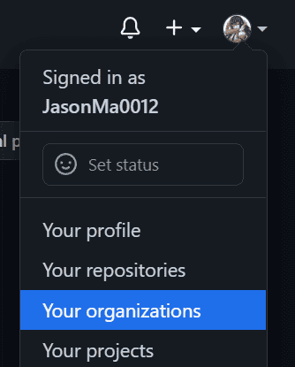
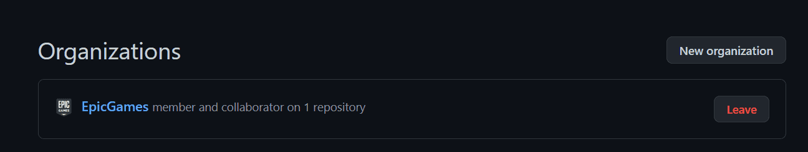
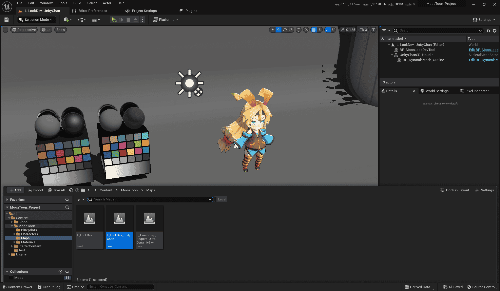
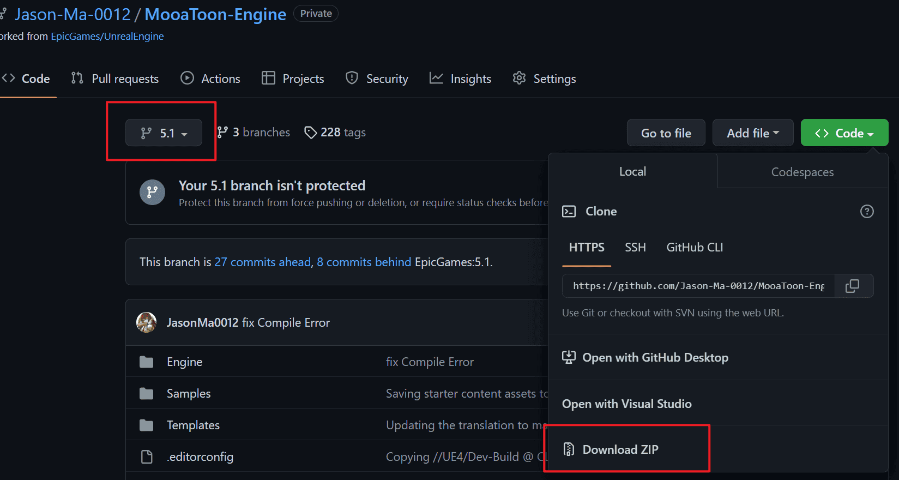
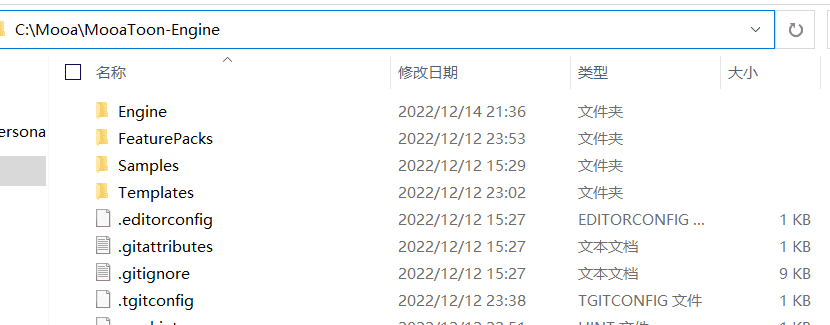
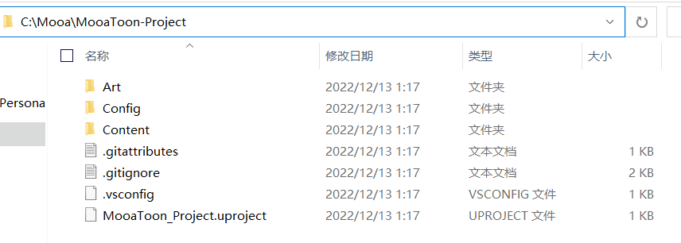
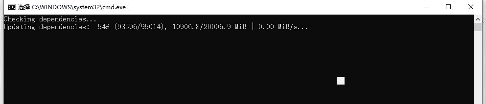
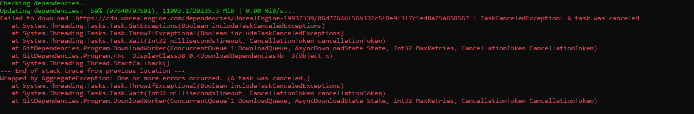
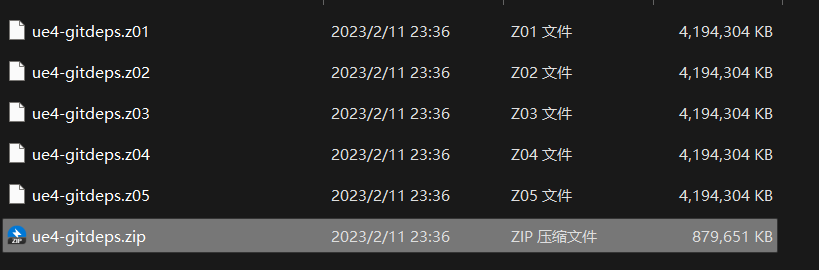

# Build Engine from Source Code

According to your network and CPU, the whole installation process may take 3~8 hours, please be calm, if there are unsolvable problems in the process, you can submit [Issues](https://github.com/JasonMa0012/MooaToon/issues/new).

## - Regular users

### Link accounts

Before you begin, you'll need an [**Epic**](https://www.unrealengine.com/) account and a [**Github**](https://github.com/) account, if not, go to Sign Up. And then:

1.  Then go to that [link](https://www.unrealengine.com/zh-CN/blog/updated-authentication-process-for-connecting-epic-github-accounts) and follow the instructions in this article to link your Github account to your Epic account.
2.  Go back to Github, head to Your Organizations, and accept Epic's invitation to join the organization:

### Download the MooaToon installation tool

[Download](https://github.com/JasonMa0012/MooaToon/archive/refs/heads/main.zip) the Zip of the installation tool, extract it to a location you see fit, and it is highly recommended to reserve at least 150GB of SSD hard disk space. Then you can start the installation process.

### Install automatically with tools

In turn:

1. `_1_1_Install_Git.bat` install Git with default settings
2. `_1_2_Install_VisualStudio.bat` install Visual Studio with default settings
3. Save your work
4. `_1_3_Restart_Computer.bat` restart your PC
5. `_2_0_Install_And_Run_MooaToon.bat` follow the prompts to log in to your Github account and wait for the download and compilation to complete, which may take 2 to 5 hours
6. When finished, the project will open automatically

### Check the project

After starting the project, wait patiently for Shader to compile, and then you should see something similar to the following:

All sample levels can be found in the `Content\MooaToonSamples\Maps` directory:

Feel free to explore it.

#### Get updates

You can check the [MooaToon-Engine](https://github.com/Jason-Ma-0012/MooaToon-Engine) repository for updates, and get them by `_3_0_Update_And_Run_MooaToon.bat` script. You should also check the [installation tool](https://github.com/JasonMa0012/MooaToon) for updates from time to time and update them via `_3_5_Update_InstallTool.bat` scripts.

#### Resolve conflicts

If you modify the MooaToon file, you will be prompted when updating, and if the modified file conflicts with the update, an error will be reported. It is recommended to manually back up that caused the merge failure, and then update them again after run `_3_X_Clean_MooaToon_X`.

## - Developer users

How to compile the engine from source: https://docs.unrealengine.com/5.1/zh-CN/building-unreal-engine-from-source/ 

Go to: https://github.com/Jason-Ma-0012/MooaToon-Engine Pull`5.1` Branch to compile the engine, Pull `5.1_MooaToonProject` branch to start the project, Enjoy it!

## Known issues

### Network issues during Install_MooaToon_Engine/project

You can try the following workarounds:

#### Get the fastest Github IP automatically

Usually, Chinese mainland users have a slow connection to Github, to solve this problem, run the script: `_2_4_Fetch_Fastest_Github_IPs.bat`

The script will be automatically executed when running the `_2_0_Install_And_Run_MooaToon.bat`, and its principle is to query the IP of the fastest Github server in the current network through a third-party website, and write it to the host file to accelerate `_2_0_Install_And_Run_MooaToon.bat` download.
#### Set up the Git proxy manually

If you have a faster proxy server, you can also set up a proxy for Git manually, `Win + R` enter the following command (please replace the proxy port with your own proxy port):

- Socks5: `git config --global http.proxy socks5://127.0.0.1:10808`
- Http: `git config --global http.proxy http://127.0.0.1:10808`

Undo the Git proxy: `git config --global --unset http.proxy`
#### Download Zip manually

You can also choose not to use Git but download Zip directly, this way of downloading may be more stable, and you can use other downloaders to speed up the download and resumption download, but each update requires manual download of the entire engine and project.

1. You can go to [https://github.com/Jason-Ma-0012/MooaToon-Engine](https://github.com/Jason-Ma-0012/MooaToon-Engine)  to download Zip:

   

2. As shown in the figure, select `5.1` as the engine branch on the left, click `Code > Download ZIP` on the right to start downloading the engine.

3. When you're done, switch to `5.1_MooaToonProject` branch to download the project.

4. After the download is complete, return to the MooaToon home directory and extract the engine to the MooaToon`MooaToon\MooaToon-Engine` directory:

   

5. Extract the project to the MooaToon`MooaToon\MooaToon-Project` directory:

   

6. Run `_2_3_Setup_Unreal_Engine.bat`, note that this still requires downloading a large number of files from Epic's servers, a step that cannot be bypassed at this time

7. Run `_4_0_Build_And_Run_MooaToon.bat`

### Network issues during Setup_Unreal_Engine

Due to Epic server or network speed issues, a file may get stuck during Setup or the download may fail. 

You should first try toggling the global proxy, or switching the proxy server.

If you still can't solve the problem, you can manually download it from any of the following NetDisk:

- https://mega.nz/folder/5rZgVR5C#5YjddnKYDcWvLNHBhE58KA
- https://pan.baidu.com/s/1Y8FFDyhvEcuQ53gFziJjvA?pwd=cht2

After downloading, you should get the following volume zip file:

Open the `ue-gitdeps.zip` using the unzip software, extract its contents to the `MooaToon-Engine\.git\ue-gitdeps` folder, and run `_2_3_Setup_Unreal_Engine.bat` again, now you should finish it quite quickly.

Then run `_4_0_Build_And_Run_MooaToon.bat` to build and launch the project.

