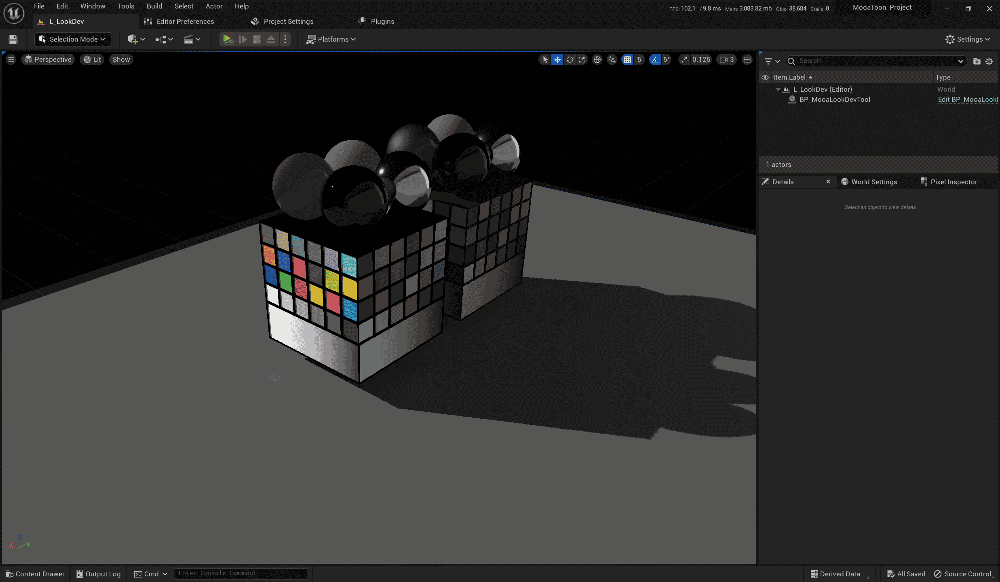

Depending on your network bandwidth and CPU performance, the whole installation process will take a few hours, please do not be impatient, if there are unsolvable problems in the process, you can submit [Issues](https://github.com/JasonMa0012/MooaToon/issues/new).

Please choose the tutorial that corresponds to your experience:
## - Regular users

### Link accounts

Before you begin, you'll need an [**Epic**](https://www.unrealengine.com/) account and a [**Github**](https://github.com/) account, if not, go to Sign Up. And then:

1.  Then go to that [link](https://www.unrealengine.com/zh-CN/blog/updated-authentication-process-for-connecting-epic-github-accounts) and follow the instructions in this article to link your Github account to your Epic account.
2.  Go back to Github, head to Your Organizations, and accept Epic's invitation to join the organization:

   |  |  |
   | ------------------------------------------------------------ | ------------------------------------------------------------ |

:::caution

- If you can't find EpicGames in your organization after accepting the invitation, try logging back into your GitHub account.
- Epic has recently restructured its Github organization, so if you find that the Github project link is inaccessible, check to see if your Github account has been successfully added to the EpicGames organization and try to re-link your account with it. 
:::

### Download the MooaToon installation tool

[Download](https://github.com/JasonMa0012/MooaToon/archive/refs/heads/main.zip) the Zip of the installation tool, unzip to the root directory of the hard disk, such as `D:\MooaToon` (the purpose is to avoid compilation errors caused by too long path), and it is highly recommended to **reserve at least 200GB of SSD hard disk space**.

Then you can start the installation process.

### Install automatically with tools

In turn:

1. Run `_1_1_Install_Git.bat` to install Git with default settings
2. Run `_1_2_Install_VisualStudio.bat` to install Visual Studio with default settings
3. **Save your work**, run `_1_3_Restart_Computer.bat`  to restart your PC
4. Run `_2_0_Install_And_Run_MooaToon.bat` and follow the prompts to login to your Github account, wait for the download and compilation to complete, this may take 1 to 3 hours.
   1. Users in mainland China should follow the instructions to enable the global proxy, otherwise you may encounter network problems.
5. When finished, the project will open automatically

### Check the project

After starting the project, wait patiently for Shader to compile, and then you should see something similar to the following:

All sample levels can be found in the `Content\MooaToonSamples\Maps` directory:

Feel free to explore it.

### Get updates

You can subscribe to the [MooaToon-Engine](https://github.com/Jason-Ma-0012/MooaToon-Engine) repository to find out if there are any updates, and get them via the `_3_0_Update_And_Run_MooaToon.bat` script.

:::caution

Do not use `_2_0_Install_And_Run_MooaToon.bat` to get updates, this script only downloads the minimum content and is only suitable for the first installation.

:::

### Resolve conflicts

If you modify the MooaToon file, you will be prompted when updating, and if the modified file conflicts with the update, an error will be reported. It is recommended to manually back up that caused the merge failure, and then update them again after run `_3_X_Clean_MooaToon_X`.

## - Developer users

How to compile the engine from source: https://docs.unrealengine.com/5.1/zh-CN/building-unreal-engine-from-source/ 

Go to: https://github.com/Jason-Ma-0012/MooaToon-Engine Pull`5.x` Branch to compile the engine, Pull `5.x_MooaToonProject` branch to run the project.

## FAQ

### Network problems during installation or update

You can try the following workarounds:

#### Get the fastest Github IP automatically

Usually, Chinese mainland users have a slow connection to Github, to solve this problem, run the script: `_2_4_Fetch_Fastest_Github_IPs.bat`

The script will be automatically executed when running the `_2_0_Install_And_Run_MooaToon.bat`, and its principle is to query the IP of the fastest Github server in the current network through a third-party website, and write it to the host file to accelerate `_2_0_Install_And_Run_MooaToon.bat` download.
#### Setting up a global proxy

If you have a faster proxy server, please turn on global proxies in your proxy utility software first.

Then run this script to enable the proxy:

- `_0_2_Set_CMD_And_Git_Proxy.bat`

To cancel the proxy run this script.

- `_0_3_Cancel_CMD_And_Git_Proxy.bat`

#### Download Zip manually

You can also choose not to use Git but download Zip directly, this way of downloading may be more stable, and you can use other downloaders to speed up the download and resumption download, but each update requires manual download of the entire engine and project.

1. Go to [https://github.com/Jason-Ma-0012/MooaToon-Engine](https://github.com/Jason-Ma-0012/MooaToon-Engine):

   

2. As shown in the figure, select `5.x` as the engine branch on the left, click `Code > Download ZIP` on the right to start downloading the engine.

3. When you're done, switch to `5.x_MooaToonProject` branch to download the project.

4. After the download is complete, return to the MooaToon home directory and extract the engine to the MooaToon`MooaToon\MooaToon-Engine` directory:

   

5. Extract the project to the MooaToon`MooaToon\MooaToon-Project` directory:

   

6. Run `_2_3_Setup_Unreal_Engine.bat`, note that this still requires downloading a large number of files from Epic's servers, a step that cannot be bypassed at this time

7. Run `_4_0_Build_And_Run_MooaToon.bat`

### Network issues during Setup_Unreal_Engine

Due to Epic server or network speed issues, a file may get stuck during Setup or the download may fail. 

You should first try toggling the global proxy, or switching the proxy server.

If you still can't solve the problem, you can manually download it from any of the following NetDisk:

- https://mega.nz/folder/5rZgVR5C#5YjddnKYDcWvLNHBhE58KA
- https://pan.baidu.com/s/1Y8FFDyhvEcuQ53gFziJjvA?pwd=cht2

After downloading, you should get the following volume zip file:

Open the `ue-gitdeps.zip` using the unzip software, extract its contents to the `MooaToon-Engine\.git\ue-gitdeps` folder, and run `_2_3_Setup_Unreal_Engine.bat` again, now you should finish it quite quickly.

Then run `_4_0_Build_And_Run_MooaToon.bat` to build and launch the project.

### Errors during compilation

#### Incorrect Compiler Version

[Strict compiler version requirements from UE 5.4 onwards](https://dev.epicgames.com/documentation/en-us/unreal-engine/unreal-engine-5.4-release-notes#platformsdkupgrades), you can [uninstall Visual Studio](https://learn.microsoft.com/en-us/visualstudio/install/uninstall-visual-studio?view=vs-2022) first, and then use `_1_2_Install_VisualStudio.bat` to automatically install the correct compiler version.

#### Missing Runtime Libraries

Compilation errors can also be caused by Windows missing some libraries, try:

1. Install the [Windows SDK](https://developer.microsoft.com/en-us/windows/downloads/windows-sdk/)
2. Install the latest [.NET Framework](https://dotnet.microsoft.com/en-us/download/dotnet-framework)
3. [Download tool](https://drive.google.com/file/d/1DR80HhJu5iZ15RA71AO757_UgzG-_qig/view) and repair DirectX and C++ runtime libraries

