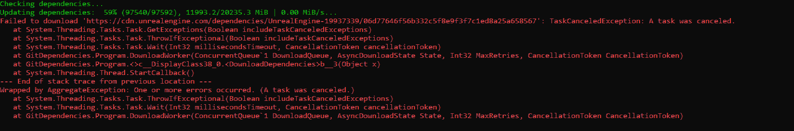

The complete installation process may take several hours, depending on your network bandwidth and CPU performance. If you encounter any issues that you cannot resolve, please submit them to our [Issues](https://github.com/JasonMa0012/MooaToon/issues/new) page.

Choose the appropriate guide based on your experience level:

## - Regular Users

### Account Setup

Before you begin, you'll need:
- An [**Epic Games**](https://www.unrealengine.com/) account
- A [**GitHub**](https://github.com/) account

If you don't have either account, please register first. Then:

1. Visit the [Epic Games documentation](https://www.unrealengine.com/en-US/blog/updated-authentication-process-for-connecting-epic-github-accounts) and follow the instructions to link your GitHub account to your Epic Games account.
2. Return to GitHub, navigate to "Your Organizations", and accept Epic's invitation to join their organization:

   |  |  |
   | ------------------------------------------------------------ | ------------------------------------------------------------ |

:::caution
Important Notes:
- If you cannot find EpicGames in your organizations after accepting the invitation, try signing out and back into your GitHub account.
- Epic Games has recently restructured their GitHub organization. If you encounter issues accessing GitHub project links, verify that your GitHub account is properly joined to the EpicGames organization and try re-linking your accounts if necessary.
:::

### Download MooaToon Installation Tool

1. [Download](https://github.com/JasonMa0012/MooaToon/archive/refs/heads/main.zip) the installation tool ZIP file
2. Extract it to a root directory on your hard drive (e.g., `D:\MooaToon`)
   - This helps avoid compilation errors caused by long file paths
   - **Important:** Ensure you have at least 500GB of free SSD space

### Automated Installation Process

Follow these steps in order:

1. Run `_1_1_Install_Git.bat` to install Git with default settings
2. Run `_1_2_Install_VisualStudio.bat` to install Visual Studio with default settings
3. **Save all your work**, then run `_1_3_Restart_Computer.bat` to restart your computer
4. Run `_2_0_Install_And_Run_MooaToon.bat` and:
   - Follow the prompts to log in to your GitHub account
   - Wait for the download and compilation to complete (typically 1-3 hours)
   - **Note for Chinese Users:** Enable a global proxy as prompted to avoid network issues
5. The project will launch automatically once installation is complete

### Verifying the Installation

When you first launch the project:
1. Wait for shader compilation to complete
2. You should see an interface similar to this:

All sample levels are located in the `Content\MooaToonSamples\Maps` directory:

Feel free to explore these samples to learn about MooaToon's features.

### Updating MooaToon

To stay updated:
1. Subscribe to the [MooaToon-Engine](https://github.com/Jason-Ma-0012/MooaToon-Engine) repository for update notifications
2. Use the `_3_0_Update_And_Run_MooaToon.bat` script to download updates

:::caution
Important: Do not use `_2_0_Install_And_Run_MooaToon.bat` for updates. This script downloads only the minimum required content and is intended for initial installation only.
:::

### Handling Conflicts

When updating MooaToon:
- You'll be notified if you've modified any MooaToon files
- If modified files conflict with updates, you'll receive an error
- Best practice:
  1. Manually backup any files causing merge conflicts
  2. Run `_3_X_Clean_MooaToon_X` to clean the workspace
  3. Attempt the update again

## - Developer Guide

For developers familiar with Unreal Engine:

1. Review the [Official UE Documentation](https://docs.unrealengine.com/5.1/en-US/building-unreal-engine-from-source/) on building from source
2. Visit the [MooaToon-Engine Repository](https://github.com/Jason-Ma-0012/MooaToon-Engine)
3. Clone and work with these branches:
   - `5.x` branch for engine compilation
   - `5.x_MooaToonProject` branch for project development

## Troubleshooting

### Network Issues During Installation or Updates

Here are several solutions to common network problems:

#### Optimize GitHub Connection Speed

For users experiencing slow GitHub connections (especially in mainland China):
1. Run `_2_4_Fetch_Fastest_Github_IPs.bat`
   - This script automatically runs during `_2_0_Install_And_Run_MooaToon.bat`
   - It finds the fastest GitHub server IPs in your region
   - Updates your hosts file to improve download speeds

#### Configure Global Proxy

If you have access to a proxy server:

1. Enable global proxy in your proxy software
2. Run `_0_2_Set_CMD_And_Git_Proxy.bat` to configure Git and CMD
3. To disable the proxy later, run `_0_3_Cancel_CMD_And_Git_Proxy.bat`

#### Manual ZIP Download Method

As an alternative to Git, you can download ZIP files directly. This method may provide:
- More stable downloads
- Support for download managers
- Resume capability for interrupted downloads

Note: This method requires manually downloading the entire engine and project for each update.

Steps:
1. Visit [MooaToon-Engine Repository](https://github.com/Jason-Ma-0012/MooaToon-Engine):
   

2. Download the Engine:
   - Select the `5.x` branch
   - Click `Code > Download ZIP`

3. Download the Project:
   - Switch to `5.x_MooaToonProject` branch
   - Download its ZIP file

4. Extract the Engine:
   - Navigate to your MooaToon directory
   - Extract engine files to `MooaToon\MooaToon-Engine`:
   

5. Extract the Project:
   - Extract project files to `MooaToon\MooaToon-Project`:
   

6. Setup and Build:
   - Run `_2_3_Setup_Unreal_Engine.bat` (requires downloading files from Epic's servers)
   - Run `_4_0_Build_And_Run_MooaToon.bat`

### Setup_Unreal_Engine Network Issues

When running the UE setup, you might encounter download issues:

If downloads stall or fail due to Epic server issues:

1. First try:
   - Toggle your global proxy
   - Switch to a different proxy server

2. Alternative solution - Manual Download:
   Download the required files from either:
   - [MEGA](https://mega.nz/folder/5rZgVR5C#5YjddnKYDcWvLNHBhE58KA)
   - [Baidu](https://pan.baidu.com/s/1Y8FFDyhvEcuQ53gFziJjvA?pwd=cht2)

   You'll receive a ZIP file like this:
   

3. Installation:
   - Extract `ue-gitdeps.zip` to `MooaToon-Engine\.git\ue-gitdeps`
   - Run `_2_3_Setup_Unreal_Engine.bat` again
   - Finally, run `_4_0_Build_And_Run_MooaToon.bat`

### Compilation Issues

#### Compiler Version Mismatch

Unreal Engine has [specific compiler requirements](https://dev.epicgames.com/documentation/en-us/unreal-engine/unreal-engine-5.4-release-notes#platformsdkupgrades).

To resolve:
1. Run `_1_2_Install_VisualStudio.bat` to automatically install the correct compiler
2. If issues persist:
   - [Completely uninstall Visual Studio](https://learn.microsoft.com/en-us/visualstudio/install/uninstall-visual-studio?view=vs-2022)
   - Restart your computer
   - Reinstall using the provided script

#### Missing Runtime Libraries

If compilation fails due to missing Windows libraries:

1. Install the latest [.NET Framework](https://dotnet.microsoft.com/en-us/download/dotnet-framework)
2. Use our [Library Repair Tool](https://drive.google.com/file/d/1DR80HhJu5iZ15RA71AO757_UgzG-_qig/view) to fix DirectX and C++ runtime libraries

#### PCH (Precompiled Header) Issues

Follow Microsoft's [official guidelines](https://devblogs.microsoft.com/cppblog/precompiled-header-pch-issues-and-recommendations/) to increase your system's virtual memory allocation.