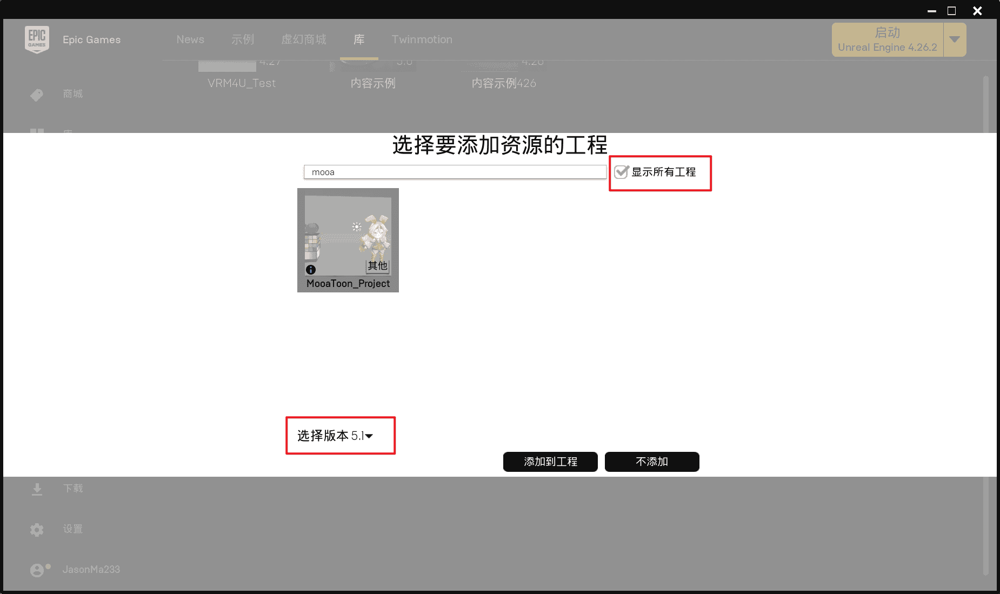

# Getting Started

## Experience an executable demo

TODO

## Select the engine version that you want to install

MooaToon is essentially a plugin that require modifications to the engine code, and currently does not support mobile platforms, so you cannot package games to mobile platforms.

### Install the precompiled version of the engine

If you are an artist and just want to try out MooaToon, the precompiled version is a good choice.

The advantage of the precompiled version is that it can be used out of the box without waiting for the engine to be compiled, and the downloaded content is the least, and the running performance is the best.

The disadvantage of the precompiled version is that it cannot package C++ games, does not contain debugging information, and needs to re-download the entire package every time a small update is made.

Execute the following scripts in sequence to use the precompiled version:

1. [Download installation tool](https://github.com/JasonMa0012/MooaToon/archive/refs/heads/main.zip) and unzip
2. Double click to run: `_0_0_Install_Latest_MooaToon_Precompiled_And_Override_All_Modified_Files.bat` will automatically download and decompress
3. Double click to run: `_0_1_Run_MooaToon_Precompiled_Project.bat` to open the project

:::caution

1. Download problem

**Because the service is based on Github, for users in mainland China, it is strongly recommended to enable the global proxy, otherwise the download speed and stability cannot be guaranteed.**

If the proxy cannot be used, it is recommended to run the script `_2_4_Fetch_Fastest_Github_IPs.bat` first to increase the download speed to a certain extent.

2. Running problems

If an error is reported when starting the project, first run `_0_0_Install_Latest_MooaToon_Precompiled_And_Override_All_Modified_Files.bat` again to ensure the integrity of the downloaded content, and then open the project.

If the problem is not resolved, please [download and run the library repair tool](https://drive.google.com/file/d/1DR80HhJu5iZ15RA71AO757_UgzG-_qig/view), restart the computer and open the project again.

:::

You can also use the script `_0_0_Install_Latest_MooaToon_Precompiled_And_Override_All_Modified_Files.bat` to update MooaToon, **all modified files will be overwritten**, and new files will not be overwritten if they do not have the same name as the MooaToon files.

### Compile the engine from source code

If you want to get full engine functionality and faster update speed, please refer to:

[Compile the engine from source code](BuildEnginefromSourceCode.md)

### Select UE version

You can edit `_2_5_Settings.bat` to select the UE version you want to install:

1. Right-click `_2_5_Settings.bat`, select Edit

2. Change the UE version in the `engineBranchName` and `projectBranchName` fields to the version you want to install, such as `5.1`:
``` 
set engineBranchName=5.1 
set projectBranchName=5.1_MooaToonProject 
```

3. Save and execute the installation process again

:::caution

You can choose to use an older version, but the older version may not contain the latest features or fixes.

:::

## (Optional) Install Ultra Dynamic Sky

Similar `L_TimeOfDay_Require_UltraDynamicSky` levels require you to purchase and install `Ultra Dynamic Sky` plugin to support the dynamic weather system:

- Purchase:[https://www.unrealengine.com/marketplace/zh-CN/product/ultra-dynamic-sky](https://www.unrealengine.com/marketplace/zh-CN/product/ultra-dynamic-sky)

- [Add MooaToon Project to Epic Launcher](/docs/FAQ#can-not-find-mooatoon-project-in-epic-launcher)

- In the Epic Launcher Library, install Ultra Dynamic Sky into MooaToon Project:

  

- Restart the engine

- Open `L_TimeOfDay_Require_UltraDynamicSky` again, and you should be able to see:

  

- You can run the game to see dynamic weather effects:

  |  |  |
  | ------------------------------------------------------------ | ------------------------------------------------------------ |

- Detailed usage of Ultra Dynamic Sky can be found on its store page

## File directory structure

- Precompiled version

```
MooaToon ------------------------------- root directory
 ├-MooaToon-Engine-Precompiled --------- engine installation directory
 │  ├-Windows\Engine\Plugins\MooaToon -- MooaToon engine plugin directory
 │  └-Windows\Engine\Binaries\Win64 ---- engine Executable file
 │    └-UnrealEditor.exe --------------- engine executable file
 ├-MooaToon-Project-Precompiled -------- project installation directory
 │  ├-Art ------------------------------ art resource file directory
 │  ├-Config --------------------------- project settings directory
 │  ├-Content -------------------------- project content directory
 │  │  ├-Global ------------------------ resources that MooaToonSamples depends on
 │  │  └-MooaToonSamples --------------- all samples of MooaToon, you can delete
 │  └-MooaToon_Project.uproject -------- project file
 │
 ...
```

- Source version

```
MooaToon ------------------------- root directory
 ├-MooaToon-Engine --------------- engine installation directory
 │  ├-Engine\Plugins\MooaToon ---- MooaToon engine plugin directory
 │  └-Engine\Binaries\Win64 ------ engine Executable file
 │    └-UnrealEditor.exe --------- engine executable file
 ├-MooaToon-Project -------------- project installation directory
 │  ├-Art ------------------------ art resource file directory
 │  ├-Config --------------------- project settings directory
 │  ├-Content -------------------- project content directory
 │  │  ├-Global ------------------ resources that MooaToonSamples depends on
 │  │  └-MooaToonSamples --------- all samples of MooaToon, you can delete
 │  └-MooaToon_Project.uproject -- project file
 │
 ...
```


 ## Using MooaToon in an existing project

You can use the MooaToon engine to open your own projects.

 ### Confirm the existing project version and MooaToon engine version

You can judge the engine version of MooaToon by the Branch name and Release name of MooaToon's [Github repository](https://github.com/JasonMa0012/MooaToon).

If your project uses an engine version lower than the MooaToon engine version, it will be required to upgrade to the MooaToon engine version.

If the engine version of your project is higher than the MooaToon engine version, it cannot be opened.

 ### Copy MooaToon example files to existing project

Copy the following example folders into your project's Content directory:

- Precompiled version
  - `MooaToon\MooaToon-Project-Precompiled\Content\Global` 
  - `MooaToon\MooaToon-Project-Precompiled\Content\MooaToonSamples`

- Source version
  - `MooaToon\MooaToon-Project\Content\Global` 
  - `MooaToon\MooaToon-Project\Content\MooaToonSamples`


 ### Open an existing project using the MooaToon engine

Locate and execute the engine executable:

 - Precompiled version 
   - `MooaToon\MooaToon-Engine-Precompiled\Windows\Engine\Binaries\Win64\UnrealEditor.exe`

 - Source version 
   - `MooaToon\MooaToon-Engine\Engine\Binaries\Win64\UnrealEditor.exe`


 :::tip

You can right-click the engine executable file and pin it to the start menu, or create a desktop shortcut, so that you don't have to find it manually every time.

 :::

Then open your own project in the project browser.

 :::caution

If your project depends on other engine plugins, you need to manually copy these plugins to the plugin directory of the MooaToon engine:

 - Precompiled version
   - `MooaToon\MooaToon-Engine-Precompiled\Windows\Engine\Plugins`

 - Source version
   - `MooaToon\MooaToon-Engine\Engine\Plugins`


 :::

 ### Check project settings

To use the full functionality of MooaToon, the following project settings must be enabled:

 - `Rendering > Dynamic Global Illumination Method: Lumen`
 - `Rendering > Ray Traced Shadows`

In addition, the following commands fix some UE rendering problems, and it is recommended to add them to `Config\DefaultEngine.ini` of your project:

 - `r.RayTracing.Shadows.AvoidSelfIntersectionTraceDistance=0.5`

Now you can check MooaToon's examples and use Toon materials in your own projects.
