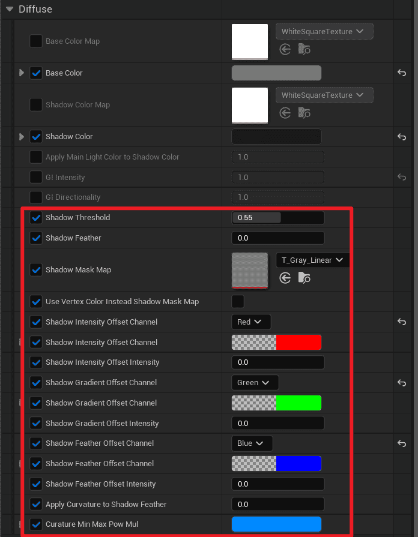
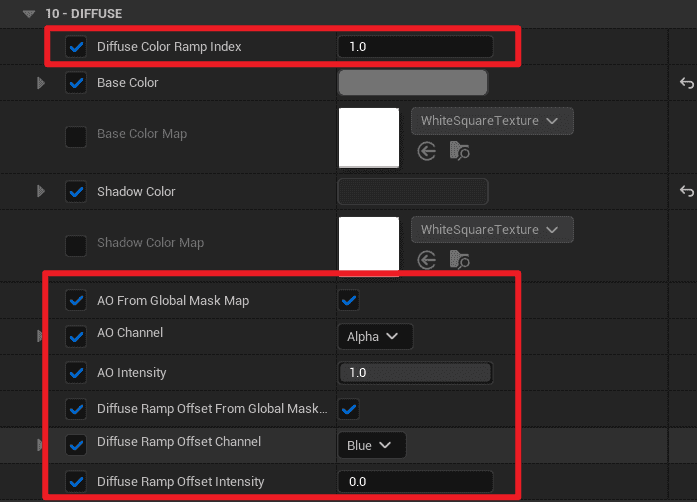
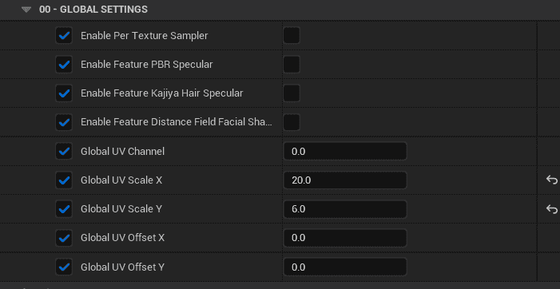

## Upgrade existing project to 5.4 

1. First, reinstall MooaToon in the temporary directory according to the [installation tutorial](/docs/GettingStarted/).  
    
2. If your project does not have version control, please make a complete copy of the project as a backup  
    
3. Copy the **Art**, **Content**, and **Plugins** folders from the newly installed MooaToonProject to your project directory and overwrite the files with the same name  
    
4. Replace the old one with the newly installed MooaToonEngine 
5. Open the project, select to upgrade the project in place
6. Check and fix your project according to the following text

## From Binarization upgrading to Global Ramp Lighting

The most important feature of 5.4 is the support for multi-light Global Ramp Lighting:

| 5.3                                                                                                                          | 5.4                                                                                                                                                       |
| ---------------------------------------------------------------------------------------------------------------------------- | --------------------------------------------------------------------------------------------------------------------------------------------------------- |
|                                                              |                                                                                           |
|                                                  |   |
| Controls Light/Shadow Transitions with `Threshold` and `Feather`, and Ramp Lighting supports only a single directional light | Customize the Light/Shadow Transitions of multiple light sources completely through `Global Diffuse Color Ramp`                                           |
|                                                              |                                                                                           |
|                                                  |   |
| Control the softness and hardness of highlights through `Threshold` and `Feather`                                            | Customize the Highlight Transition of multiple light sources completely through `Global Specular Color Ramp`                                              |

Please refer to these two tutorials to set up [Diffuse](/docs/Tutorial/ControlLightShadowColorTransition) and [Specular](/docs/Tutorial/AddStylizedHairHighlights#controlling-highlight-transitions-with-specular-color-ramp).

## Toon Material and GBuffer reconstruction

Through a series of modifications to optimize performance, simplify parameters, and enhance user experience:  

- The parameters that do not require per-pixel control have been changed to **Global Console Variables** and **Post-Processing Volume Parameters**:  
    
    This can reduce bandwidth requirements, minimize GBuffer waste, and simplify operation steps.

|  |  |
| ---------------------------------------------------------------- | ---------------------------------------------------------------- |
| 5.3: Parameters removed from the Toon material                   | 5.4: Global parameters added in `BP_LookdevTool`                 |

- Some global settings have been organized into separate categories:

|  |  |
| ---------------------------------------------------------------- | ---------------------------------------------------------------- |
| Before organizing                                                | Organized                                                        |
- By using the new `Global Mask Map` to reduce texture sampling as much as possible. Now you can choose _**to use a separate texture**_ or _**to use a channel from the Global Mask Map**_:

|  |                                     |
| ---------------------------------------------------------------- | --------------------------------------------------------------------------------------------------- |
| Only use separate maps                                           | You can select to use a certain channel from the `Global Mask Map` to reduce the number of textures |
- `ML_KajiyaKayHairHighlight` and `ML_DistanceFieldFacialShadow` have been removed and their functionality has been integrated into `ML_ToonBaseInput`.
- Ray Tracing Hair Shadow have been removed, as they have higher cost but are no better than Screen Space Hair Shadow.

:::caution

***Some parameters and textures may need to be reconfigured***.

:::

## Import VRM files directly 

MooaToon now has a built-in [VRM4U](https://github.com/JasonMa0012/VRM4U_MooaToon) engine plugin, allowing you to directly import .vrm files and automatically set materials.

The source file is located at: `MooaToon\MooaToon-Project\Art\VRMs`

## Houdini example updates

The Houdini example files have been simplified and annotated to lower the learning curve, and the documentation in the other tutorials has been updated.

## Documentation Updates

All tutorials have been updated and the layout and order have been greatly optimized to be more intuitive and easier to read.

## License Updates

MooaToon is committed to bringing the technology to more people. This update adds a clearer definition of commercial behavior and relaxes the scope of free use of MooaToon, click [here](./../Licence.md) to view.