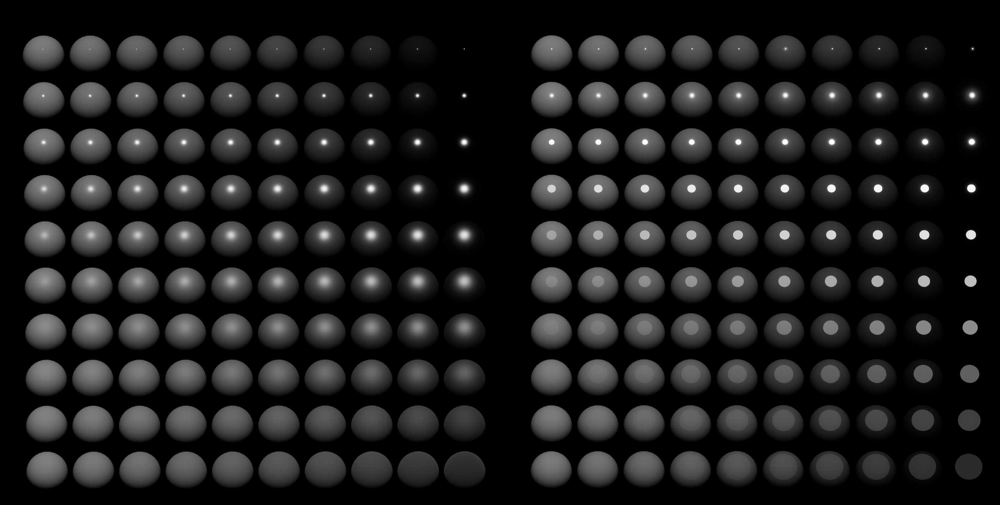
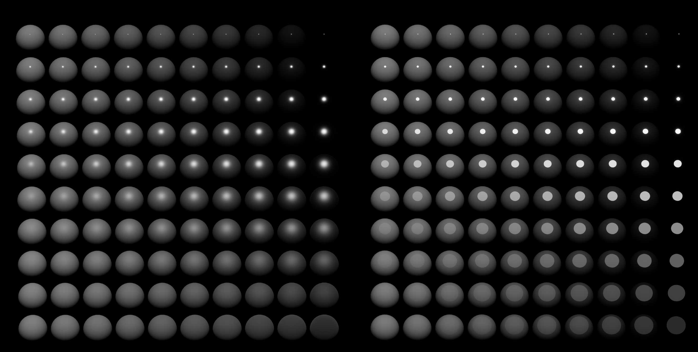
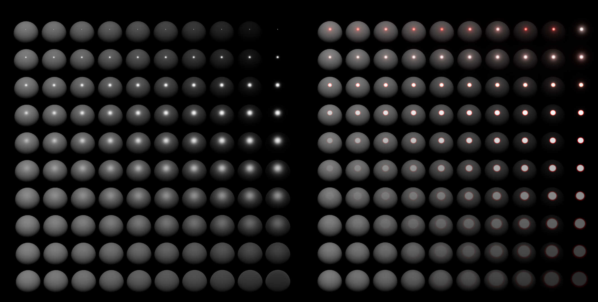

## Optimization of Specular Color Ramp
(2025/11/3)  
The UV and intensity of the Specular Color Ramp have been optimized, and the results may now appear different:  

| Before                                       | After                                        | Specular Color Ramp                             |
| -------------------------------------------- | -------------------------------------------- | ----------------------------------------------- |
|  |  |  |
|  |  |  |

Optimizations include:
- Specular Color Ramp UV distribution optimized to make the ramp sampling results more consistent with expectations.  
- Specular intensity optimized to prevent extreme values and make Bloom results more consistent with PBR Specular.  
- Internally built-in Specular Color Ramp adds smooth gradients.