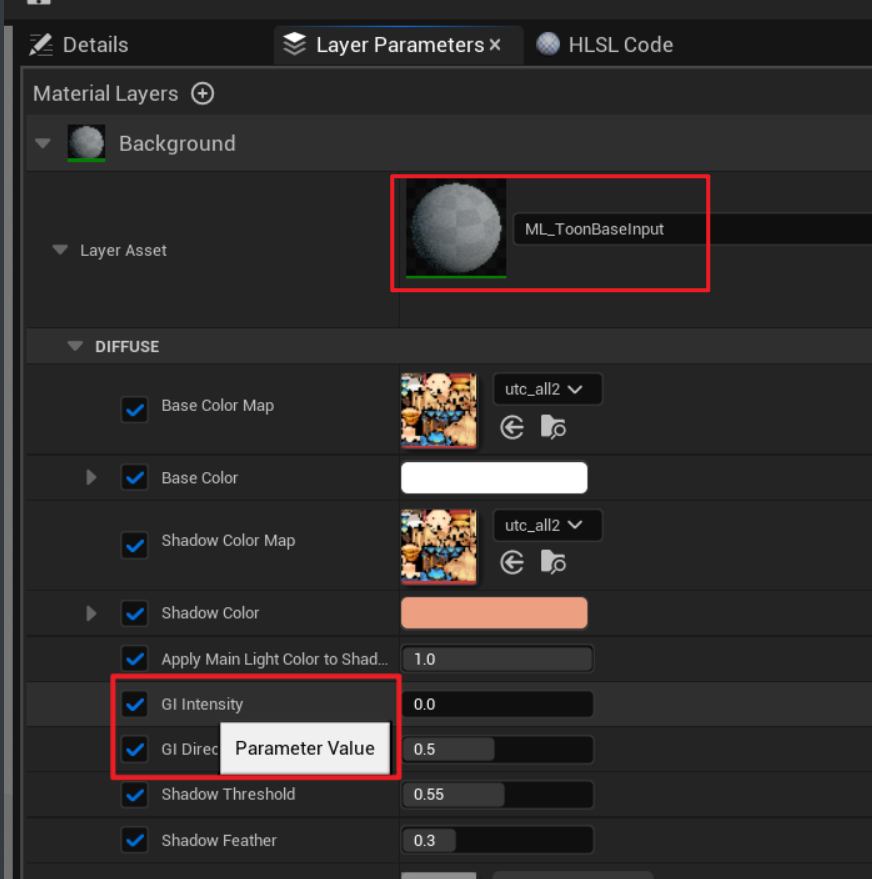
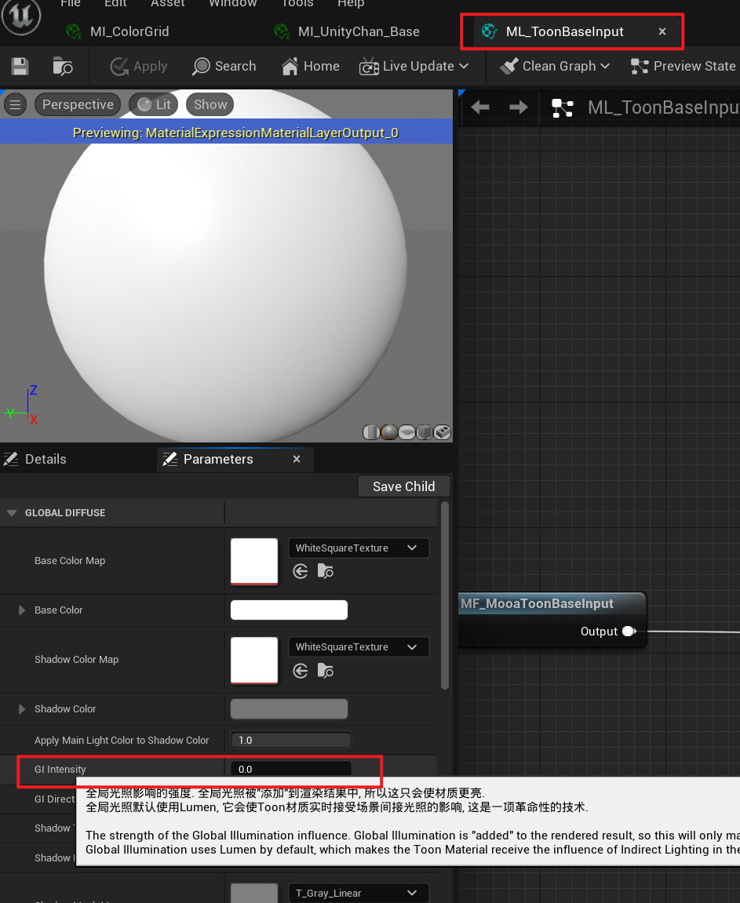

# Q and A

## Things to know

### File management

Please copy and not change the MooaToon file as much as possible, otherwise conflicts may arise due to the update

## Known official BUGs in UE 5.1

### Ray Tracing

#### Character shadow disappears

Sometimes the character's Ray Tracing Shadow disappears, runs the game or Hide / Show the character and then shows it again

#### Subsurface Transmission

The ShadingModelID obtained by Ray Tracing Shadow is always DefaultLit, which means that all shadows of objects will be treated as DefaultLit materials, and effects such as Subsurface Transmission will not take effect

#### Material preview

The floor of the material preview window is black when Ray Tracing Skylight is enabled

### Translucent

OIT (Order Independent Transparency, which provides support for correct rendering of multiple layers of translucency) causes translucent Blending Mode Add not to work

### Material editing

#### Crash

Adjusting the Material Layer Parameters is quite easy to crash, remember to save it often when using it

#### Description of Material Layer parameters

The description of Material Layer parameters often disappears, please check the full parameter description on the Parameters Panel after opening the Material Editor:

