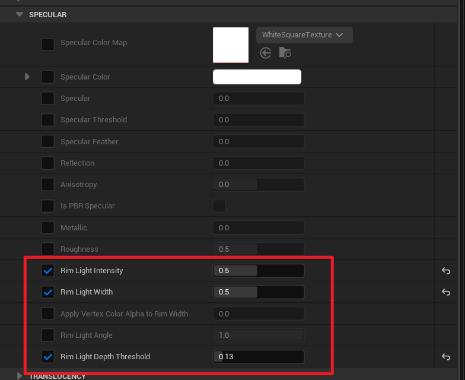

# Add Depth Using Rim Light

Adjusting a few material parameters can add a screen-space rim lighting effect to your materials:

Screen-space means that the width of the rim is not significantly affected by surface curvature, similar to the painting techniques commonly used in anime. The effect also supports depth occlusion and interacts with multiple light sources:

<Video src={require("./assets/WindowTop_2023_05_01_01_54.webm").default}></Video>

In addition to the material parameters, there are global console variables that can control the rim lighting effect:

- `r.Mooa.RimLight.MaxDepthFadeDistance`
- `r.Mooa.RimLight.MaxDepthTestDistance`
- `r.Mooa.RimLight.MaxWidth`
