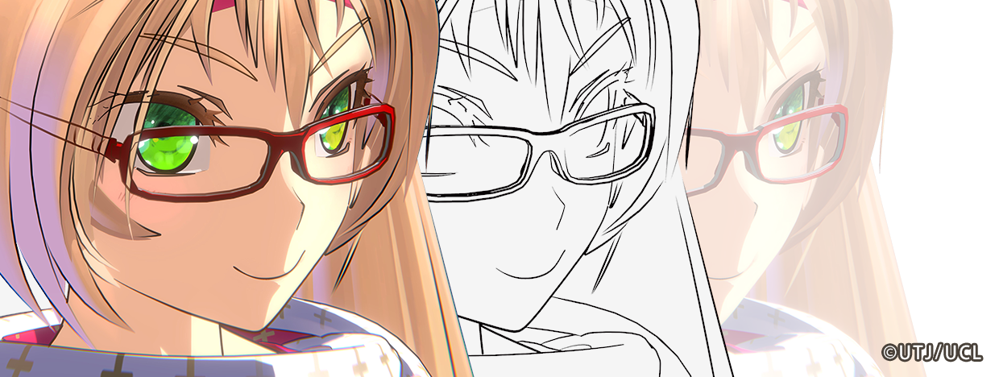
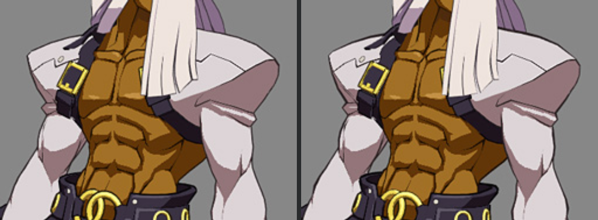
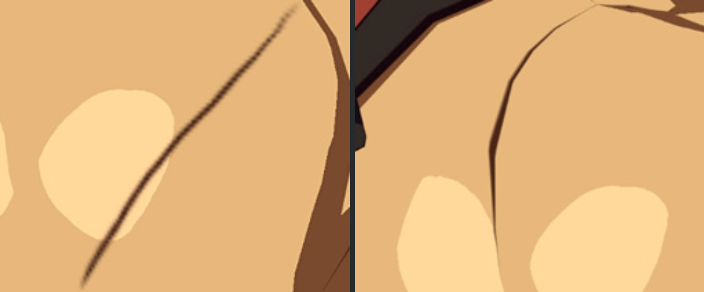

# Control Outline

## Outline and Stroke

Outline refers to the contour lines around the character, which is an important factor in achieve Toon Renderding:

Stroke refers to the width or color change between the start and end points of an outline. The physical reason for the formation of strokes is the change in pressure of the pen tip on the paper:

Left: No stroke; Right: With stroke

It is relatively easy to implement outlines with consistent width, but it is difficult to implement outlines with strokes. Whether there is a stroke is the key factor in making the outline look more hand-drawn, and therefore strokes have always been the watershed in outline techniques.

Outlines also have different **types**:

## Common Implementation Methods for Outlines and Strokes

**GUILTY GEAR's [article](https://www.4gamer.net/games/216/G021678/20140703095/index_2.html)** provides a detailed explanation of outlining techniques in Toon Rendering.

Here are some commonly used real-time outlining rendering methods:

### Outer Outline

Based on the "backface" or "shell" method, a character's back model is rendered behind the character and extruded along its normals. This is the most classic and widely used outline technique. The normals used for extrusion must be smooth, otherwise the outline will break at hard edges. Only the "Outline" type can be rendered, so it is commonly referred to as the **Outer Outline**.

Vertex colors and other methods can be used to control the width and simulate brush strokes locally:

Left: Controllable stroke width outline; Right: Vertex color used to control the width

Left: No width adjustment at the shoulder; Right: Width adjustment at the shoulder

### Inner Outline

Compared with outer outline, the outline drawn directly on the texture can be called **inner outline**.

#### Homura Style Line

Due to resolution limitations of textures, the edges drawn on textures can appear pixelated and blurry when viewed up close.

Homura C Junya(本村・C・純也) proposed a method called "Homura Style Line" that can achieve infinite high-precision perfect edges through a special UV layout and texture:

Left: Edges using conventional methods; Right: Edges obtained using Homura Style Line

UV and texture, distant view, close-up view of Homura Style Line

UV and texture, distant view, close-up view of conventional methods

This method can achieve high-precision internal edges without relying on rendering algorithms, but it requires a lot of work from the artist.

#### SDF

There is also a [method](https://zhuanlan.zhihu.com/p/113190695) that converts the internal edges of conventional methods into SDF to improve accuracy and width control, similar to high-precision text rendering based on SDF.

### Post-processing Outline

Edges calculated by convolving depth / normal / color in screen space, which have the characteristics of global effectiveness, regardless of scene complexity, and can achieve almost all types of edges.

If fine control of character edge visibility and width is required, some additional development of the rendering pipeline is needed, such as in "Ni no Kuni" (CG world 2018-06):

A: Base Color; B: Outlines detected where the outline strength changes suddenly in vertex color; C: Mesh ID changes are also detected as outlines; D: Outline result

### Pencil+

[Pencil+](https://www.psoft.co.jp/jp/product/pencil/unity/) is a commonly used outline plugin in the film industry, representing the highest quality, controllability, and ease of use in the industry.

However, it can only be used for offline purposes and there is currently no UE version.

### Others

Technological changes are fast, and in recent years, new technologies such as [real-time stroked outlines](https://github.com/JiangWZW/Realtime-GPU-Contour-Curves-from-3D-Mesh) and [neural network-based outlines](https://github.com/DifanLiu/NeuralStrokes) have emerged.

But our pursuit of perfection will not change, and using new technologies well, we will reach and surpass goals faster.

## Using Houdini to adjust vertex color to control the width of outer outlines

Left: Before; Right: After

After the [previous tutorial](/docs/Tutorial/AddAdvancedRenderingFeaturesToCharacters/ControlTheShapeOfShadows#transferring-custom-normals-using-houdini), you should be familiar with the process of baking vertex data using Houdini. The `Vertex_Color_Alpha_for_Outline` node contains all the modifications to the edge width:

You can use a similar method to directly specify or paint Alpha on your own model.

After painting is complete, export the model using the `OUTPUT_FBX` node and import it into UE.

Follow [the previous tutorial](/docs/Tutorial/ImportANewCharacterAndSetupTheBasicMaterial#outline-settings) to set the outline.

Then set the following material parameters, and you can see the modified results:

## Controlling Outline Width with a Curve at Different Distances

MooaToon controls the width of the outline at different distances using a curve:

The X-axis of the curve represents the size of the current pixel in world space, which can be simply understood as the distance between the camera and the character. The closer the distance, the smaller the X value, and vice versa. The Y-axis represents the width of the outline. `Max Distance` controls the distance when X equals 1.

Thanks to this unique algorithm, the outline width at different distances looks correct in various complex environments, such as different FOVs, aspect ratios, and rendering resolutions:

<Video src={require("./assets/rider64_2023_04_16_16_00.webm").default}></Video>

:::caution

When adding your own curve, please copy and rename a curve in `MooaToon/MooaToon-Engine/Engine/Plugins/MooaToon/Content/Assets/CA_OutlineCurves`, to avoid being overwritten when updating MooaToon.

If you can't see this file, make sure you have enabled `Show Engine Content` in the Content Browser:

After updating the precompiled version of MooaToon, since all files with the same name have been overwritten, you need to reassign the curve you created in `CA_OutlineCurves`.

:::

