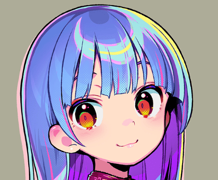
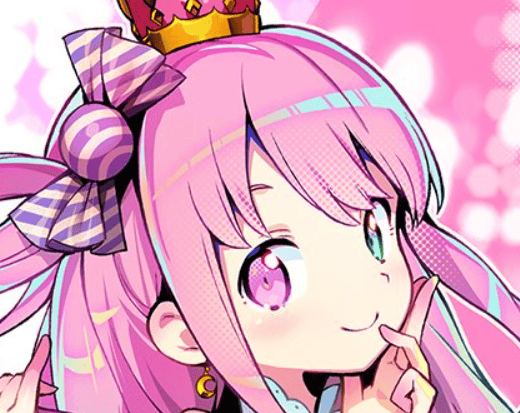
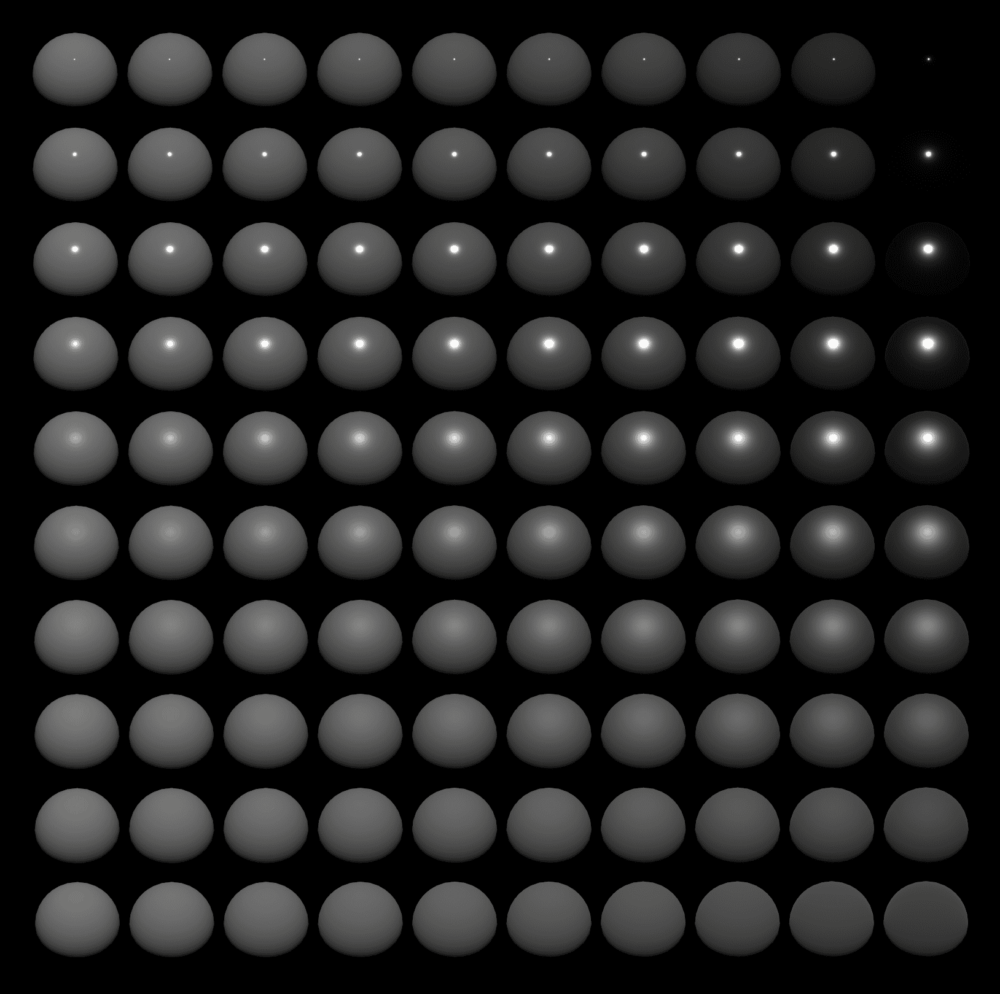
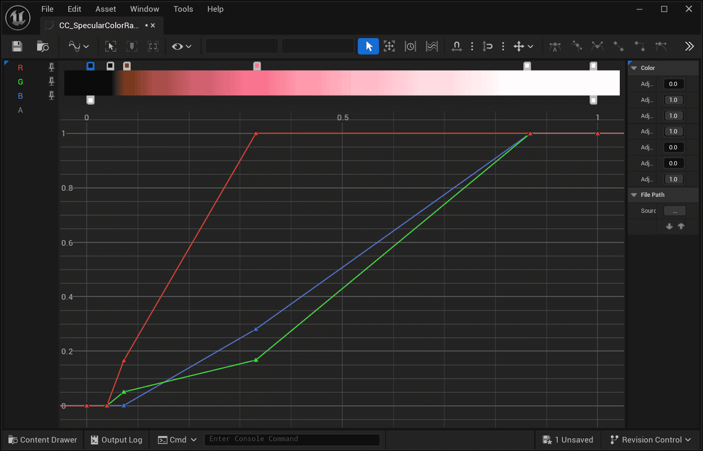
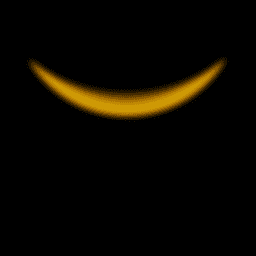

The highlights of hair in illustrations are diverse in form (Author: [おののいもこ 魚介](https://twitter.com/_himehajime)):

|  |  |  |
| ---------------------------------------------------------------- | ---------------------------------------------------------------- | ----------------------------------------- |
| Annular                                                          | Point-like                                                       | Angel ring                                |

The following provides common methods for achieving hair highlights. The method used in the MooaToon example is the original **Stylized Kajiya-Kay based on Tangent Transfer**:

## - Stylized Kajiya-Kay based on Tangent Transfer

<Video src={require("./assets/bandicam 2024-08-10 17-19-49-631.webm").default}/>

The position of Kajiya-Kay highlights depends on the view direction and tangent direction. Custom tangents can be defined through Tangent Transfer to control highlight shape and direction, without being limited by topology.

Further refinement of highlight shape can be achieved by controlling the Specular Gradient, theoretically enabling the realization of all types of highlights.  

To use this method, custom tangents need to be baked into the model UV. MooaToon uses Houdini for baking and provides all source files:

### Baking Custom Tangents using Houdini 

The nodes used are already included in the [previous tutorial](./ControlTheShapeOfShadows#--houdini-normal-transfer).  

In the `mooa_highlightTangentTransfer` node, the tangents of the ellipsoid are transferred to the hair:

Use the `mooa_highlightPreview2` node to preview the highlight range:  

1. Select `cam1` from the camera menu in the top right corner of the 3D View  
    
2. Enable `Tie View To Camera/Light`
3. Ensure that `Display materials on objects` is disabled in the options on the right side of the 3D View  
    
4. Hold Alt and use the mouse to rotate the view to see changes in highlights 
5. Adjust the lighting angle using the slider in the bottom left corner of the 3D View

<Video src={require("./assets/bandicam 2024-08-14 01-04-10-750.webm").default}/>

If you want to use your own model, you need to: 

1. Modify the `mooa_highlightTangentTransfer` node's `Destination Group` to select the hair part of your model  
    
2. Modify the second input of the `mooa_highlightTangentTransfer` node. You can directly modify the `transform5` node of the ellipsoid to customize the highlight shape, or replace it with new geometry input

Once ready, follow the [previous tutorial](./ControlTheShapeOfShadows#import-the-model-into-ue) to export the model to UE, then adjust the hair material as shown in the image below:

Use `Ctrl + L` to adjust the lighting direction, and you will see shapes and dynamic highlights similar to those in Houdini.  

Next, you can control highlight detail shapes through Masks. 

### Draw a Specular Mask to Precisely Control highlight Shapes

Similar to [drawing a Shadow Mask Map](./ControlTheShapeOfShadows#draw-mask-maps), the Highlight Mask example source files are located in the `MooaToon\MooaToon-Project\Art\Models\NewTextures\HairHighlightMaskMap.spp`:

Set the background color to 0, and draw 1 in the areas where highlights should appear. 

After drawing is complete, export the texture to UE, uncheck sRGB. Then set it as the `Specular Color Map`:

Unwanted highlights have been erased. 

Next, you can choose to directly add Noise to `Specular Ramp Offset`:

Or copy `Specular Color Map` and reduce the brightness by half (from a maximum value of 1 to 0.5), then set it as `Specular Ramp Offset Map`:

The sharp angle of the visible highlight has become rounded.

### Controlling Highlight Transitions with Specular Color Ramp

Similar to [Diffuse Color Ramp](./ControlLightShadowColorTransition), Specular Color Ramp can also be used to control the highlight color transition.  

The values of the RGB channels of the Specular Color Ramp represent the Specular Color, with the x-axis being the relative brightness of PBR Specular:  

- 0 represents the minimum brightness (corresponding to the farthest distance from the center of Specular)  
    
- 0.5 represents the middle value (corresponding to the range after binarization of PBR Specular based on experience)  
    
- 1 represents the maximum brightness (corresponding to the center of Specular) 

Intuitively represented as follows:

|                                                                  |                                         |
| ---------------------------------------------------------------- | ------------------------------------------------------------------------------------------------------- |
|                                                                  | PBR Specular; Metallicity increases from left to right; Roughness increases from top to bottom; |
|  |                                         |
| Binarization of Specular Color Ramp at 0.5                       | Toon Specular, Binarized highlight range approximates PBR.                                          |
|  |                                         |
| Gradient from 0 to 1                                             | Soft transition of highlights                                                                           |
|  |                                         |
| Gradient with multiple colors                                    | Edge-colored transition of highlights                                                                   |

## - Drawn on a Texture 

Static, no lighting, but optimal controllability, suitable for fixed-angle games or videos.  

## - Physically-Based Hair Rendering 

The goal of this method is to render hair as realistically as possible, so it is only suitable for works in a realistic style:

## - Material Capture (MatCap) 

Please refer to [UTS](https://docs.unity3d.com/Packages/com.unity.toonshader@0.9/manual/MatCap.html).

MatCap Map Example

|  |  |
| ------------------------------------ | --------------------------------- |
| MatCap Map Off                     | MatCap Map On                   |

This method only supports a single main light. Although the shape can be customized through MatCap Map, the highlight shape is still limited by the topology. 

Unsightly highlights often appear when the model has a low number of faces or an unreasonable structure, making it suitable for game works with low requirements for highlight shape.

## - Texture Projection 

Please refer to [UTS](https://docs.unity3d.com/Packages/com.unity.toonshader@0.9/manual/AngelRing.html).

|  |  |
| --------------------------------- | ------------------------------------------------- |
| Example Texture                 | Texture Projection On                           |

This method projects textures onto hair along the line of sight, suitable for angel halo highlights that look the same from any angle. Suitable for games with a specific style.
