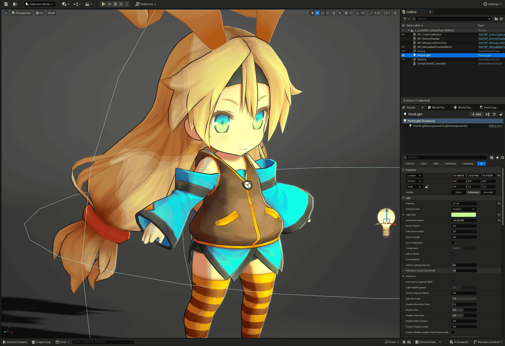
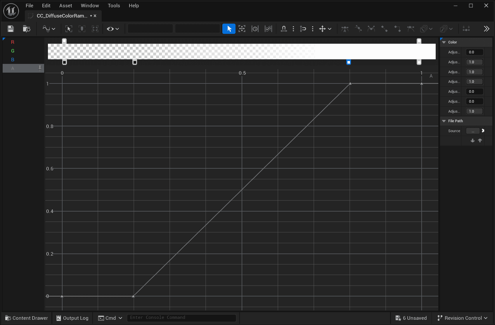

MooaToon uses Ramp Map to represent the color transition from light to shadow:


| Default Ramp + Single Light<br/>Binarization Shadow Transition           |  |
| ------------------------------------------------------------------------ | ---------------------------------------------------------------- |
| 3Levels Ramp + Single Light<br/>Shadow Transition now has 3 color levels |  |
| 3Levels Ramp + Multiple Lights                                           |  |

Ramp is a 1D lookup table (LUT), which stores user-defined Curves, represented as Color Curves in UE:


By vertically arranging multiple Color Curves, a Curve Atlas texture can be created, with each Color Curve occupying one row of pixels:


Starting from MooaToon 5.4, use Global Diffuse Color Ramp and Global Specular Color Ramp, by placing all Ramps in an Atlas, and specifying which Ramp to use in each material, achieving Multi-Light Ramp Lighting.

## Choose Which Ramp to Use

First find `Global Diffuse Color Ramp Atlas` in Project Settings to browse all available Ramps: `Project Settings > Engine > MooaToon > Global Diffuse Color Ramp Atlas`.

Then remember the index of the Ramp you want to use, for example, the index of `CC_DiffuseColorRamp_012_3Levels2` is 12, then fill in the index into the `Diffuse Color Ramp Index` of the Toon material:


## Add a New Ramp

To avoid file conflicts, please do not directly modify the built-in Ramps of MooaToon. Instead, add new Ramps directly.  

First, duplicate the current `Global Diffuse Color Ramp` (default is `CA_GlobalDiffuseColorRampAtlas`), then place it in your own directory.  

Then set the duplicated RampAtlas file to `Global Diffuse Color Ramp Atlas`.  

Now you can edit your own Ramp Atlas, you can directly create new Color Curves or copy built-in Ramps, then add them to the Ramp Atlas.  

## Detailed Explanation of Diffuse Color Ramp Channels 

The A channel of Diffuse Color Ramp has the angle between the normal direction and the lighting direction (N dot L) on the horizontal axis, 0 for backlit, 1 for frontlit. 
And the value is Shadow Gradient.  

The RGB channels have Shadow Gradient on the horizontal axis, and the value is color.

:::info

The final calculation order of Diffuse color is represented in pseudo code as follows:

```c
1. ShadowGradient = Sample DiffuseColorRamp.A by NdotL + DiffuseColorRampOffset
2. ShadowGradient = minimal(ShadowGradient, ShadowAttenuate/*RT Shadow or Virtual Shadow Map*/, MaterialAO)
3. DiffuseColor   = Blend ShadowColor and BaseColor with ShadowGradient // 1=Base Color, 0=Shadow Color
4. Output         = DiffuseColor Multiply (Sample DiffuseColorRamp.RGB by minimal(NdotL, ShadowGrdient))
```

:::

直观表示如下:


|        | +   |  | =   |                                                                                            |
| :--------------------------------------------------------------------- | --- | ---------------------------------------------------------------- | --- | ---------------------------------------------------------------------------------------------------------------------------------------------------------- |
| Ramp A: Binarized at 0.5                                               |     | Modify Base Color and Shadow Color                               |     | Binarization of 2 colors                                                                                                                                   |
|        | +   |  | =   |                                                                                            |
| Ramp A: Slow transition from 1 to 0                                    |     | Modify Base Color and Shadow Color                               |     | Slow transition of 2 colors                                                                                                                                |
|        | +   |  | =   |                                                                                            |
| Ramp RGB: Gradient of 3 colors<br/>Ramp A: Slow transition from 1 to 0 |     | Base Color = Shadow Color                                        |     | Gradient of 3 colors                                                                                                                                       |
|        | +   |  | =   |                                                                                            |
| Ramp A: Gradient of 4 color levels                                     |     | Modify Shadow Color                                              |     | Staggered gradient of 2 colors                                                                                                                             |
|        | +   |  | =   |                                                                                            |
| Ramp RGB: Gradient of 3 colors<br/>Ramp A: Gradient of 4 color levels  |     | Base Color = Shadow Color                                        |     | Staggered gradient of 3 colors                                                                                                                             |
|                                                                        |     |  | =   |                                                                                            |
| Ramp remains unchanged                                                 |     | Modify Shadow Color                                              |     | Staggered gradient of 3 colors in multiply blending mode with Shadow Color                                                                                 |
|        |     |                                                                  | =   |                                                                                            |
| Sample Noise Map                                                       |     |                                                                  |     | Noise Map sampling result                                                                                                                                  |
|        | +   |  | =   |                                                                                            |
| Ramp A: Gradient of 4 color levels                                     |     | Noise Map as Diffuse Ramp Offset                                 |     | Diffuse Ramp A channel is offset,<br/>Meaning the position of the light-shadow boundary is offset                                                          |
|                                                                        |     |  | =   |                                                                                            |
| Ramp remains unchanged                                                 |     | Noise Map as AO                                                  |     | - Areas where Noise is less than 1 gradually transition to shadows,<br/>- No offset at the light-shadow boundary,<br/>- Can create soft shadow transitions |
