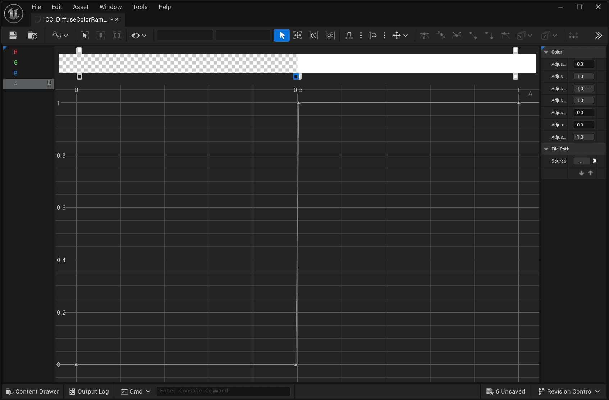
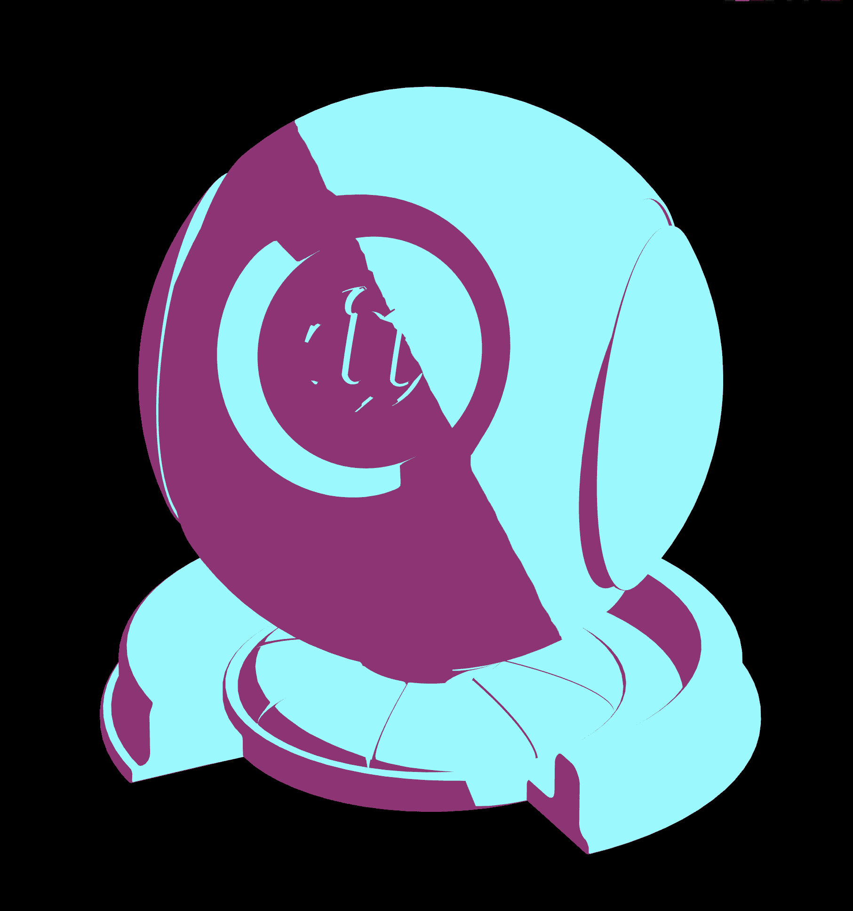
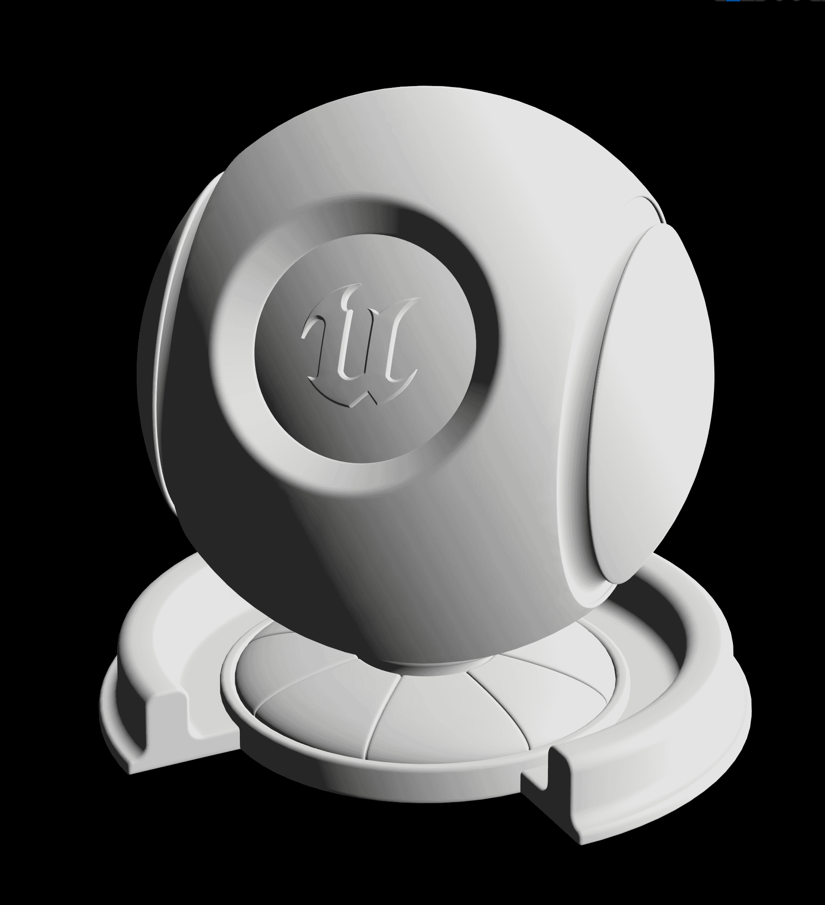
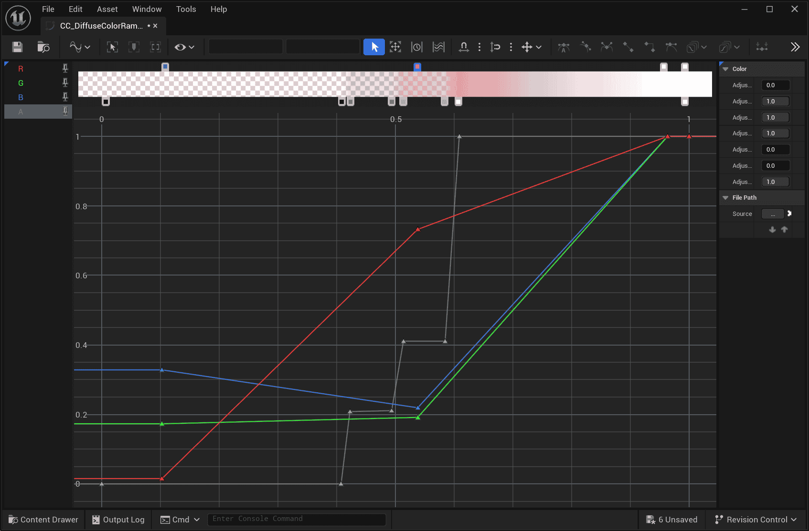

MooaToon uses Ramp Map to represent the color transition from light to shadow:


| Default Ramp + Single Light<br/>Binarization Shadow Transition           |  |
| ------------------------------------------------------------------------ | ---------------------------------------------------------------- |
| 3Levels Ramp + Single Light<br/>Shadow Transition now has 3 color levels |  |
| 3Levels Ramp + Multiple Lights                                           |  |

A Ramp is a 1D lookup table (LUT) that stores user-defined Curves, represented as Color Curves in UE:


By vertically arranging multiple Color Curves, a Curve Atlas texture can be created, with each Color Curve occupying one row of pixels:


Starting from MooaToon 5.4, use Global Diffuse Color Ramp and Global Specular Color Ramp by placing all Ramps in an Atlas and specifying which Ramp to use in each material to achieve Multi-Light Ramp lighting.

## Choose Which Ramp to Use

First find `Global Diffuse Color Ramp Atlas` in Project Settings to browse all available Ramps:  
`Project Settings > Engine > MooaToon > Global Diffuse Color Ramp Atlas`.

Then remember the index of the Ramp you want to use, for example, the index of `CC_DiffuseColorRamp_012_3Levels2` is 12, then fill in the index into the `Diffuse Color Ramp Index` of the Toon material:


## Add New Ramps and Ramp Atlas

To avoid file conflicts, please do not directly modify the built-in Ramps or Ramp Atlas of MooaToon. Instead, directly add new Ramps and Ramp Atlas.

First, duplicate the current `Global Diffuse Color Ramp` (default is `MooaToon-Project/Plugins/MooaToon/Content/Assets/DiffuseColorRamps/CA_GlobalDiffuseColorRampAtlas`), then to your own directory.  

Then set the duplicated RampAtlas file to `Global Diffuse Color Ramp Atlas`.  

Now you can edit your own Ramp Atlas, you can directly create new Color Curves or copy built-in Ramps, then add them to the Ramp Atlas.  

## Detailed Explanation of Diffuse Color Ramp Channels 


| PBR Lambertian Diffuse                          | Binary Ramp Lighting                            | 3 Levels Ramp Lighting                          | Skin Ramp Lighting                              |
| ----------------------------------------------- | ----------------------------------------------- | ----------------------------------------------- | ----------------------------------------------- |
|  |  |  |  |
|  |  |  |  |

The horizontal axis of the Diffuse Color Ramp represents the angle between the normal direction and the light direction (N dot L, abbreviated as NoL), where 0 is the backlit side and 1 is the frontlit side.  

The `Diffuse Color Offset` input of the Toon Material is used to offset the light-dark boundary (`NoL + DiffuseColorOffset`), while `AO` is used to create fixed-position shadows (`min(NoL, AO)`).  

The value of the RGB channel is Diffuse Color.     
The A channel is used to distinguish between light and dark areas, which means blending Base Color and Shadow Color, where 1 represents light (Base Color) and 0 represents dark (Shadow Color).

:::info

The final calculation order of Diffuse color is represented in pseudo code as follows:

```c
1. DiffuseColorRampU = min(NoL + DiffuseColorRampUVOffset, AO, Shadow/*Ray Tracing Shadows / Virtual Shadow Maps / Hair Shadows*/)
2. DiffuseColorRamp  = Sample GlobalDiffuseColorRampAtlas by DiffuseColorRampU 
3. DiffuseColor      = Blend ShadowColor and BaseColor with DiffuseColorRamp.a
4. Output            = DiffuseColor * DiffuseColorRamp.rgb * Light Color
```

:::

More examples are as follows:

|        | +   |  | =   |                                                                                            |
| :--------------------------------------------------------------------- | --- | ---------------------------------------------------------------- | --- | ---------------------------------------------------------------------------------------------------------------------------------------------------------- |
| Ramp A: Binarized at 0.5                                               |     | Modify Base Color and Shadow Color                               |     | Binarization of 2 colors                                                                                                                                   |
|        | +   |  | =   |                                                                                            |
| Ramp A: Slow transition from 1 to 0                                    |     | Modify Base Color and Shadow Color                               |     | Slow transition of 2 colors                                                                                                                                |
|        | +   |  | =   |                                                                                            |
| Ramp RGB: Gradient of 3 colors<br/>Ramp A: Slow transition from 1 to 0 |     | Base Color = Shadow Color                                        |     | Gradient of 3 colors                                                                                                                                       |
|        | +   |  | =   |                                                                                            |
| Ramp A: Gradient of 4 color levels                                     |     | Modify Shadow Color                                              |     | Staggered gradient of 2 colors                                                                                                                             |
|        | +   |  | =   |                                                                                            |
| Ramp RGB: Gradient of 3 colors<br/>Ramp A: Gradient of 4 color levels  |     | Base Color = Shadow Color                                        |     | Staggered gradient of 3 colors                                                                                                                             |
|                                                                        |     |  | =   |                                                                                            |
| Ramp remains unchanged                                                 |     | Modify Shadow Color                                              |     | Staggered gradient of 3 colors in multiply blending mode with Shadow Color                                                                                 |
|        |     |                                                                  | =   |                                                                                            |
| Sample Noise Map                                                       |     |                                                                  |     | Noise Map sampling result                                                                                                                                  |
|        | +   |  | =   |                                                                                            |
| Ramp A: Gradient of 4 color levels                                     |     | Noise Map as Diffuse Ramp Offset                                 |     | Diffuse Ramp A channel is offset,<br/>Meaning the position of the light-shadow boundary is offset                                                          |
|                                                                        |     |  | =   |                                                                                            |
| Ramp remains unchanged                                                 |     | Noise Map as AO                                                  |     | - Areas where Noise is less than 1 gradually transition to shadows,<br/>- No offset at the light-shadow boundary,<br/>- Can create soft shadow transitions |
## Console Variables


### r.Mooa.DiffuseColorRamp.EnablePostRampShadow

Shadows from other objects will by default participate in the sampling of the Diffuse Color Ramp as one of the UVs, which is intuitive in most cases.    
However, for some large area low-intensity shadows (such as cloud shadows), this can cause characters to appear to receive shadows at times and not at others.  

By setting `r.Mooa.DiffuseColorRamp.EnablePostRampShadow` to 1, shadows can be calculated after Ramp Lighting, making the shadow performance of characters and scenes consistent, as shown in the figure below:

| Diffuse Color Ramp                              | EnablePostRampShadow = 0                        | EnablePostRampShadow = 1                        |
| ----------------------------------------------- | ----------------------------------------------- | ----------------------------------------------- |
|  |  |  |

### r.Mooa.DiffuseColorRamp.EnablePostRampMaterialAO

Similar to `r.Mooa.DiffuseColorRamp.EnablePostRampShadow`, when enabled, Material AO will not affect the sampling of Diffuse Color Ramp, but instead, together with the A channel of Diffuse Color Ramp, influence the blending of Diffuse Color and Shadow Color:

| Diffuse Color Ramp                              | AO Value                                        | EnablePostRampMaterialAO = 0<br/>Shadow Color = Black | EnablePostRampMaterialAO = 1<br/>Shadow Color = Black |
| ----------------------------------------------- | ----------------------------------------------- | ---------------------------------------------------- | ----------------------------------------------------- |
|  |  |       |        |

### r.Mooa.DiffuseColorRamp.UVOffsetMaxRange

Maximum range of UV Offset. Note: Limited by the GBuffer bit depth, if this value is too large, it may lead to insufficient precision.

### r.Mooa.SpecularColorRamp.UVOffsetMaxRange

Maximum range of UV Offset. Note: Limited by the GBuffer bit depth, if this value is too large, it may lead to insufficient precision.