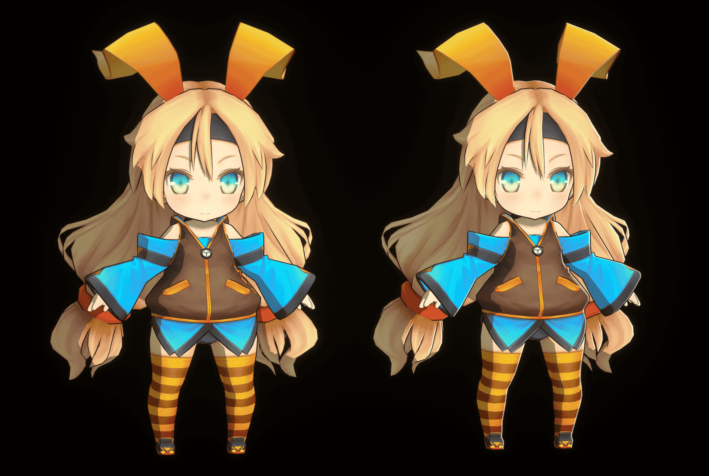
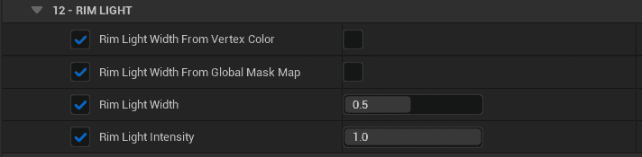

Screen Space Rimlight is different from traditional Rimlight based on normal direction and viewing direction angle, it is not affected by surface curvature, can provide nearly uniform width Rimlight, closer to hand-drawn:

<Video src={require("./assets/WindowTop_2023_05_01_01_54.webm").default}/>

You can easily adjust the Screen Space Rimlight by simply adjusting the material parameters, supporting the use of textures or vertex colors to control local width:

More global parameters can be adjusted in `BP_MooaLookDevTool`.
