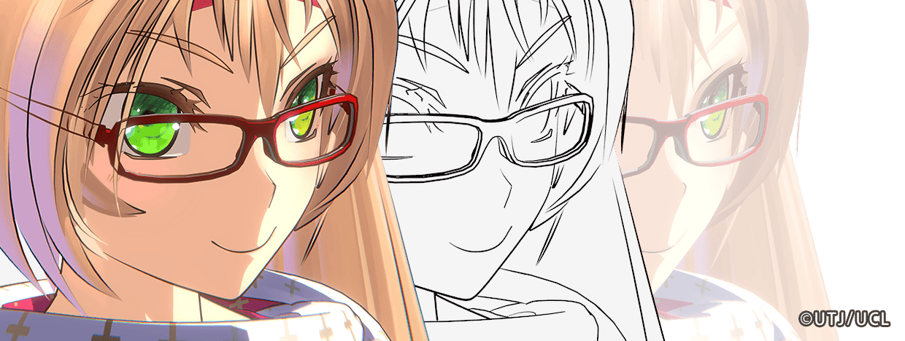
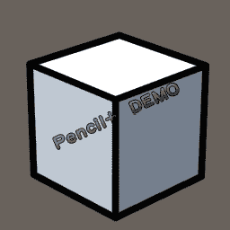
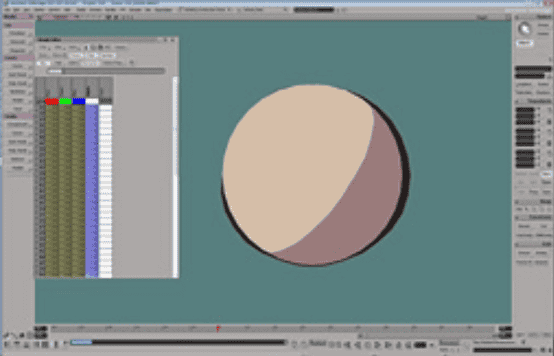
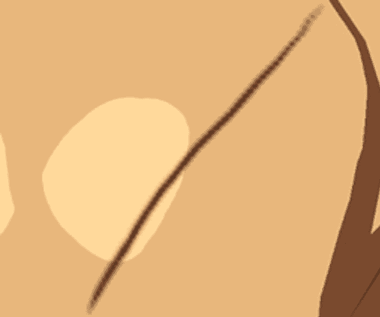
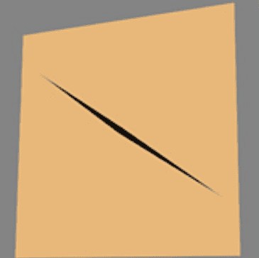
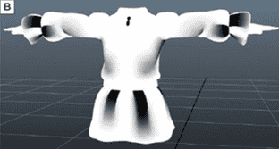

## What are Outlines and Strokes?

Outlining is an important factor in making a character look hand-drawn:

A Stroke is changes in width or color from the beginning to the end of a outline. The physical reason for the formation of Strokes is the change in pressure of the pen tip on the paper:

|  |  |
| ---------------------------------------------------------------- | ---------------------------------------------------------------- |
| No strokes, outline with fixed width                             | With strokes, the starting and ending points are finer           |

Outlines with consistent width are easier to achieve, while outline with strokes are more difficult to achieve. Whether or not there are strokes is a key factor in making the outlines look more like hand-drawing. Therefore, whether strokes can be automatically generated has always been a watershed in outline technology.  

There are also different types of strokes:

## Implementation Methods of Outlines and Strokes

Below are some ways to implement outlines and strokes. 

MooaToon implements the _** Outer Outline**_ and _**Inner Outline**_ mentioned in GUILTY GEAR's [sharing](https://www.4gamer.net/games/216/G021678/20140703095/index_2.html) :

### - Outer Outline

Outer outline refers to the outline on the outside of the model, which is the "Outline" type in the picture above. After rendering the character, the back model of the character is rendered again, and at the same time it is extruded along the normal direction. This is the most classic and also used the most widespread outline technique.  

The disadvantage of this technique is that the normals used for extrusion must be smooth, otherwise the outline will be broken at the hard edge. Moreover, the outline type is single and there are not many details.  

GUILTY GEAR uses the vertex color as the outline width to simulate strokes locally:

|  |  |
| ---------------------------------------------------------------- | ---------------------------------------------------------------- |
| Outer outline with stroke                                        | Vertex color used to control outline width                       |

|  |  |
| ---------------------------------------------------------------- | ---------------------------------------------------------------- |
| No width adjustment at shoulders                                 | With width adjustment at shoulders                               |

The Unity Chan in the example was drawn vertex colors in Houdini:  

:::tip

You can also draw vertex colors in DCC software such as [_Blender_](https://www.youtube.com/watch?v=khT1Pjx9w-g) or [_Maya_](https://www.youtube.com/watch?v=rREjGwDM5AA).  

:::

#### Draw Vertex Colors to Control Outline Width

Left: Before adjustment; Right: After adjustment

##### Drawing in UE

You can directly draw Vertex Colors in UE and preview the results in Real Time:

##### Drawing in Houdini

After the [previous tutorial](ControlTheShapeOfShadows#--houdini-normal-transfer), you should be familiar with the process of baking vertex data in Houdini.  

To add width-controllable outlines to your own model: 

1. Select and enable the `attributePaint_face_vertexColor_alpha` node.  
    
2. Click `Reset All Changes`
3. Select the Group to draw 
4. Choose the Lighting Mode you think is appropriate

5. Press Enter to enter drawing mode, follow the instructions in the upper left corner to draw Alpha on the model, pay attention to the value of FG: 
6. In the bottom-right corner display settings, make sure enabled: `Optimize > Remove Backfaces`: 
7. Display the `mooa_outlinePreview` node, select the `attributePaint_face_vertexColor_alpha` node, then enable material display to draw and preview the stroke in real time:<Video src={require("./assets/bandicam 2024-08-14 00-23-01-549.webm").default}/>

7. After drawing is complete, export the model using the `OUTPUT_FBX` or `OUTPUT_OBJ` node, and import it into UE.

Set the stroke according to the [previous tutorial](ImportANewCharacter#outline-settings).  

Then enable `Use Vertex Color A as Outline Width` in the outline material, and you will see the modified result:

#### FAQs

##### Incorrect Outline Shape

The principle of this outline is to extrude the mesh outward and then render only its backside as the outline. Since the extrusion direction is calculated last, it may be difficult to detect issues during the modeling process.  

The following reasons may all cause incorrect extrusion direction of the outline:
- Mesh data issue:
    1. Incorrect or missing normals
    2. Incorrect or missing UV
    3. The UV area of a face is 0
- Mesh topology issue:
    1. The length of a edge is 0
    2. The area of a face is 0
    3. Polygons with more than 4 edges
    4. Vertices with coincident positions
    5. More than 2 polygons share the same edge
    6. When multiple layers of meshes are close together, if the outline width exceeds the gap between the meshes, it will cause clipping  
    7. Single-sided mesh, the outline will inevitably break at the junction of the front and back faces

Some suggestions:
1. Before exporting the model, carefully confirm whether the data is correct and whether there are any illegal topologies  
    1. You can check all geometric attributes in the Geometry Spreadsheet panel in Houdini  
    2. Ensure that the `mooa_dataInit` node is used in Houdini  
    3. Houdini's `Clean/PolyDoctor` node can quickly check and repair illegal topology  
2. Carefully inspect the mesh near the vertices where the outline is incorrect
3. Avoid adding outlines to single-sided meshes
    1. Use Inner Outline instead of Outer Outline
    2. If you must use Outer Outlines, make sure the width at the junction of the front and back sides is 0  
4. Avoid adding Outer Outlines to complex multi-layered meshes that are very close together
    1. Use Inner Outline instead of Outer Outline
    2. Reduce width

##### Alembic

Although Houdini can export multiple UV channels through `Additional UV Attributes` when exporting Alembic, **UE does not support multiple UV channels when importing Alembic as Geometry Cache**.  

Since Alembic is usually only used for offline production or cutscenes, you can export the outline mesh generated by the `mooa_outlinePreview` node to UE. Also, ensure that the `Compressed Position Precision` in the import settings is small enough.

### - Inner Outline 

In contrast to outer outline, inner outline is usually directly painted on the texture. Inner and outer outline can complement each other to achieve beautiful outline effects.  

The advantage of this method is that it is simple and controllable, but due to the resolution limit of the texture and the usually fine outline, blurring and aliasing may occur when observed up close.  

These methods can reduce blurring and aliasing without increasing the texture resolution:

#### - Homura Style Line

In GUILTY GEAR, Honmura C. Junya (本村・C・純也) proposed a method called the "Homura Style Line" which can achieve perfect inner outlines at any distance without resolution limitations through special UV layout and textures:

|  |  |
| ---------------------------------------------------------------- | ---------------------------------------------------------------- |
| Inner outlines drawn on textures using conventional methods      | Inner outlines by Homura Style Line                              |

|  |  |  |
| ---------------------------------------------------------------- | ---------------------------------------------------------------- | ---------------------------------------------------------------- |
| UV and textures of the Homura Style Line                         | Viewing the Homura Style inner outlines from a distance          | Viewing the Homura Style  inner outlines up close                |

|  |  |  |
| ---------------------------------------------------------------- | ---------------------------------------------------------------- | ---------------------------------------------------------------- |
| UV and textures using conventional methods                       | Viewing conventional inner outlines from a distance              | Viewing conventional inner outlines up close                     |

This method can achieve high-precision inner outlines without relying on rendering algorithms, is compatible across different engines and renderers, but requires a significant amount of work from artists.

#### - SDF Anti-Aliasing 

Another [method](https://zhuanlan.zhihu.com/p/113190695) is to convert the inner outline texture of the conventional method into an SDF texture to improve accuracy and width control, similar to high-precision text rendering based on SDF.  

MooaToon does not currently support this method. 

### - Post-Processing Outlines 

The post-processing outlines is calculated by convolving the Depth/Normal/Color Buffer in screen space.

The advantage is that it works in full screen, the performance overhead is independent of scene complexity, and it is possible to implement almost any type of outline.

The disadvantage is the difficulty in precisely controlling local outlines. 

If you need precise control over outline visibility and width, you need to do some additional development on the rendering pipeline, such as **Ni no Kuni (CG world 2018-06)**:

|  |  |  |    |
| ---------------------------------------------------------------- | ---------------------------------------------------------------- | ---------------------------------------------------------------- | ------------------------------------------------------------------ |
| Base color                                                       | Vertex color                                                     | Mesh ID                                                          | Areas with abrupt changes in vertex color are detected as outlines |

Currently, you can directly obtain post-processing outlines through plugins, such as:

- [Post Process Hand Draw Outline](https://www.unrealengine.com/marketplace/en-US/product/post-process-hand-draw-outline)
- [Stylized Post Process Material Pack vol.1](https://www.unrealengine.com/marketplace/en-US/product/stylized-post-process-material-pack-vol-1)

### - Pencil+

[Pencil+](https://www.psoft.co.jp/jp/product/pencil/unity/) is a commonly used outline plugin in the film industry, representing the highest quality, controllability, and ease of use in the industry.  

However, it can only be used for offline purposes and currently has no UE version. 

### - Other Cutting-Edge Technologies 

In recent years, some new technologies have emerged in academia, such as [real-time stroke with brush](https://github.com/JiangWZW/Realtime-GPU-Contour-Curves-from-3D-Mesh), [neural network-based stroke](https://github.com/DifanLiu/NeuralStrokes), etc.  

But it will take some time before they are implemented in the industry.

