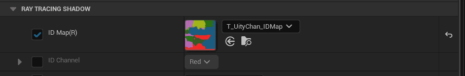
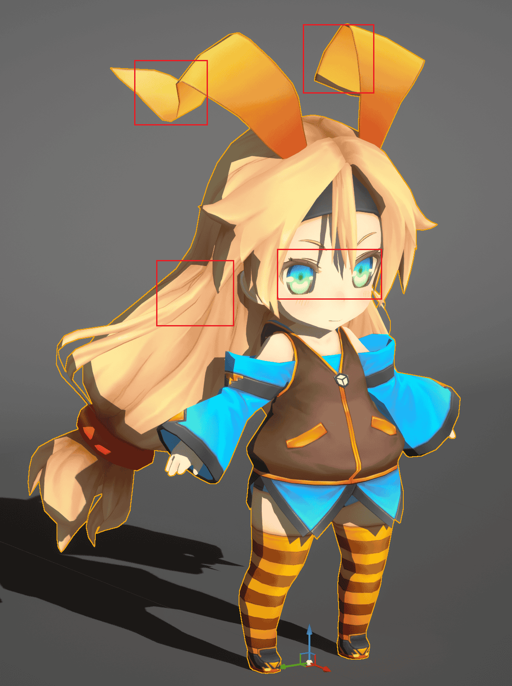
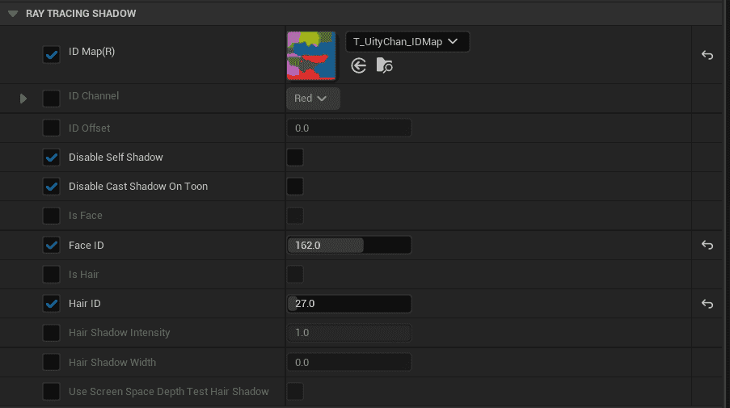
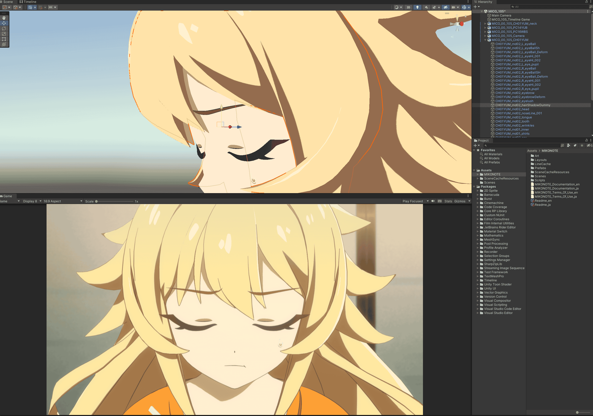
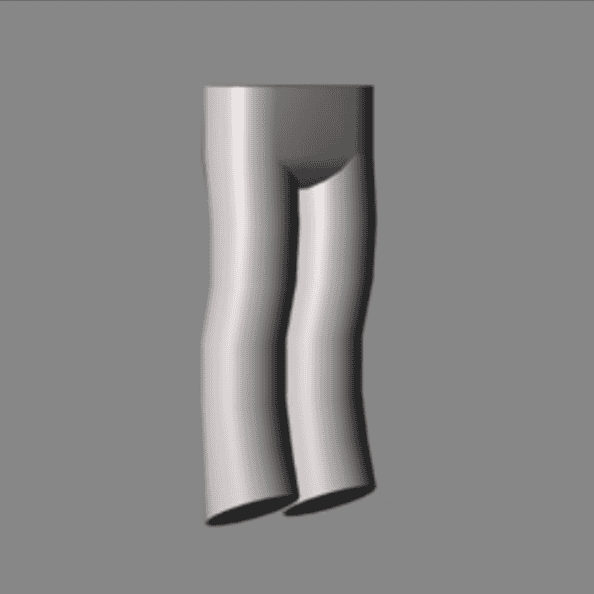
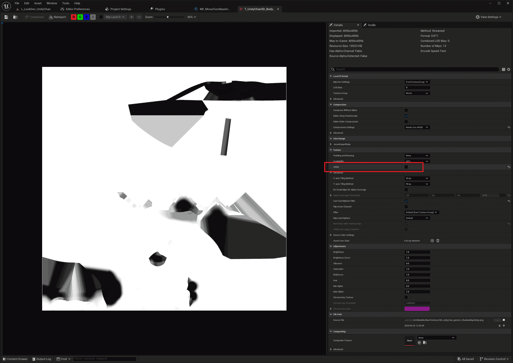
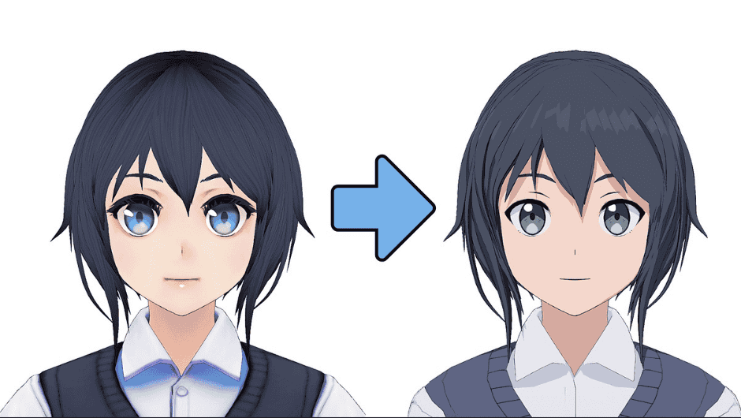

The factors that affect the shape of shadows mainly include **Surface Normals**, **Self-Shadowing**, and **Shadows of Other Objects**.

The shadow generated by the surface normal refers to the fact that when light shines on the surface of an object, the larger the angle between the surface normal and the  light direction, the less light energy per unit area received. 

Therefore, the closer the normal and the light direction are to 90 degrees, the darker it is.


## Custom Shadows From Self or Other Objects

MooaToon offers both **Ray Tracing** and **Shadow Bias** methods to remove cluttered Self-Shadows and shadows casted from the scene.

The Ray Tracing method provides full functionality, and should be used in preference to Ray Tracing when performance allows. Shadow Bias is only an alternative when performance is low or equipment is too old. 

### - Ray Tracing

Thanks to Ray Tracing, specific material information can be obtained, and the behavior of Ray Tracing Shadows can be controlled through material properties.  

MooaToon provides the function to disable _**Self-Shadowing**_ and _**Shadow Casting to different IDs**_.

With these two functions, you can achieve: 

- Disable Self-Shadowing for a character completely and receive projections from other characters or scenes  
    
- Divide the same character into several different parts, disable Self-Shadowing for each part, and receive shadows from other parts or scenes 
    

To use these functions, you first need to set different IDs for different parts of the character.

#### Set IDs

MooaToon uses IDs to determine whether the material hit by the ray is part of the same part as the material at the starting point of the ray. You can choose one of the following two methods to set the ID:

##### - ID Map

ID Map refers to filling different parts of a character with different solid colors, making it easy to cut out textures during texture creation or post-production. 

It is usually essential in the film workflow, and its resolution can be very low as long as it does not overflow the UV boundary.


By using ID Map, you can precisely control the ID down to the pixel in a material:



:::caution

Due to GBuffer bit depth limitations, there needs to be sufficient difference (8 / 255) between different IDs in the ID Map.  

The color space of ID Map must be **linear** (uncheck sRGB in texture assets).

:::

##### - Separate Materials and Set ID Offset

There is a simple way, you can set different materials for different parts of the character, and set different `ID Offset` for each material.  

Although this method does not require an ID Map, it will generate more draw calls, slightly increasing rendering performance overhead. Please use it judiciously.

#### Disable Self-Shadowing

After setting the ID correctly, you can use `Disable Self Shadow` to disable Self-Shadowing of each part of the character:

|  |  |
| ------------------------------------------------------------ | ------------------------------------------------------------ |

You can see that the messy Self-Shadowing of each part of the character has disappeared.  

#### Disable Shadow Casting to Different IDs

Next, enable `Disable Cast Shadow on Toon`:

|  |  |
| ------------------------------------------------------------ | ------------------------------------------------------------ |

Now you can see that all shadows other than normal shadows have disappeared.


### - Shadow Bias

As an alternative to Ray Tracing, it is possible to simply offset the pixel depth when depth testing in the light space to remove all shadows at a certain distance.

You can find the `Shadow Bias` parameter at: 
- `Post Process Volume > MooaToon > Shadow Bias` 
- `BP_MooaLookDevTool > Post Process > Shadow Bias`

Increasing the Shadow Bias to remove shadows from obstructions at a certain distance. For example, setting the Shadow Bias to 200 means that objects within 200 cm from the surface of the character model will not cast shadows on the character: 

|  |  |  |  |
| ----------------------------------------------- | ----------------------------------------------- | ----------------------------------------------- | ----------------------------------------------- |
| Shadow Bias: 0                                  | Shadow Bias: 10                                 | Shadow Bias: 30                                 | Shadow Bias: 150                                |

:::caution

- Shadow Bias only works without Ray Tracing Shadow.
- Shadows may suddenly appear beyond the Shadow Bias distance.
- Due to UE's own algorithmic problems, Shadow Bias may not be consistent for different types of lights and different distances between the light and the camera.

:::


## Hair Shadow 

The hair shadow in the artwork usually matches the hair outline. MooaToon provides **Screen Space Depth Test Hair Shadow** to achieve hand-drawn hair shadow programmatically without modifying art assets.  

You can also choose to use a translucent model as the hair shadow, which can be customized in shape but requires modifying artistic assets.

### - Screen Space Hair Shadow 

First, you need to correctly set the IDs for the face and hair: 

##### Set IDs for the Face and the Hair 

If the face and hair use different materials, you can directly specify the face and hair through material parameters; otherwise, you need to use an ID Map.  

###### - Material Parameters 

Enable `Is Face` on the face material, and enable `Is Hair` on the hair material.  

###### - ID Map

Open your ID Map in DCC software, note the values of the ID channel corresponding to the face and hair IDs:


Set `Face ID` and `Hair ID` to the corresponding values:



##### Set Hair Shadow Parameters

After correctly setting the IDs for the face and hair, enable `Use Screen Space Depth Test Hair Shadow` on the **face material**:


Hair shadow parameters can be globally adjusted through Console Variables, or adjusted in `BP_MooaLookDevTool`.

|  |  |  |
| ------------------------------------------------------------ | ------------------------------------------------------------ | ------------------------------------------------------------ |
| <center>Hair Shadow Width: 0.2</center>                      | <center>Hair Shadow Width: 0.3</center>                      | <center>Hair Shadow Width: 0.4</center>                      |

The principle of this method is to sample depth by translating a distance from the current pixel towards the light source, and if the sampled pixel is hair and has a smaller depth, it is occluded.  

Therefore, the shape of the hair shadow depends entirely on the shape of the hair from the current viewpoint:

<Video src={require("./assets/UnrealEditor_2023_04_02_03_57.webm").default}/>


### - Translucent Model

This method does not require engine support. an artist creates a separate translucent model placed under the hair for shadow, allowing full control over the shape.  

Please refer to this project: [MIKONOTE Anime Toolbox Sample](https://assetstore.unity.com/packages/templates/tutorials/mikonote-anime-toolbox-sample-237176)



## Custom Normal Shadow

In MooaToon, you can modify the shape of the normal shadow using the following methods:  

### Modify Normals

Modifying vertex normals is the most direct way to avoid ugly shadows and is applicable to different engines and renderers.  

You can choose different methods to improve normal shadows: 

#### - Houdini Normal Transfer

This method replaces the normals of the original model with those of a simple model, achieving controlled and good results at a low cost, suitable for most scenarios.  

[This article](https://www.4gamer.net/games/216/G021678/20140703095/) documents how Arc System Works applies this technique in Guilty Gear:

|  |  |
| ---------------------------------------------------------------- | ---------------------------------------------------------------- |
| Shadows generated by original normals                            | Shadows generated by replaced normals                            |

|  |                                                                             |
| ---------------------------------------------------------------- | ------------------------------------------------------------------------------------------------------------------------------------------- |
| Simplified model                                                 | Wrap the original model with a simplified model, then find and replace the normals of the original model with those of the nearest vertices |

The Unity Chan model in the MooaToon example is processed in Houdini using this method, and all source files are included in the project.  

[Houdini](https://www.sidefx.com/products/houdini/) is a commonly used DCC software in the film and game industry. Its powerful node-based workflow and geometry functions are ideal for making some procedural adjustments to characters, such as adjusting normals, baking AO / Curvature / any custom data to vertex color and UV, and each step is represented by nodes, allowing you to modify the order and parameters without breaking other modifications.  

:::tip

Other DCC software can also easily pass normals if needed:  

Blender: [https://www.youtube.com/watch?v=qgr0AR8R9yg](https://www.youtube.com/watch?v=qgr0AR8R9yg)

Maya: [https://www.youtube.com/watch?v=6LdtlJ71000](https://www.youtube.com/watch?v=6LdtlJ71000), [https://80.lv/articles/creating-stylized-leaves-in-maya/](https://80.lv/articles/creating-stylized-leaves-in-maya/)

3ds Max: [http://www.scriptspot.com/3ds-max/scripts/normal-thief](http://www.scriptspot.com/3ds-max/scripts/normal-thief)

:::

##### Install Houdini

First, make sure you have installed Houdini version `19.5.493` or above, then install [GameDevelopmentToolset](https://github.com/sideeffects/GameDevelopmentToolset):  

1. [Download GameDevelopmentToolset](https://github.com/sideeffects/GameDevelopmentToolset/archive/refs/heads/Development.zip), and extract it to a directory you find suitable.  
    
2. Use a text editor to open `C:\Users\YOUR USER NAME\Documents\houdini19.5\houdini.env`
3. Set the values of `HOUDINI_PATH` and `PATH` to the installation directory like this:

```
HOUDINI_PATH = C:\GameDevelopmentToolset;&
PATH = C:\GameDevelopmentToolset\bin;$PATH
```

4. Make a copy and open `MooaToon\MooaToon-Project\Art\Models\MooaToonHoudiniPipelineSample.hip`:


##### Transfer Normals and Export Models 

:::tip

If you are new to Houdini, there are some [_tutorials_](https://www.youtube.com/watch?v=Tsv8UGqDibc&list=PLhyeWJ40aDkUDHDOhZQ2UkCfNiQj7hS5W) that can help you get started quickly.  

:::

1. Modify the File path in the `Fbx Character Import` node to import the model:
2. (Optional) Enter the texture path in the `mooa_setMaterials` node, then double-click `Load Textures` to load the materials:
3. Select the Group that needs to transfer normals in the `mooa_normalTransfer` node:
4. Enable normal display, then press the `D` key to open `Display Options`, adjust `Scale Normal` to a suitable size:
5. Select the `transform1` node and set it as a Template, then press Enter to adjust the position and scale of the sphere in real-time and observe the changes in normals:<Video src={require("./assets/bandicam 2024-08-14 00-34-38-362.webm").default}/>
6. Use the slider in the bottom left corner to adjust the lighting angle in real-time:
7. Temporarily disable irrelevant nodes:
8. Export the model using the `OUTPUT_FBX` or `OUTPUT_OBJ` node (the free Houdini Apprentice version only supports exporting OBJ format):


##### Import the Model Into UE 

Import the model into UE, the `Normal Import Method` must be set to `Import Normals and Tangents`, here are the import settings I used:


Set up materials for it and place it in the scene to check the effect:

<Video src={require("./assets/UnrealEditor_2023_04_08_16_43.webm").default}/>


The shadow shape of the model on the right side is much cleaner now.


#### - Blender Normal Transfer


[@aVersionOfReality](https://www.youtube.com/@aVersionOfReality) introduces how to programmatically generate clean normals in Blender in this [video](https://www.youtube.com/watch?v=sQW2wqltB0A), and how to use normal transfer in this [video](https://www.youtube.com/watch?v=qgr0AR8R9yg).  

If you are more familiar with Blender, this method is lower cost and free.

#### - Manually Draw Normal Maps


Sometimes directly drawing normal maps can be easier than modifying vertex normals, and allows pixel-by-pixel control of normals.  

The downside is limited by the resolution and compression accuracy of normal maps, flaws may appear at close distances.  

[@SFNA](https://note.com/sfna32121) explains how to preview and paint normal maps in Substance 3D Painter in this [article](https://note.com/sfna32121/n/n8d46090005d1?tdsourcetag=s_pctim_aiomsg).


#### - Manually Edit Vertex Normals 

Manually editing vertex normals on high-polygon models can provide the highest precision results at any viewing distance, but the cost is that there are no smooth transitions between shadow shapes, and the artistic cost is very high, requiring a long time of experience accumulation to flexibly apply this technique.  

Arc System Works used this technique in Guilty Gear:

|  |  |
| ---------------------------------------------------------------- | ---------------------------------------------------------------- |
| Original normals                                                 | Corresponding shadows                                            |

|  |  |
| ---------------------------------------------------------------- | ---------------------------------------------------------------- |
| Manually edited normals                                          | Corresponding shadows, much cleaner                              |

### Modify Shadow Gradient

Arc System Works also used vertex colors to indirectly control shadow shapes in Guilty Gear:

|                                                  |  |                               |
| ---------------------------------------------------------------------------------------------------------------- | ---------------------------------------------------------------- | --------------------------------------------------------------------------------------------- |
| Vertex color channel, similar to Ambient Occlusion.  <br/> Shadows are more likely to appear in darker areas | Original shadows                                                 | Shadows after adjustments, notice shadows are more likely to appear between pants and muscles |

|                     |  |                     |
| ----------------------------------------------------------------------------------- | ---------------------------------------------------------------- | ----------------------------------------------------------------------------------- |
| ILM texture G channel,   <br/>Shadows are more likely to appear in darker areas | Original shadows                                                 | Shadows after adjustments, notice shadows are more likely to appear under the skirt |

In MooaToon, you can achieve the same effect by adjusting the Shadow Gradient.  

Shadow Gradient basically refers to the angle between the normal direction and the light direction:

|  |                                                         |
| ---------------------------------------------------------------- | ----------------------------------------------------------------------------------------------------------------------- |
| Rendering result                                                 | Corresponding Shadow Gradient, <br/>Can be understood as the angle between the normal direction and the light direction |

MooaToon's shader uses Shadow Gradient as UV sampling for Diffuse Color Ramp (which will be detailed in the following article), calculating the final shadow range and color based on the Ramp.  

You can modify the shadow shape in the material in two different ways by adjusting the Shadow Gradient:

| Normal rendering result of a cylinder                                                                                                                                                                                                                                                                                                  |  |
| -------------------------------------------------------------------------------------------------------------------------------------------------------------------------------------------------------------------------------------------------------------------------------------------------------------------------------------- | ---------------------------------------------------------------- |
| Toon rendering result of a cylinder                                                                                                                                                                                                                                                                                                    |  |
| Sampling result of Noise texture                                                                                                                                                                                                                                                                                                       |  |
| Use Noise as ***AO*** (Ambient Occlusion):<br/>- The smaller the Noise value, the stronger the shadow intensity;<br/>- Does not change the position of light-shadow boundaries;<br/>- Can produce soft shadows;                                                                                                                        |  |
| Use Noise as ***Diffuse Ramp Offset***:<br/>- The closer the Noise value is to 1, the easier it is to enter lights;<br/>- The closer the Noise value is to 0, the easier it is to enter shadows;<br/>- Changes the position of light-shadow boundaries;<br/>- The softness of shadows depends on the RGB channels of the Diffuse Ramp; |  |

As shown in the figure, precise control of shadow shapes can be achieved through AO and Diffuse Ramp Offset.  

In Toon materials, you can select specific channels as AO and Diffuse Ramp Offset in the Global Mask Map:


The following tutorial demonstrates how to directly paint Mask Maps on models using Substance 3D Painter:  

:::tip

Path to the example file: `MooaToon\MooaToon-Project\Art\Models\NewTextures\ShadowMap.spp`

You can also create textures in other DCC software, such as [_Blender_](https://www.youtube.com/watch?v=AnRQhH3fEDY) or [_C4D_](https://www.youtube.com/watch?v=Pm4mtXhBZ_I).  

:::

#### Draw Mask Maps

Now you can draw a Shadow Mask to add AO to characters, such as under the neck.  

First, import the model into Substance 3D Painter according to [this tutorial](https://www.youtube.com/watch?v=LsV7CkaBWoM).  

Then draw AO in the intrinsic color channel with white as the background:


After painting, export the textures according to [this tutorial](https://www.youtube.com/watch?v=kXC8ZsHZvHQ), then import the textures into UE and disable sRGB:



:::tip

All non-color textures must disable sRGB, otherwise the correct values cannot be sampled.  

:::

Then set the texture as Global Mask Map, now there is AO near the neck.


### Distance Field Facial Shadow 

Distance Field Facial Shadow refers to directly rendering the shadow shape of the face in a specific direction as a texture map, and then baking multiple texture maps into an SDF texture, thereby obtaining a completely custom shape of the face shadow at various lighting angles.  

Please refer to [this open-source project](https://github.com/akasaki1211/sdf_shadow_threshold_map) to generate SDF textures, then apply them to the face material:


Finally you need to make sure your character is facing +Y axis, and right click on the Skeletal Mesh: `Scripted Asset Actions > Mooa Toon > Bake Face Forward Direction`, as shown below:
  

## Migrate Lighting from Base Color to Mask Map

Some old workflows directly paint lighting changes into the base color map, which is not conducive to clean visuals and is not suitable for dynamic shadows and global illumination. [This article](https://muro.fanbox.cc/posts/1657633) explains how to repaint it into a clean texture:



In MooaToon, you can use Mask Map to split the static lighting in the left image into dynamic Base Color + Shadow Color + Specular Color.
