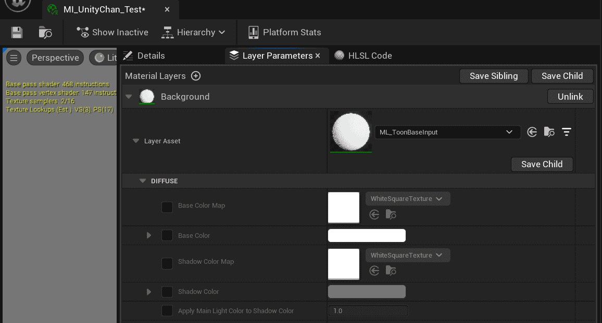
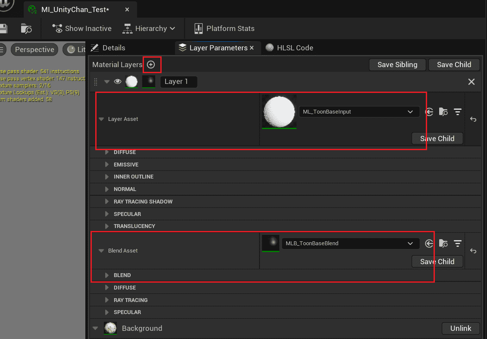
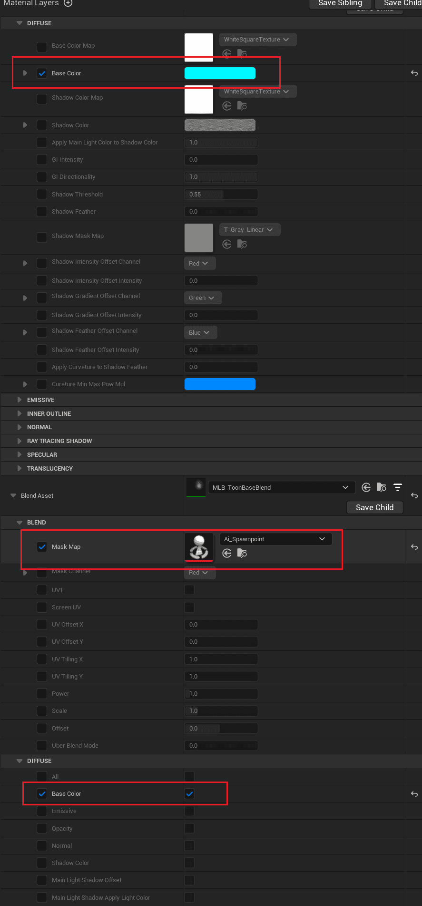

MI_Toon is a common material with simple and fixed inputs that can be used to create simple effects.  

If you want to overlay multiple textures or mix custom effects, use layered materials.

UE's [layered materials](https://docs.unrealengine.com/5.1/zh-CN/layering-materials-in-unreal-engine/) allow you to freely combine [material layers](https://docs.unrealengine.com/5.1/zh-CN/using-material-layers-in-unreal-engine/), adjust order and blending modes.

## Convert materials to Layered Materials 

Replace the parent material with MI_ToonLayer in the material editor:

Then you can find the original parameters in the layer parameters:

:::caution

_**Attention: this step will reset adjusted values!**_ So decide early whether to use layered materials.

When editing layered materials, _**there is a certain probability of causing UE to crash, so save frequently!**_

:::

## Using Material Layers 

Now you can add material layers and create complex effects:

Modify the following parameters:

You can see the following changes:

|  |  |
| ------------------------------------------------------------ | ------------------------------------------------------------ |

In other words, using material layers to add new effects, using layer blending to control how they are overlaid on the layers below.

