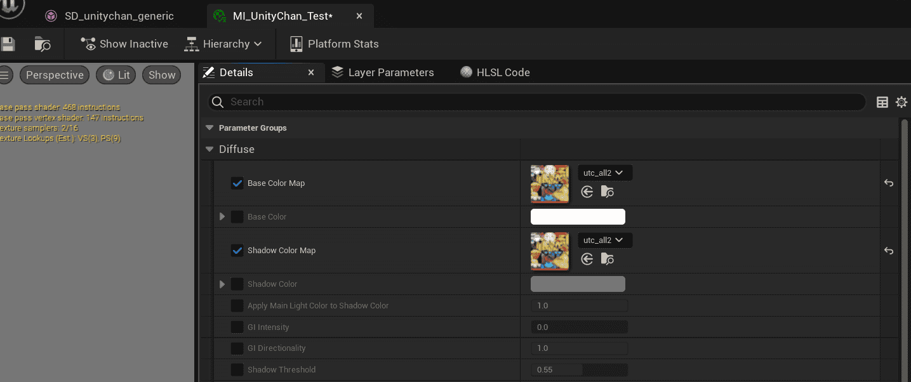
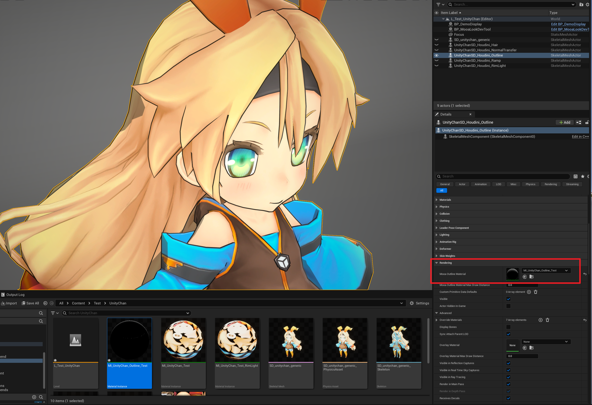
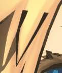

Using [Unity Chan](https://unity-chan.com/) as an example character, you can find the original Unity Chan model at `MooaToon\MooaToon-Project\Art\Models\SD_unitychan_generic.fbx`.

You can also obtain character models through the following website: 

- Paid
  - UE Marketplace: https://www.unrealengine.com/marketplace
  - Unity Asset Store: https://assetstore.unity.com/
  - BOOTH: https://booth.pm/
  - ...

- Free
  - VRoid Hub: https://hub.vroid.com/
  - Mirai Komachi: https://www.miraikomachi.com/download/
  - ネオン: http://airtone-vr.com/
  - MMD Models: https://bowlroll.net/
  - ...

:::info

- Now supports _**direct import of VRoid models**_ (.vrm, with the help of [VRM4U plugin](https://github.com/JasonMa0012/VRM4U_MooaToon)), you can quickly create your own model using [VRoid Studio](https://vroid.com/studio), then import it into the MooaToon project along with textures and materials.  
    
- For MMD models, you need to convert them to FBX models first, it is recommended to use [Blender](https://www.blender.org/) and [Cats Blender Plugin](https://github.com/absolute-quantum/cats-blender-plugin).

:::

## Import Characters

You can directly import character models by dragging them into the Unreal Editor's content browser. Due to different export settings in different DCC software, you may need to adjust the rotation and scale in the import settings.  

After correct import, the character should be facing forward standing on the ground, and the size should be appropriate:

Copy and open the scene `Content/MooaToonSamples/Maps/L_LookDev.umap`, place the character Skeletal Mesh in it:

## Create Materials

Create a material instance in the content browser, select `MI_Toon` as the parent material, _**make sure to show plugin content in the filter**_:

Open the character's Skeletal Mesh file, and place the newly created material in the material slot:

Note that Unity Chan has only one texture, so only one material instance is created. **If different parts of your model correspond to different textures, then you need to create a material instance for each part separately**.

## Material Settings

Import the intrinsic color texture in the content browser (`MooaToon\MooaToon-Project\Art\Models\Textures\utc_all2.tga`).  

In the material instance, set the `Base Color Map` and `Shadow Color Map` to the color texture:

## Outline Settings

First, make sure to disable `Recompute Normals/Tangent` in the character Skeletal Mesh settings:

Then right-click on the character Skeletal Mesh:

1. `Reimport`
2. `Scripted Asset Actions > Mooa Toon > Bake Smoothed Normal and Curvature`:

Create a material instance for outlining in the content browser, select `MI_OverlayOutline` as the parent material, and set the following parameters:

Select the character in the level, set the outline material to `Outline Material`:

Now you should see the complete character outline:

## Viewport settings 

You should pay attention to the viewport settings, different FOVs will have a huge impact on the perspective of the character:

|  |  |  |
| ------------------------------------------------------------ | ------------------------------------------------------------ | ------------------------------------------------------------ |
| 10                                                           | 45                                                           | 90                                                           |

If you pursue a close-to-hand-painted artistic style, you should use the smallest FOV possible to make the character look more flat, such as 10.  

If you let players control the camera in real time, you should choose the appropriate FOV according to your game type and ensure that the main character is in the center of the screen to reduce perspective distortion.

## Advanced settings 

I have to admit that the current rendering result is far from good-looking:

If you carefully observe the current character, you will find the following areas that need improvement: 

- Eye white color, eye outline, hair shadow

  

- Self-shadow shape

  

- Hair outline width

  

- Hand outline width

  

- Hair highlights 
    
- Skin texture 
    
- Accuracy of character models and textures themselves 
    
- Animation and expressions 
    
- Environment and post-processing 
    
- ......

It must also undergo a series of more detailed adjustments, basically the time you spend is proportional to the final rendering quality.  

Please continue reading the tutorial.

