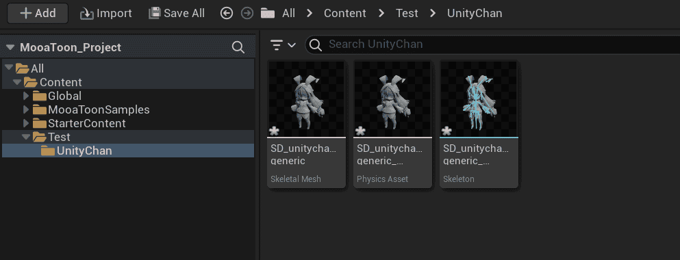
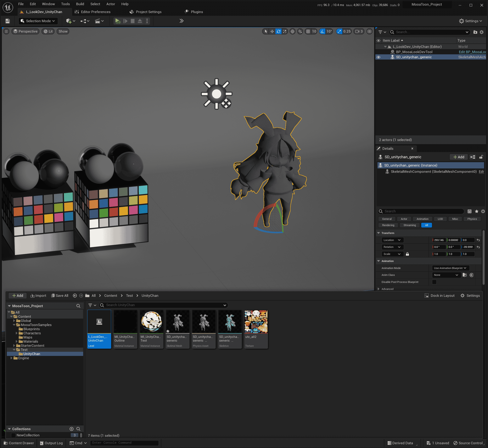
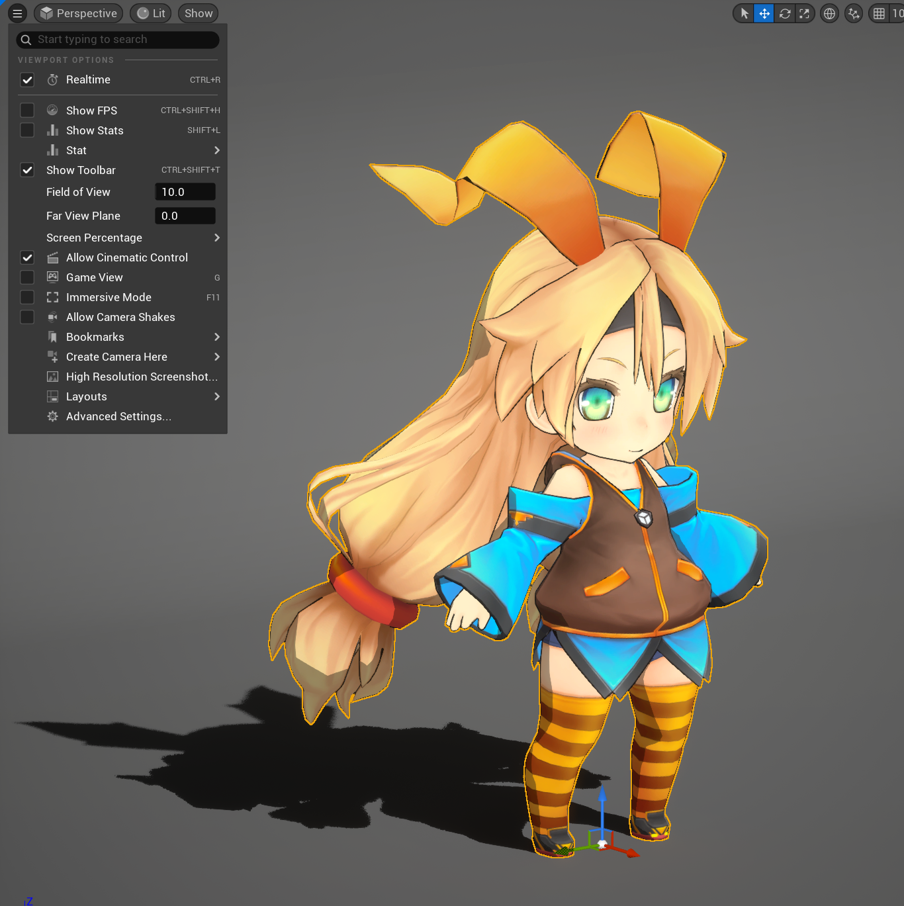
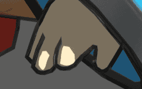

# Import a New Character and Setup the Basic Material

Using [Unity Chan](https://unity-chan.com/) as an example character, you can find the original Unity Chan model at `MooaToon\MooaToon-Project\Art\Models\SD_unitychan_generic.fbx`.

You can also get character models at:

- Paid
  - UE Marketplace: https://www.unrealengine.com/marketplace
  - Unity Asset Store: https://assetstore.unity.com/
  - BOOTH: https://booth.pm/
  - ...

- Free
  - Mirai Komachi: https://www.miraikomachi.com/download/
  - ネオン: http://airtone-vr.com/
  - MMD Models: https://bowlroll.net/
  - VRoid Models: https://hub.vroid.com/
  - ...

For MMD models you need to convert them to FBX models first, [Blender](https://www.blender.org/) and [Cats Blender Plugin](https://github.com/absolute-quantum/cats-blender-plugin) are recommended.

VRoid can make character models easily and quickly, VRM4U can be used to import VRoid models, VRM4U support is currently planned.

## Import Characters

Character models can be imported by dragging them directly into the Unreal Editor's Content Browser, you may need to adjust the rotation and scaling in the Import Settings due to different export settings for different DCC software.

After proper import, the character should stand on the ground facing forward and be the right size:

Copy and open the scene `Content/MooaToonSamples/Maps/L_LookDev.umap` and place the Character Skeletal Mesh in it:

## Create Materials

Create a Material Instance in the Content Browser, Parent Material selection MI_Toon, make sure Show Plugin Content is selected in the filter:

Open your character's Skeletal Mesh file and place the Material Instance you just created into the Material Slots:

Note that Unity Chan only has one texture so created only one Material Instance, if you have multiple parts of your model corresponding to different textures, then you need to create a Material Instance for each part.

## Material Settings

Import character texture (`MooaToon-Project\Art\Models\Textures\utc_all2.tga`) in the Content Browser.

Set Base Color Map and Shadow Color Map as character texture in the Material Instance:

## Outline Settings

Make sure Recompute Normals/Tangent is disabled in the settings for the Character Skeletal Mesh:

Right-Click the Character Skeletal Mesh and select `Scripted Asset Actions > Mooa Toon > Bake Smoothed Normal and Curvature`:

Create a Material Instance for Outline in the Content Browser, Parent Material selection MI_OverlayOutline, and set the following parameters:

Select the character in the level and set the Outline Material to Overlay Material:

You should now see the full character outline:

## Viewport Settings

You should pay attention to the Viewport Settings, different FOVs will have a huge impact on character perspective:

|  |  |  |
| ------------------------------------------------------------ | ------------------------------------------------------------ | ------------------------------------------------------------ |

If you pursue the flattened character look of Japanese Anime, you should use the smallest possible FOV, say 10.

If you let the player control the perspective in Real-Time, you should choose the appropriate FOV according to your game type, and ensure that the protagonist is in the center of the screen to reduce perspective distortion.

## Advanced Settings

I have to admit that the current rendering results are far from good-looking:

Take a closer look at the current character and you'll see the following points for improvement:

- The color of the whites of the eyes, the outline around the eyes, the shadows of the hair

  

- Self-Shadow shape

  

- The outline of the hair

  

- The outline width of the hand

  

- Highlights of hair

- The shading of the skin

- The accuracy of the character model and the texture itself

- Animations and emotes

- Environmental and Post-Processing

- ......

If you want to show your character in Real-Time, you also have to go through a series of more detailed adjustments, basically the time you spend is proportional to the final rendering quality, see "Add Advanced Rendering Features to Characters".

If you just want to show your character offline, you can naturally use the current very powerful AIGC tools to compensate for these shortcomings, such as Stable Diffusion, and I will also try to integrate AIGC tools in the future.

