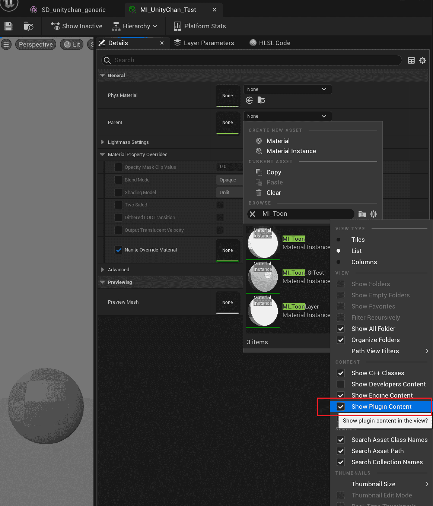
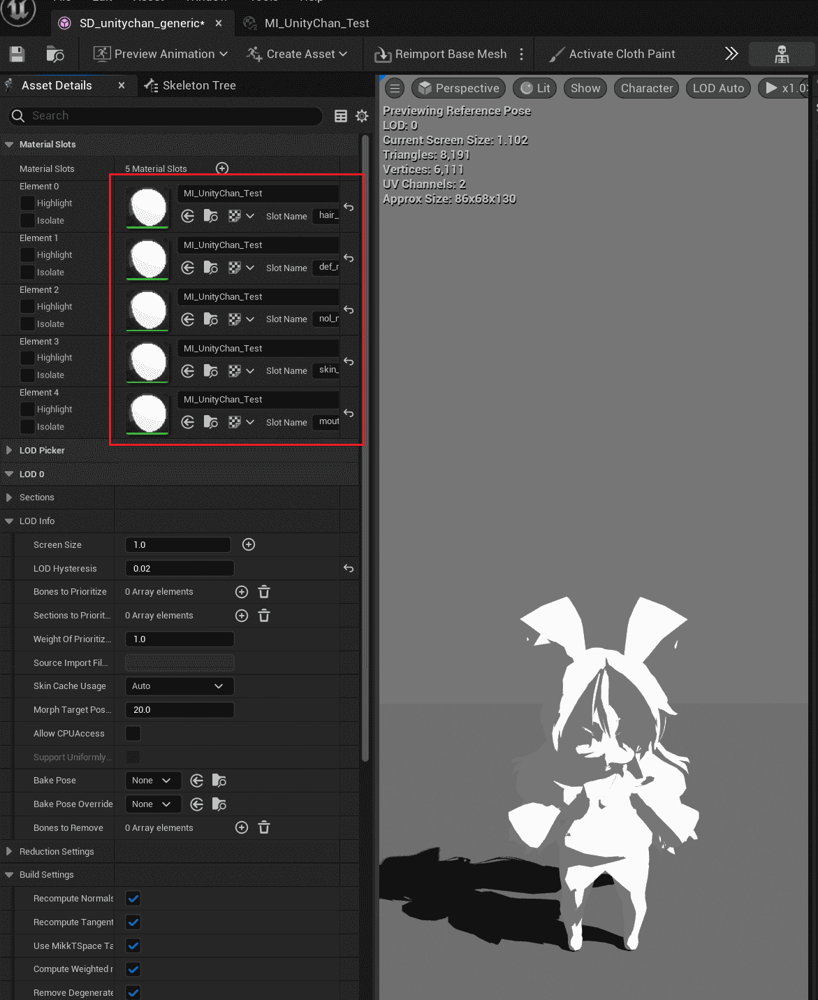
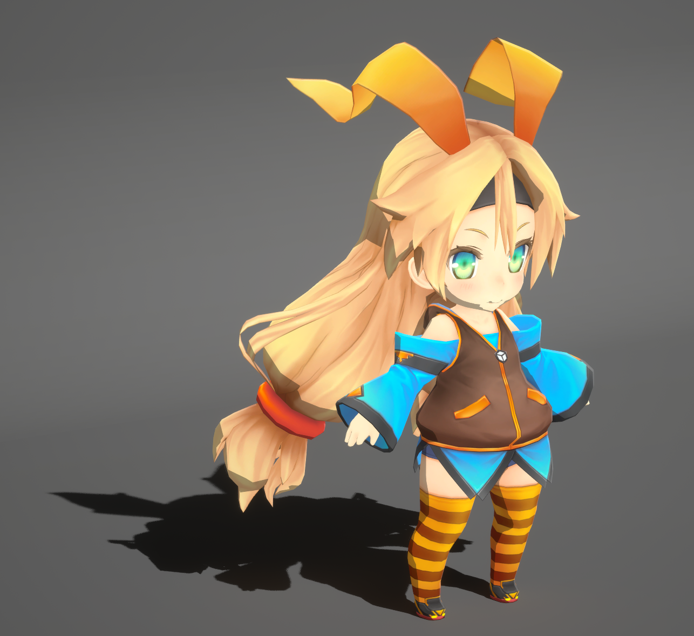
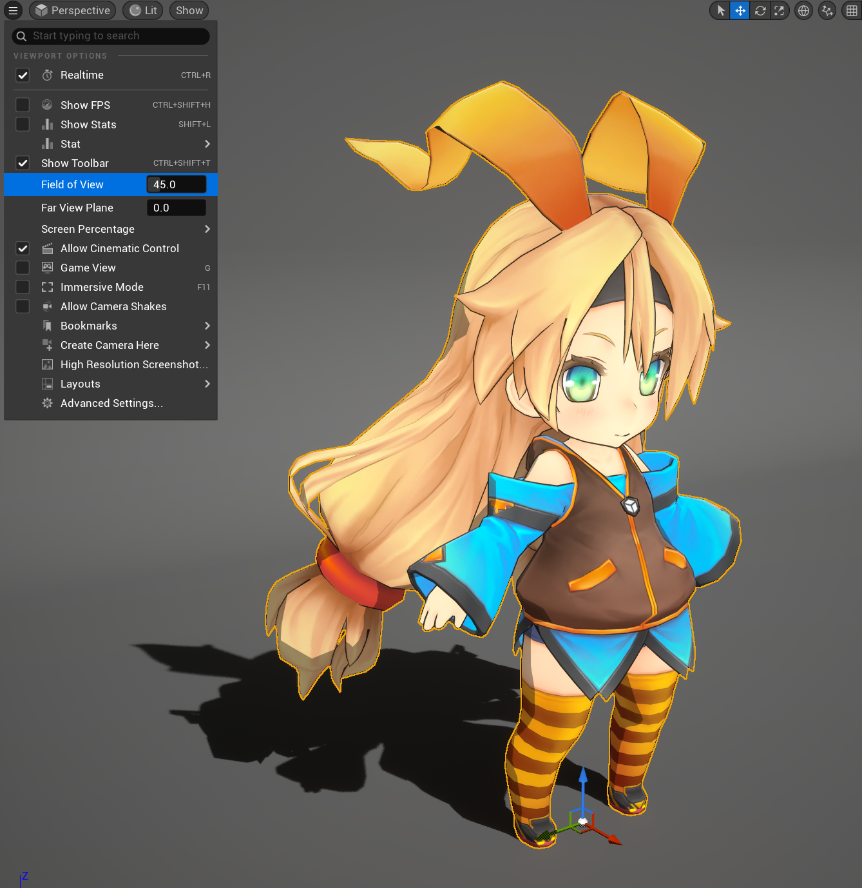
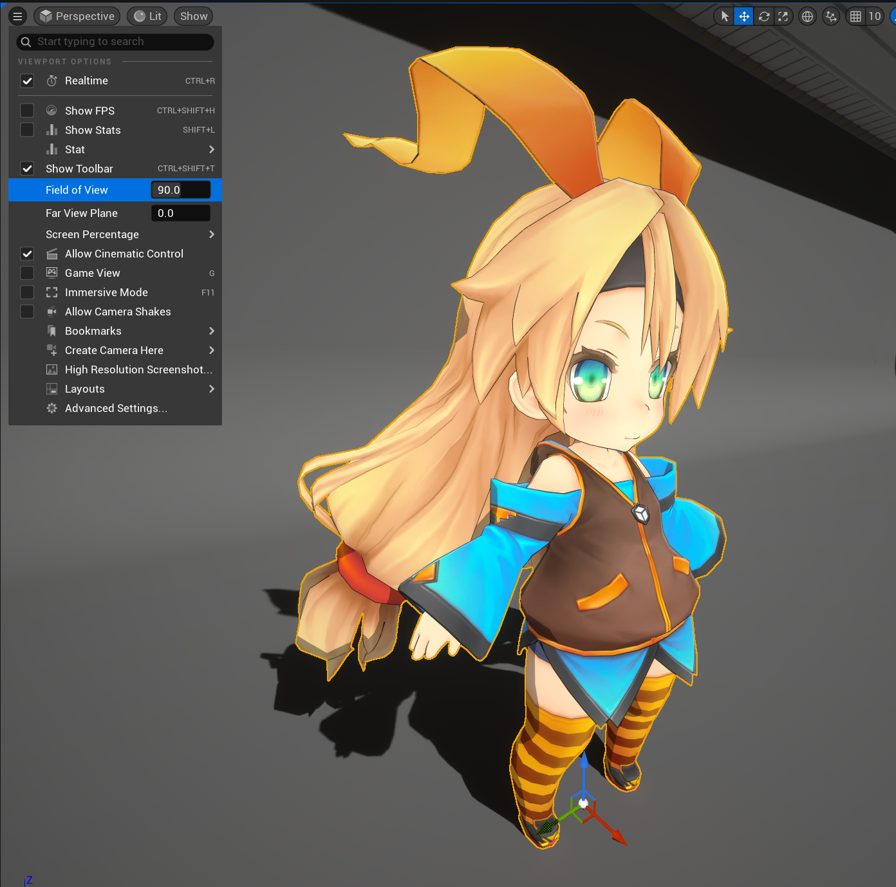
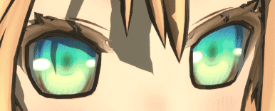

# Import a New Character and Setup the Basic Material

以[Unity Chan](https://unity-chan.com/)为示例角色, 你可以在`MooaToon\MooaToon-Project\Art\Models\SD_unitychan_generic.fbx`找到原始的Unity Chan模型.

你还可以通过以下网站获取角色模型:

- 付费
  - UE 官方商城: https://www.unrealengine.com/marketplace
  - Unity官方商城: https://assetstore.unity.com/
  - BOOTH: https://booth.pm/
  - ...

- 免费
  - Mirai Komachi: https://www.miraikomachi.com/download/
  - ネオン: http://airtone-vr.com/
  - MMD模型: https://bowlroll.net/
  - VRoid模型: https://hub.vroid.com/
  - ...

对于MMD模型你需要先将其转换为FBX模型, 推荐使用[Blender](https://www.blender.org/)和[Cats Blender Plugin](https://github.com/absolute-quantum/cats-blender-plugin).

VRoid可以简单快速地制作角色模型, VRM4U可以用于导入VRoid模型, 目前对于VRM4U的支持已在计划中.

## 导入角色

直接将角色FBX模型拖入虚幻编辑器的内容浏览器即可导入角色模型, 由于不同DCC软件的导出设置不同, 可能需要调整导入设置中的旋转和缩放.

正确导入后角色应正面朝前站在地上, 并大小合适:

复制并打开场景`Content/MooaToonSamples/Maps/L_LookDev.umap`, 将角色骨骼网格体放入其中:

## 创建材质

在内容浏览器中创建一个材质实例, 父材质选择MI_Toon, 确保筛选器中已选择显示插件内容: 

打开角色的骨骼网格体文件, 将刚刚创建的材质放入材质插槽中:

注意, Unity Chan只有一张贴图所以只创建了一个材质实例, 如果你的模型的多个部位对应不同的贴图, 那么你需要为每个部位分别创建一个材质实例.

## 材质设置

在内容浏览器中导入角色贴图(`MooaToon\MooaToon-Project\Art\Models\Textures\utc_all2.tga`).

在材质实例中, 将Base Color Map和Shadow Color Map设置为角色贴图:

## 描边设置

确保角色骨骼网格体的设置中关闭了Recompute Normals/Tangent:

在角色骨骼网格体上右键, 选择`Scripted Asset Actions > Mooa Toon > Bake Smoothed Normal and Curvature`:

在内容浏览器中创建用于描边的材质实例, 父材质选择MI_OverlayOutline, 并设置以下参数:

选中关卡中的角色, 将描边材质设为Overlay Material:

现在你应该能看到完整的角色描边:

## 视口设置

你应该注意视口设置, 不同的FOV将对角色透视产生巨大的影响:

如果你追求日本动画这种平面化的角色外观, 你应该使用尽可能小的FOV, 比如10.

如果你让玩家实时操控视角, 你应该根据你的游戏类型选择合适的FOV, 并保证主角处于屏幕中央, 以减少透视畸变.

## 进阶设置

不得不承认现在的渲染结果离好看还差得很远:

仔细观察目前的角色你会发现以下需要改进的地方:

- 眼白的颜色, 眼周的描边, 头发的阴影

  

- 自阴影的形状

  

- 头发的描边

  

- 手的描边宽度

  

- 头发的高光

- 皮肤的质感

- 角色模型和贴图本身的精度

- 动画和表情

- 环境和后处理

- ......

如果你想实时展示你的角色, 还必须经过一系列更加细致的调整, 基本上你花费的时间和最终的渲染质量成正比, 请参阅"为角色添加高级渲染特性".

如果你只是想离线展示你的角色, 你自然可以利用现在非常强大的AIGC工具弥补这些缺点, 比如Stable Diffusion, 未来我也将尝试对AIGC工具进行集成.

