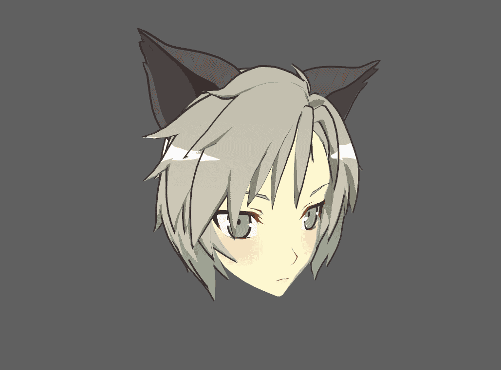
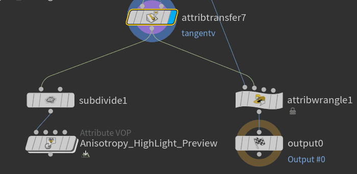
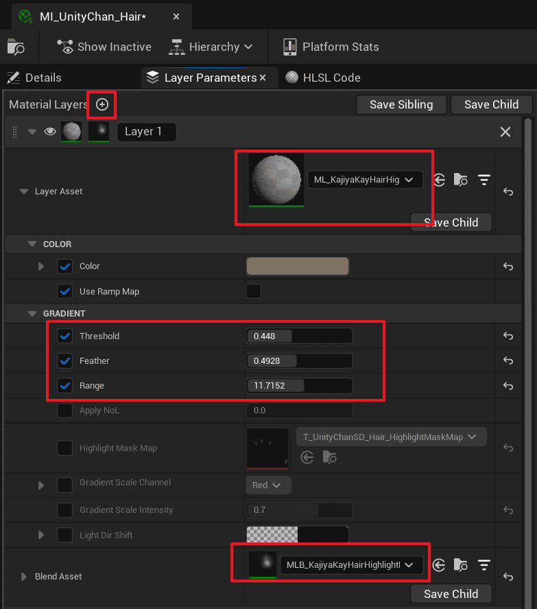
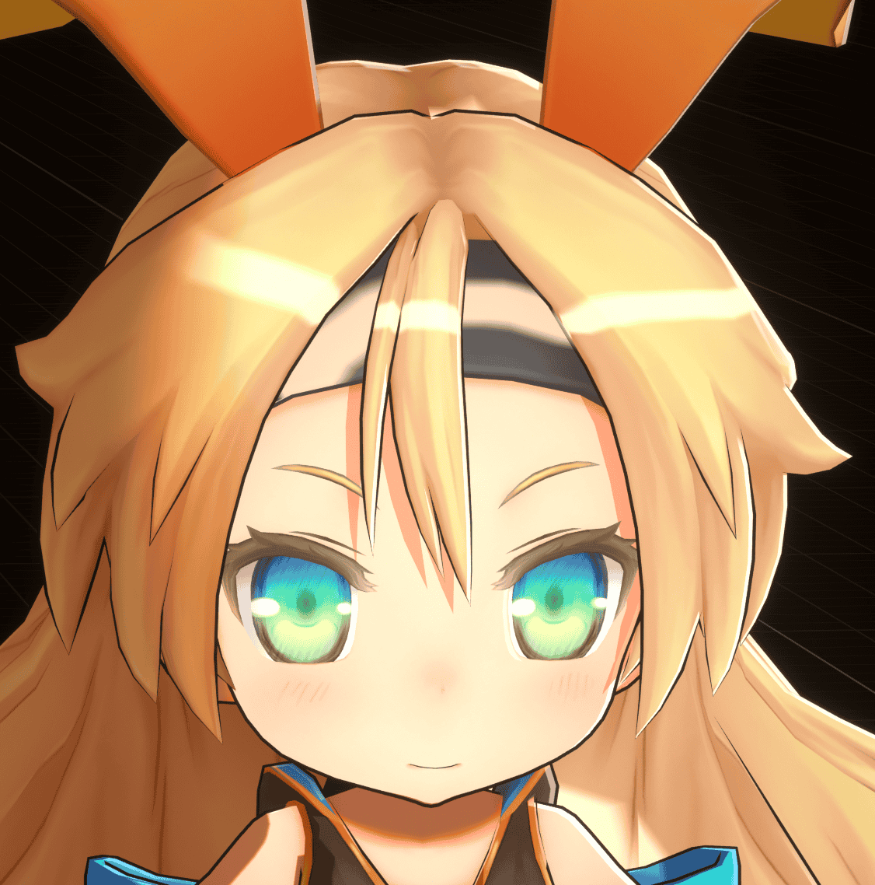

# Control Hair Highlight

## Common implementation methods

In the artworks (by [おののいもこ 魚介](https://twitter.com/_himehajime)), the hair highlights take on various forms:

|  |  |  |
| ------------------------------------------------------------ | ------------------------------------------------------------ | ----------------------------------------- |
| Circular                                                         | Point                                                          | Angel Ring                                    |

The following methods are commonly used to achieve hair highlights:

### Painted on the texture

Static, without lighting, but provides the best control. Suitable for fixed-angle games or film works.

### Physically based rendering

This method is usually used for realistic hair styles:

It needs to be stylized when used in toon rendering. Dynamic, supports multiple light sources, but has poor control, and the shape is strongly influenced by the topology. Suitable for games or film works with a realistic style.

### Material Capture (MatCap)

Please refer to [UTS](https://docs.unity3d.com/Packages/com.unity.toonshader@0.9/manual/MatCap.html).

MatCap Map Texture Example

|  |  |
| ---------------------------------- | ------------------------------- |
| MatCap Map Off                     | MatCap Map On                   |

This method only supports a single main light source. The shape can be customized with a MatCap Map, but the timing of the highlight appearance is influenced by the viewing angle and topology. It often results in unsightly highlights when the model has a low number of faces or an unreasonable structure. Suitable for games that do not require high-quality highlights.

### Texture Projection

Please refer to [UTS](https://docs.unity3d.com/Packages/com.unity.toonshader@0.9/manual/AngelRing.html).

|  |  |
| ------------------------------- | ----------------------------------------------- |
| Example Texture                 | Texture Projection On                           |

This method projects a texture onto the hair along the viewing direction and is suitable for Angel Ring highlights that look the same from any angle.

### Kajiya-Kay stylized shading based on tangent transfer

This is one of the innovative algorithms of MooaToon.

The timing of the Kajiya-Kay highlight appearance depends on the viewing and tangent directions. Through tangent transfer, the timing of the highlight appearance can be customized without being influenced by the topology. Combined with control over the highlight gradient, it can further refine the highlight shape, theoretically achieving all types of highlights. It offers excellent control and is suitable for games and film works.

## Use Houdini to bake custom tangents to control the approximate range of highlights

After [the previous tutorial](/docs/Tutorial/AddAdvancedRenderingFeaturesToCharacters/ControlTheShapeOfShadows#TransferringCustomNormalsUsingHoudini), you should be familiar with the process of baking vertex data using Houdini.

In the `Front_Hair_Highlight_Tangent` node, the tangent of the ellipsoid is transferred to the hair to define the shape of the hair highlights and the trajectory of their movement based on the lighting and viewing angles:

1. Display `Anisotropy_HighLight_Preview` node to see the highlight range represented by vertex colors.
2. In the viewport's upper right corner, select `cam1` and enable `Tie View To Camera/Light`, Then you can move the view to see the highlight changes.
3. Adjust the light source rotation in the lower-left corner of the viewport to see the changes in highlights.

If you want to use your own model, you need to set the `Group` in the following nodes to the hair `Group` of your own model:

Then adjust the `Transform` of the sphere to fit the shape of the hair and preview the changes in the highlights in real-time.

:::tip

You can also use other shapes, but they must have tangent properties, and the tangent direction is influenced by the UV direction.

:::

Next, the code in the `Bake_HighlightTangent_to_UV23` node bakes the tangent to UV2 and UV3, which usually doesn't need to be modified.

After preparation, export the model to UE following the previous process, and make sure the hair uses [layered materials](/docs/Tutorial/AddAdvancedRenderingFeaturesToCharacters/CreateComplexMaterialsUsingMaterialLayer):

1. Click the plus sign to create a new layer.
2. Select `ML_KajiyaKayHairHighlight` for the `Layer Asset`.
3. Select `MLB_KajiyaKayHairHighlightBlend` for the `Blend Asset`.
4. Adjust the `Threshold`, `Feather`, `Range` parameters, and use `Ctrl + L`to adjust the light direction. You can see the shape of the dynamic highlights similar to Houdini:

Now, the movement trajectory of the highlights has reached expectations, and you only need to control the shape of the highlights through a mask.

## Drawing Highlight Mask for Precise Control of Highlight Shape

Similar to [Drawing Shadow Mask](/docs/Tutorial/AddAdvancedRenderingFeaturesToCharacters/ControlTheShapeOfShadows#drawing-shadow-mask), you can find an example source file for Highlight Mask at `MooaToon\MooaToon-Project\Art\Models\NewTextures\HairHighlightMaskMap.spp`:

- When the value is 0.5, it does not affect the highlight.
- The closer the value is to 0, the easier the highlight disappears, and the area with the value of 0 will never have a highlight.
- The closer the value is to 1, the easier the highlight appears.

After drawing is complete, export the texture to UE and uncheck sRGB. Then set `Highlight Mask Map` and `Gradient Scale Intensity`:

