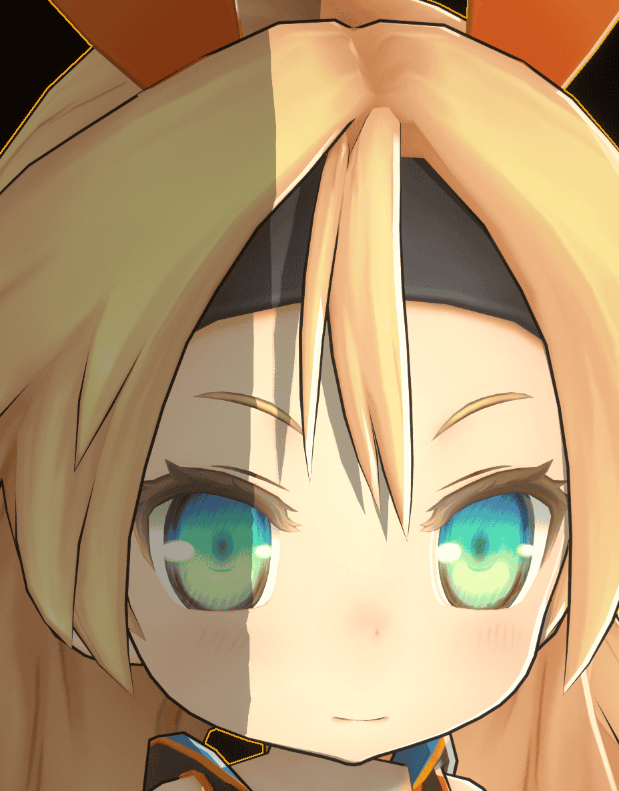

# Control Light Shadow Transition By Ramp Map

Ramp Map is a type of 1D Lookup Table (LUT), where the horizontal axis represents the angle between the normal and the light direction, and the value represents the corresponding color for that angle.

MooaToon uses Ramp Map to describe the color transition of soft shadows:

|  |  |  |
| ------------------------------------------------------------ | ------------------------------------------------------------ | ------------------------------------------------------------ |
| `Shadow Feather : 0.0`                                       | `Shadow Feather : 0.2`                                       | `Shadow Feather : 0.2 + Ramp Map`                            |

Ramp Map represented as Color Curve

Enable Ramp Map in the material, and select Color Curve:

The RGB channels of Color Curve represent the color, while the A channel represents the shadow factor. When the value of A is 0, the color is affected by `Shadow Color`, and when the value is 1, the color is affected by `Base Color`.

:::caution

When adding your own curve, make sure to copy and rename a curve in `MooaToon/MooaToon-Engine/Engine/Plugins/MooaToon/Content/Assets/CA_RampCurves` to prevent it from being overwritten when updating MooaToon.

If you cannot find this file, make sure to enable `Show Engine Content` in the Content Browser:

After updating the precompiled version of MooaToon, since all files with the same name have been overwritten, you need to re-assign the curve you created in `CA_RampCurves`.

:::

:::tip

Currently, Ramp Map does not affect shadows from other objects. This feature will be added in future updates.

:::
