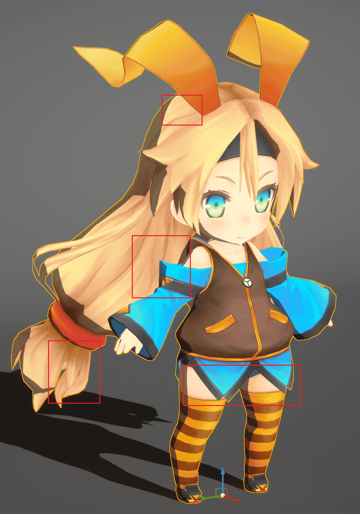
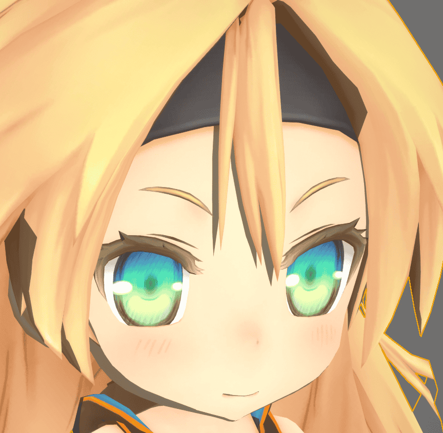
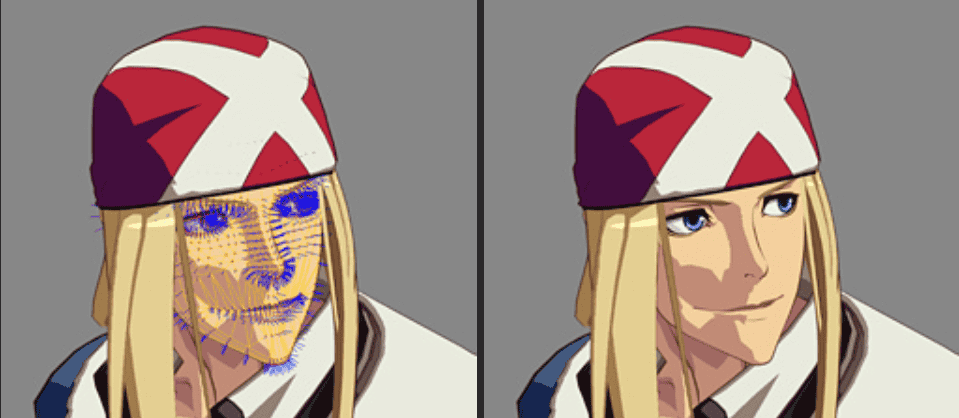
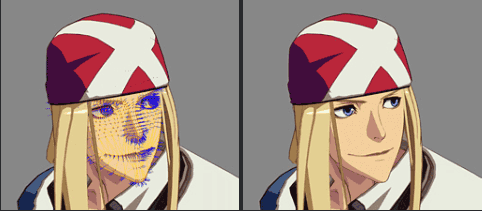
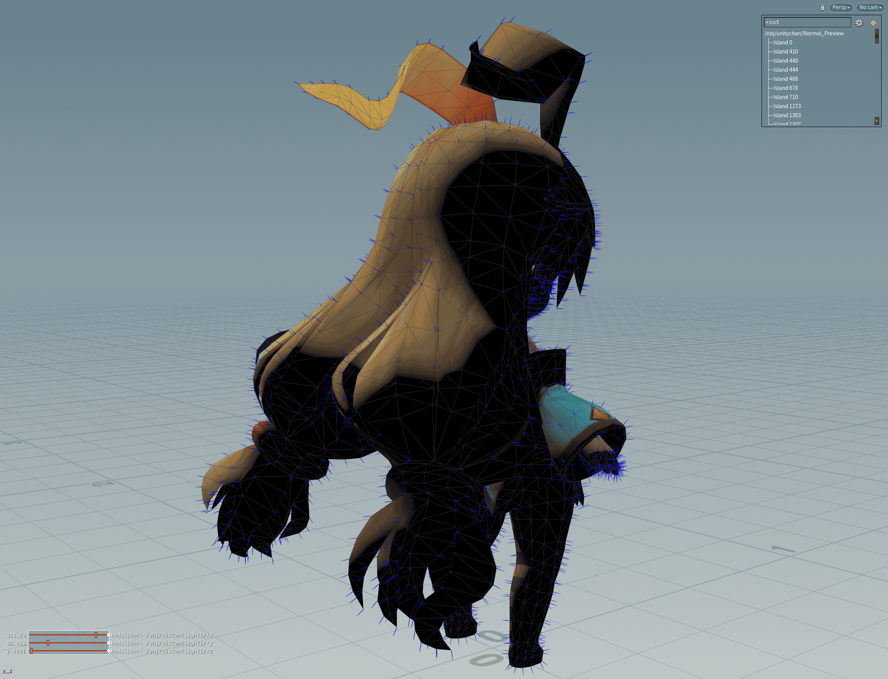
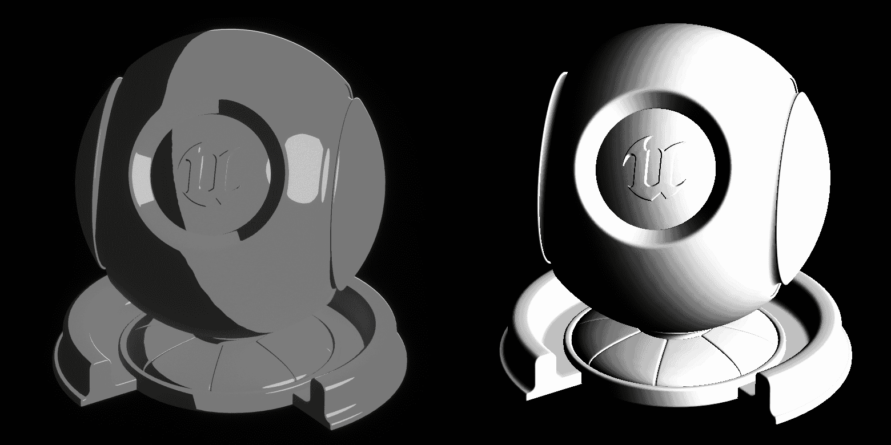
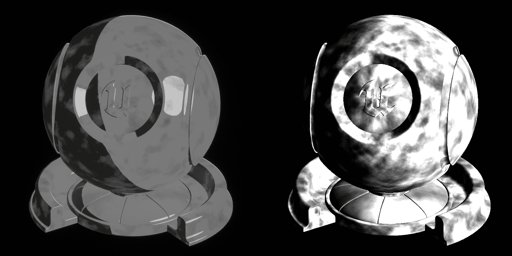
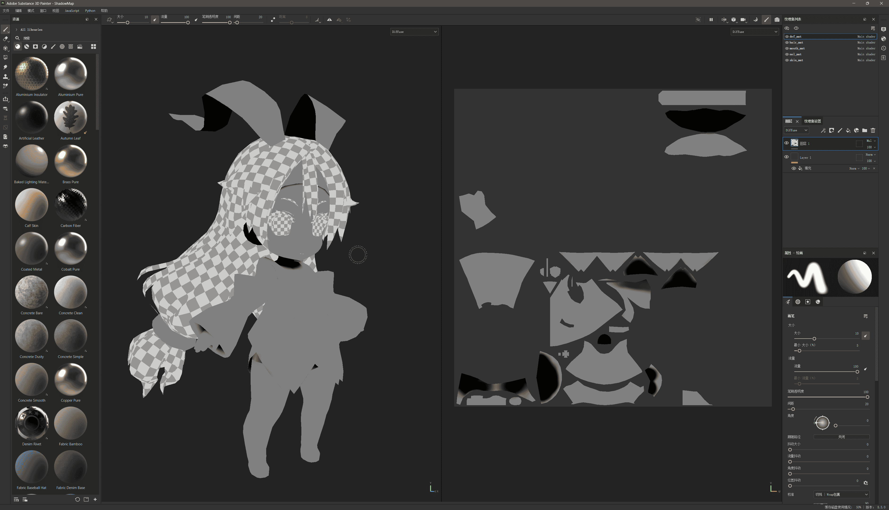
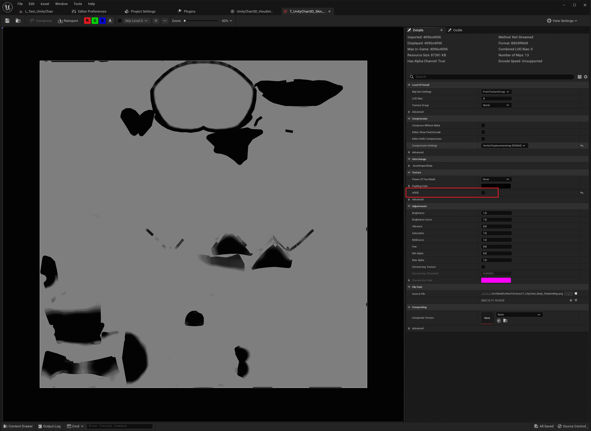

# Control the Shape of Shadows

The main factors that affect the shape of the shadow are **normals**, **self-shadows**, and **shadows of other objects**.

The shadow produced by the normal means that when the light hits the surface of the object, the greater the angle between the surface normal and the direction of the light, the less light energy per unit area is received, so the closer the normal and the direction of illumination are to 90º, the darker:


## Custom Ray Tracing Shadows

Thanks to the specific material information available from Ray Tracing, the behavior of Ray Tracing Shadows can be controlled through material properties.

MooaToon provides the ability to disable the shadow of the Toon Material on itself and the shadow of other Toon Materials with different IDs.

To use these features you first need to set different IDs for different parts of the character.

### Set the ID

MooaToon uses the ID to determine whether the material currently hit by the ray belongs to the same part as the material at the beginning of the ray, you can choose one of the following two methods to set the ID:

#### ID Map

ID Map refers to filling different parts of the character with different solid colors, so as to make textures or post-production to facilitate cutouts, which is usually a necessary texture in film and television workflows, and its resolution can be very low, as long as it does not overflow the UV boundary:


By using ID Map, you can control IDs down to the pixel in a material:


:::caution

Limited by GBuffer bit depth, there needs to be enough differences between different IDs in the ID Map (8 / 255).

The color space of the ID Map must be **Linear** (uncheck sRGB in the Texture Asset).

:::

#### Separate the material and set the ID Offset

Another simple way is that you can set different materials for different parts of the character, and set different `ID Offset` for each material.

:::caution

Although this method does not require ID Map, it will generate more draw calls, please use it as appropriate.

:::

### Disable Self-Shadow

Once the ID is set correctly, you can use `Disable Self Shadow` to disable self-shadow for various parts of the character:

|  |  |
| ------------------------------------------------------------ | ------------------------------------------------------------ |

You can see that the messy self-shadows of each part of the character have been eliminated.

### Disable Cast Shadows to Other IDs

Next, enable `Disable Cast Shadow on Toon`:

|  |  |
| ------------------------------------------------------------ | ------------------------------------------------------------ |

Now you can see that all the shadows except the normal shadows are gone.

### Set the Hair-to-Face Shadow

MooaToon has made a special treatment for the shadows of hair on the face, using a procedural method to replace the original hair shadow to avoid unsightly hair shadows as much as possible.

MooaToon provides two procedural methods: **Ray Tracing Hair Shadow** and **Screen Space Depth Test Hair Shadow**, and this article will introduce an additional method that relies only on art assets.

To use the method provided by MooaToon, you first need to set the ID of the face and hair correctly:

#### Set the ID of the Face and Hair

Open your ID Map using DCC software and note `ID Channel` values for face and hair IDs:


Set `Face ID` ID and `Hair ID` to the corresponding values:


:::tip

There is also a simple way to enable Is `Is Face` on the material of the face and `Is Hair` on the material of the hair, which only applies if the face and hair are separate materials.

:::

Now, regardless of the Disable `Disable Self Shadow` Shadow and `Disable Cast Shadow on Toon` settings, hair never casts shadows on the face:


#### Ray Tracing Hair Shadow

Once the ID of the face and hair is set correctly, simply adjust the `Hair Shadow Width` to see the result of Ray Tracing Hair Shadow:

|  |  |  |
| ------------------------------------------------------------ | ------------------------------------------------------------ | ------------------------------------------------------------ |
| <center>Hair Shadow Width: 0.3</center>                      | <center>Hair Shadow Width: 0.5</center>                      | <center>Hair Shadow Width: 1.0</center>                      |

The principle is to shift the shadow rays direction from light to view, so the closer the direction between light and view, the narrower the shadow width. Video preview:

<Video src={require("./assets/UnrealEditor_2023_04_02_03_00.webm").default}/>

#### Screen Space Depth Test Hair Shadow

Once the face and hair IDs are set correctly, enable `Use Screen Space Depth Test Hair Shadow`:

|  |  |  |
| ------------------------------------------------------------ | ------------------------------------------------------------ | ------------------------------------------------------------ |
| <center>Hair Shadow Width: 0.2</center>                      | <center>Hair Shadow Width: 0.3</center>                      | <center>Hair Shadow Width: 0.4</center>                      |

This method is simpler, when shading the current pixel, it is sampled after panning a distance by light direction, if that pixel is hair, than this pixel is occluded.

So, the shape of the hair shadow obtained by this method entirely depends on the shape of the hair at the current viewing angle:

<Video src={require("./assets/UnrealEditor_2023_04_02_03_57.webm").default}/>

#### Use a Translucent Model as Hair Shadow

This method does not require engine support, please set `Hair Shadow Width`  to 0 to disable procedural hair.

A separate translucent model is made by the artist and placed under the hair as a shadow, while the shape is fully controllable by the artist.

Please refer to the project: [MIKONOTE Anime Toolbox Sample](https://assetstore.unity.com/packages/templates/tutorials/mikonote-anime-toolbox-sample-237176):


## Custom Normal Shadows

Manually editing normals to avoid unsightly shadows is a classic technique in the industry, and [the sharing of Guilty Gear](https://www.4gamer.net/games/216/G021678/20140703095/) is a representative of this:

<center>Left: Original normal; Right: Shadows of the original normal</center>

<center>Left: Manually edited normals; Right: The shadows of the edited normal is much cleaner</center>

The art workload of this craft is very large, the requirements for the model are very demanding, and it usually requires a long period of technical accumulation.

Another convenient way is to replace the normals of the simplified model:

<center>Left: Shadows of original normal; Right: Shadows of replaced normals</center>

<center>The simplified model used to replace</center>

MooaToon provides sample files for normal transfer using Houdini.

There are also two ways to work on Shadow Gradient:

<center>Left: Vertex color channel, which looks close to ambient occlusion, make this area more prone to generating normal shadows; Middle and right: Before-and-after comparison, note that shadows are generated earlier on the pants and thigh muscles after the setting is applied.</center>

<center>Left: ILM texture G channel; middle and right: Before-and-after comparison, shadows are generated in fixed locations such as the skirt.</center>

MooaToon provides Shadow Gradient related features that are sufficient to achieve these effects.


### Transferring Custom Normals Using Houdini

[Houdini](https://www.sidefx.com/products/houdini/) is a common DCC software in the film and game industry, and its powerful noded workflow and geometry capabilities are ideal for making some procedural adjustments to characters, such as adjusting normals, baking AO / Curvature / any custom data to vertex colors and UVs, and each step is represented using nodes, you can modify its order and parameters at will without breaking other modifications.

:::tip

If you just transfer normals, other DCC software can do this easily:

Blender: [https://www.youtube.com/watch?v=qgr0AR8R9yg](https://www.youtube.com/watch?v=qgr0AR8R9yg)

Maya: [https://www.youtube.com/watch?v=6LdtlJ71000](https://www.youtube.com/watch?v=6LdtlJ71000), [https://80.lv/articles/creating-stylized-leaves-in-maya/](https://80.lv/articles/creating-stylized-leaves-in-maya/)

3ds Max: http://www.scriptspot.com/3ds-max/scripts/normal-thief

:::

#### Installation

First you need to make sure you have Houdini above 19.5.493 installed, and then you need to install [GameDevelopmentToolset](https://github.com/sideeffects/GameDevelopmentToolset):

1. [Download GameDevelopmentToolset](https://github.com/sideeffects/GameDevelopmentToolset/archive/refs/heads/Development.zip) and extract it to a directory as you see fit.
2. Open `C:\Users\YOUR USER NAME\Documents\houdini19.5\houdini.env` using a text editor
3. Set the `HOUDINI_PATH` and `PATH` to the installation directory like this:

```
HOUDINI_PATH = C:\GameDevelopmentToolset;&
PATH = C:\GameDevelopmentToolset\bin;$PATH
```
4. Make a copy and open: `MooaToon\MooaToon-Project\Art\Models\UnityChanSD.hip`:


#### Usage

:::tip

If you are new to Houdini, some of these [tutorials](https://www.youtube.com/watch?v=Tsv8UGqDibc&list=PLhyeWJ40aDkUDHDOhZQ2UkCfNiQj7hS5W) can help you get started quickly.

:::

`Fbx Character Import` is responsible for importing models, you can modify the path to import your own models:


The left output (Rest Geometry) contains geometric information, most of the modifications are for geometry.

The middle output (Capture Pose) contains the skin information, which does not need to be modified here. One major advantage of Houdini compared to other DCC software is that fine-tuning geometry does not break the skinning.

The right output (Animated Pose) contains animation keyframe information, which is used to modify character posture and expressions.

Next, double-click to open `Face_Normal` node:


Here, I replaced the normal of the face with the normal of a smooth ellipsoid.

Switch the lighting mode in the toolbar to `Normal Lighting`, and then adjust the lighting direction in the lower left corner to preview the normal shadows.

If you want to use your own model, you need to modify the `Destination Group` of the `attribtransfer1` node to the face of your character, and then adjust the position and scale of the ellipsoid through `transform1`.

The processing of the hair is similar to that of the face. The modified normal and its shadow are shown below:



#### Export

Temporarily disable the following unrelated nodes, then select `OUTPUT_FBX` node, modify the `Output FBX File` path and click `Save to Disk` export the modified model:


:::tip

[The free version of Houdini does not provide FBX export function](https://www.sidefx.com/products/compare/), you can also try exporting to OBJ format.

:::

#### Import to UE

Import the model to UE, `Normal Import Method` must be `Import Normals and Tangents`, here are the import settings I used:


Set the material for it and place it in the scene to check the effect:

<Video src={require("./assets/UnrealEditor_2023_04_08_16_43.webm").default}/>

Now (right) the shape of shadows is much cleaner, Great Job!


### Use Shadow Gradient to Control Local Shadows

In MooaToon, Shadow Gradient refers to the angle between the normal and the light directions:

<center>Left: Unmodified normal shadows; Right: Its Shadow Gradient</center>

<center>Adding Noise to the `Shadow Gradient Offset` will shift the position of the edges when the shadow passes here</center>

<center>Adding Noise to `Shadow Intensity Offset` controls the timing of shadow generation directly at the current location</center>

#### Drawing Shadow Mask

Now you can draw Shadow Mask to add a fixed position shadow to the character, such as under the neck.

The background color of Shadow Mask should be 0.5, and then the `Shadow Intensity Offset` is drawn on the R channel:

- Value 0: The position is always a shadow
- A value of 0.5: Does not affect shadows
- Value is 1: The location is never shadowed

:::caution

Shadow Mask only affects normal shadows, not the shadows of other objects.

:::



:::tip

The Shadow Mask here is drawn using the latest version of Substance 3D Painter, composited by Substance 3D Designer.

Source files at:  `MooaToon\MooaToon-Project\Art\Models\NewTextures\ShadowMap.spp` and  `MooaToon\MooaToon-Project\Art\Models\NewTextures\ShadowMapCombine.sbs`.

Just to make it easier to draw textures, you can also choose other DCC software that you are more familiar with.

:::

#### Import to UE

Import the map into UE after drawing, and then disable sRGB in the map settings:



:::tip

This step is to ensure that Shader samples the texture in Linear Color Space to sample the correct background value.

:::

Then set the material parameters `Shadow Mask Map` and `Shadow Intensity Offset Intensity`:


Now (right) there is already a shadow in a fixed position under the neck.

:::tip

You can also use vertex colors instead of the Shadow Mask texture by enabling `Use Vertex Color Instead Shadow Mask Map`.

Note that vertex colors also have color space issues. You can use `Use Vertex Color In sRGB Space` to control whether to use gamma correction. You can first set all vertex colors to 0.5 to verify whether the background color is correct.

Although using vertex colors instead of textures can achieve high precision with very little memory, the topology of the model has a significant impact on the final result due to linear interpolation between vertices. Therefore, when modeling early on, consideration should be given to how to lay out the topology to obtain the best results.

:::

#### Move Lighting from Base Color to Shadow Mask

There are some outdated workflows that paint lighting onto the Base Color Map, which is not conducive to clean visuals and is not suitable for dynamic shadows and global illumination. [This article](https://muro.fanbox.cc/posts/1657633) explains how to repaint it as an anime-style texture:


In MooaToon, Shadow Mask can be used to break down the static lighting in the left map into dynamic Base Color + Shadow Color + Highlight.


