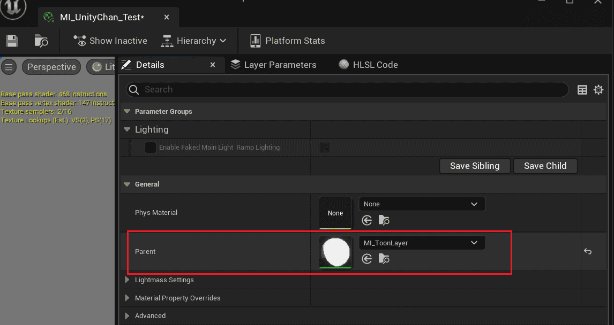
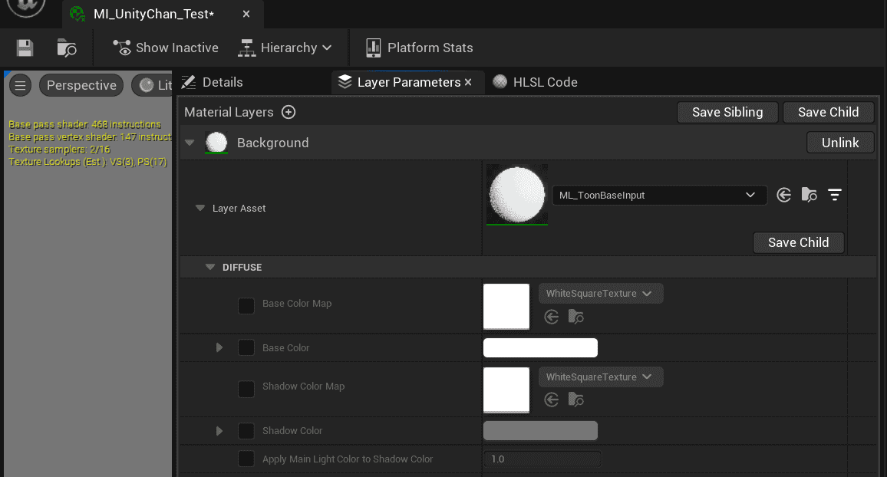
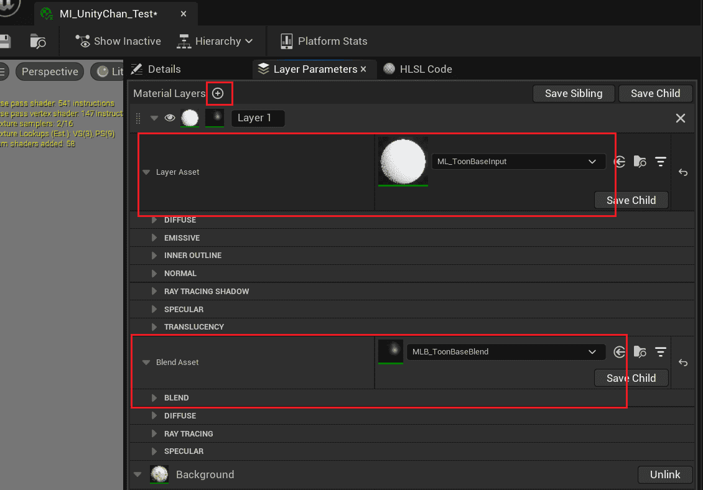
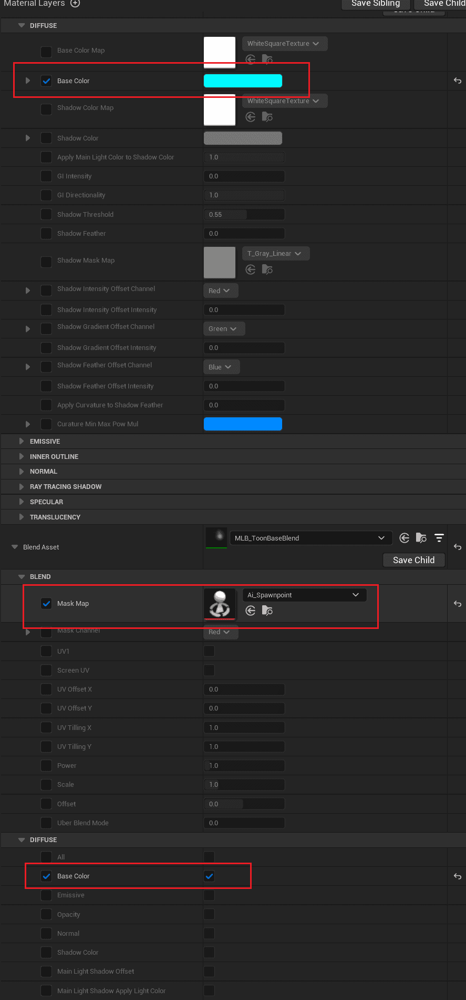

# Create Complex Materials Using Material Layer

`MI_Toon`  is a normal material, which has a simple and fixed input, which can be used to create simple effects.

But if you want to give anisotropic highlights to your hair, or overlay different types of materials or patterns to the original material, you need to use layered materials.

UE's [layered materials](https://docs.unrealengine.com/5.1/zh-CN/layering-materials-in-unreal-engine/) let you freely combine different [types of material layers](https://docs.unrealengine.com/5.1/zh-CN/using-material-layers-in-unreal-engine/), adjust the order and blend modes.

## Convert a material to a layered material

Replace the parent material with `MI_ToonLayer`  in the Material Editor:

You can then find the original parameters in the layer parameters:

:::caution

**Note that this step will lose the values that have already been adjusted!** So decide as early as possible whether to use layered materials.

:::

:::info

Here are some [important tips](https://mooatoon.com/en/docs/FAQ#material-editing) for layered materials.

:::

## Use material layers

Now you can add [material layers](https://docs.unrealengine.com/5.1/zh-CN/using-material-layers-in-unreal-engine/) and create complex effects:

Modify the following parameters:

You can see the following changes:

|  |  |
| ------------------------------------------------------------ | ------------------------------------------------------------ |

This means adding new effects using material layers, using layer blending to control how they overlay onto the layers below.

